# Agenda

-   Shiny Apps
-   Pub Assignment

# Review: Dashboards

- Layout created with markdown headers

- Showing data visualizations in multiple tabs

- Static elements

# Why add shiny elements?

- Interactive widgets

- Reactive outputs based on changing inputs

[Dashboards with Shiny for R Documentation](https://quarto.org/docs/dashboards/interactivity/shiny-r.html)

## Elements of a Shiny App

::: {.columns}
::: {.column}
- Navbar

- Sidebar with widgets

- Main panel 
:::
::: {.column}
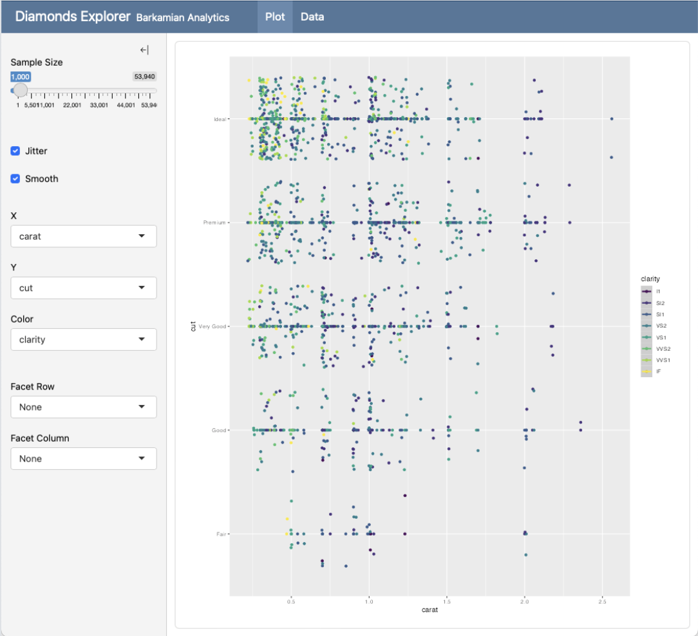
:::
:::
<!-- end columns -->

## Walkthrough

- The 'traditional' method uses a `.R` file and a function input (last time's demo)

- Newer `.qmd` file solution can be broken down into more intuitive `quarto` elements

## Orientation

Orientation of Shiny Apps works the same as in quarto dashboards

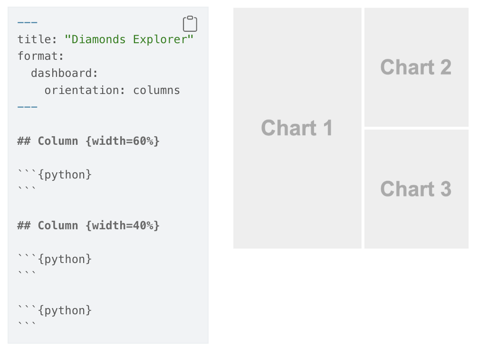

## Part 1: YAML Header and Setup

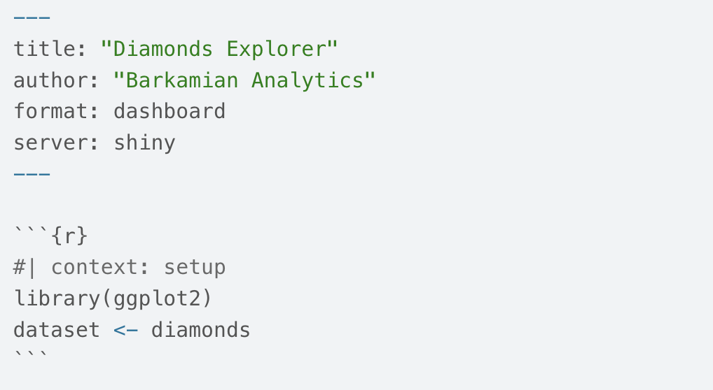

Shiny apps must live on a shiny server - more on this later

## Part 2: Sidebar {.scrollable}

Sidebars are a great place to group inputs for dashboards. To include a sidebar, add the `.sidebar` class to a level 2 heading. Here's how a sidebar would usually appear:

::: {.columns}
::: {.column}
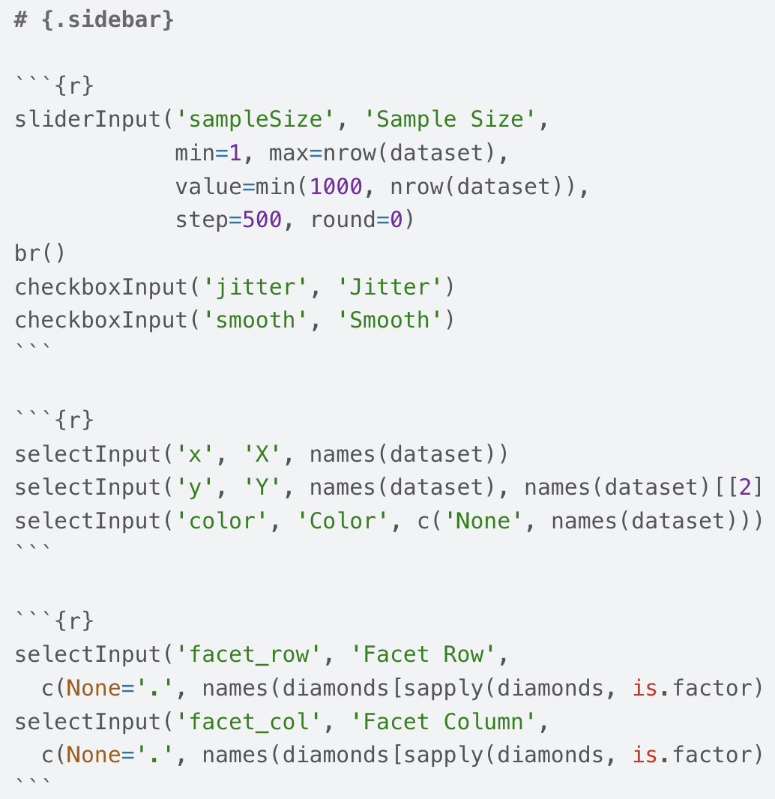

:::
::: {.column}
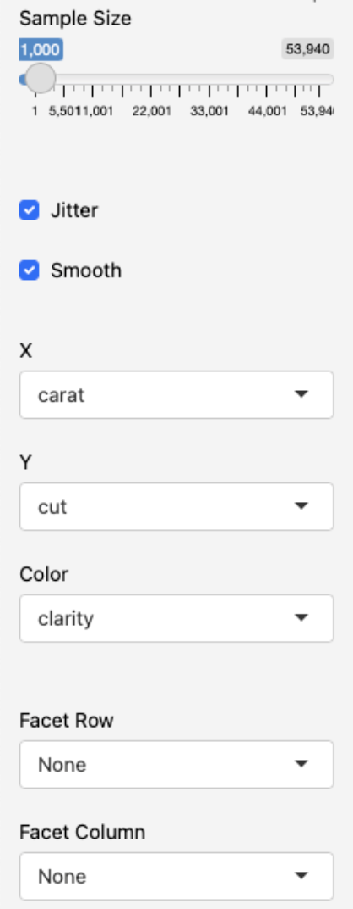
:::
:::
<!-- end columns -->

## Sidebar Layouts

### Global Sidebar

If you have a dashboard with multiple pages, you may want the sidebar to be global (i.e. visible across all pages). To do this, add the .sidebar class to a level 1 heading

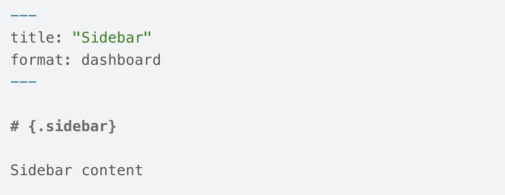

## Sidebar Layouts

### Inline Sidebar

While sidebars are often laid out at the page level (i.e. spanning the dashboard from top to bottom) you can actually include them anywhere within a layout. For example, here we have a sidebar that is within a row (rather than spanning all rows):

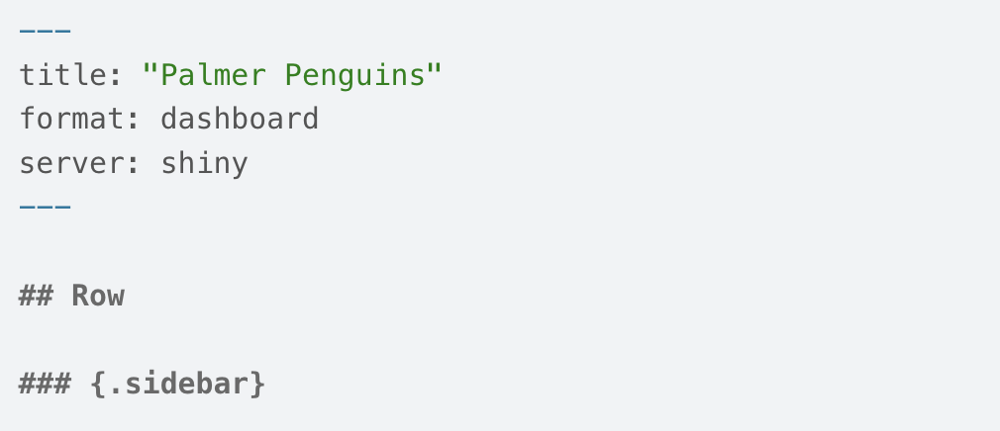

## Sidebar Layouts

### Location and Size

Sidebars can be located on either the left or right side. Layout a sidebar on the right by including it after the column(s) it is adjacent to. You can also modify the size of sidebars using the width attribute. This example demonstrates both of these techniques:

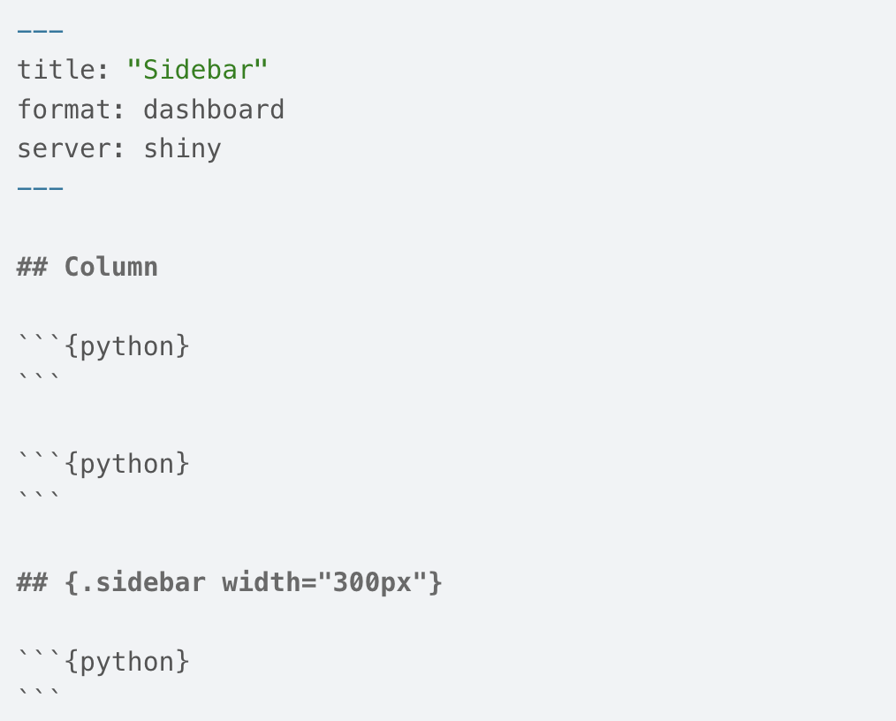

## Part 3: Content

After defining your YAML Header and the layout of your sidebar, add content to create plots and data tables in the `output` pane. 

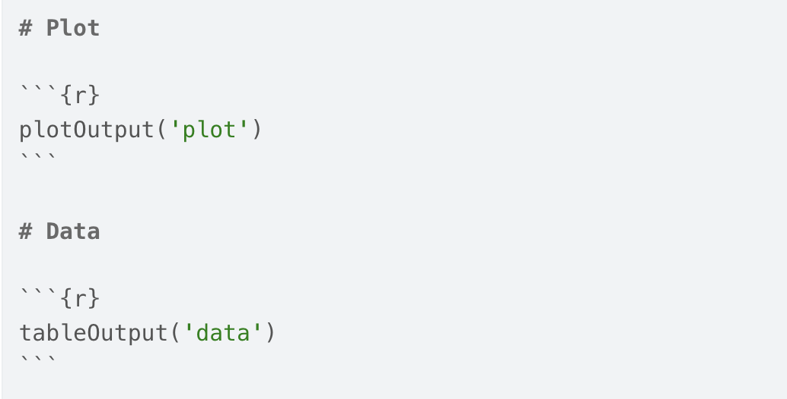

## Part 4: Server

Shiny is a reactive programming framework, meaning it takes care of tracking the relationships between inputs and outputs in your app. 

> When an input changes, only outputs that are affected by that input are re-rendered. 

This is a powerful feature that makes it easy to create dashboards that respond to user input efficiently.

## Server

`context: server` as an option in the second code chunk delineates this R code as running within the Shiny Server

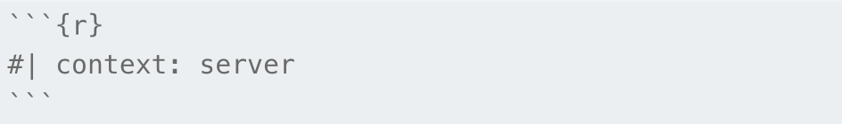

This is where to assign reactive items like `output$plot <- renderPlot()`

## Demo 1

Navigate to BCourses:

Files > lab-materials > lab10-shiny-dashboards > penguins1-density-plot

Open the file and identify the following components: 

1. YAML Header and setup
2. Sidebar
3. Panel Content
4. Server

# Why Do We Need a Server?

A Shiny app is live code, so every time a user moves a slider or changes a dropdown, R has to run new code and send back updated output.

That means R needs to be running somewhere all the time, waiting for user input. That's where the server comes in.

- Your laptop can run a Shiny app locally
- But once you close RStudio, the app dies, and no one else can access it
- A Shiny server keeps R running 24/7 so anyone with a link can use your app

## Deploying with shinyapps.io

[shinyapps.io](https://www.shinyapps.io) is a hosting service that runs your Shiny app on a server for you.

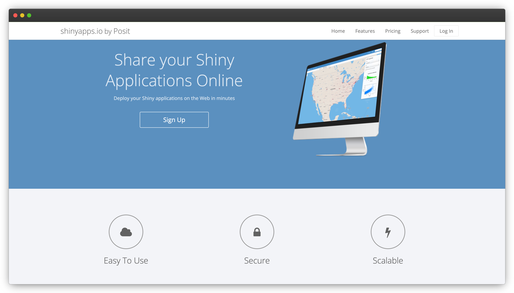

## Steps to deploy

1. Create a free account at shinyapps.io

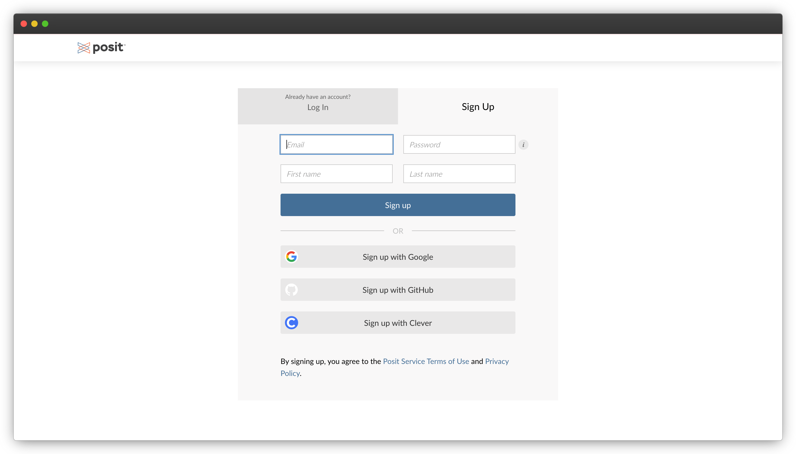

## Steps to deploy

1. Create a free account at shinyapps.io

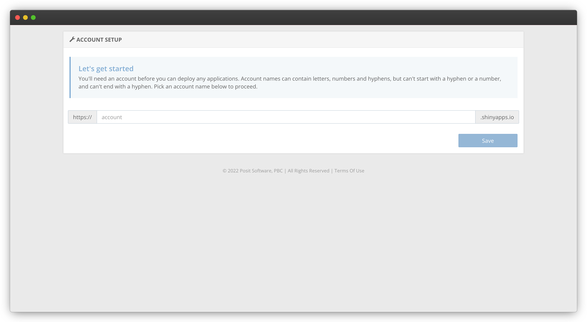

## Steps to deploy

This will take you to the homepage, from where you can follow the steps to link your account.

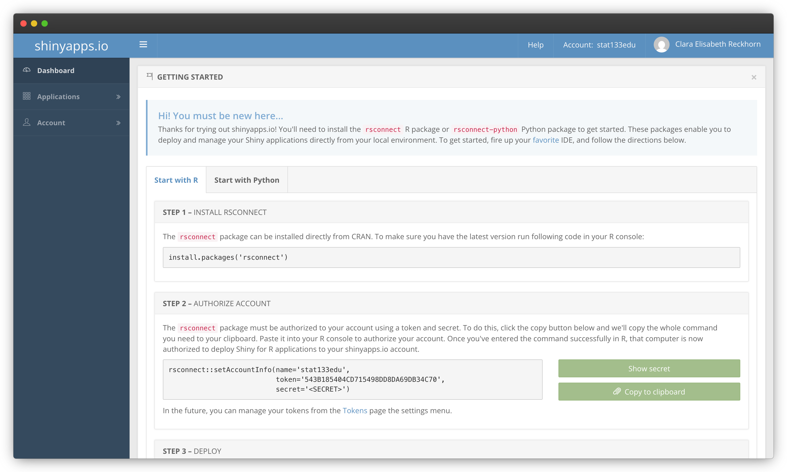

## Steps to deploy

2. In Positron/RStudio, use `install.packages('rsconnect')` to install the packages and link your account
3. Authorize your account using the given token and secret. 
4. When you're ready to deploy, run `library(rsconnect)` and `rsconnect::deployApp('path/to/your/app')`

## Steps to deploy

shinyapps.io uploads your app and gives you a public URL to share

Your app now lives on their server. R is running there, not on your laptop.

# Your Turn:

Navigate to BCourses:

Files > lab-materials > lab10-shiny-dashboards > penguins2-scatter-plot-template.qmd

Open the file and fill in the code.

## Submission to BCourses

Submit the Netlify URL (link) of your published document to the corresponding assignment in bCourses.

See [Assignments tab \> Quarto Publications \> Pub9]{.bold-hilit}

# Problem Set 8

## Pset 8

Available in bCourses:

See [Assignments tab \> Problem Sets \> PS8]{.bold-hilit}

You'll find 2 files:

-   `ps8.html`: instructions

-   `ps8.qmd`: template file to write your answers

. . .

In case of trouble: Go to Files tab, folder `problem-sets`, folder `ps8`, and download the `qmd` file.

Sometimes Safari blocks or denies you access. If this is the case you may want to use another browser (e.g. Chrome).

## Pset 8 Submission

-   Submit your `qmd` and `html` files to bCourses.
-   Use assignment problem set **ps8**
-   Graded credit / no-credit
-   Credit for evidence of earnest engagement (just don't submit a blank or empty template file)