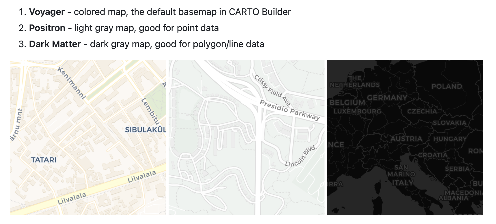

# Agenda

-   Quiz 5
-   Leaflet Review 
-   Demo
-   Pub Assignment

# Before the Quiz

::: callout-important
A note on academic integrity:
:::

\
Cheating is **100% not tolerated**. Talking with other individuals during the quiz, using your phone for any reason, looking at others' answers, etc. will result in a violation of the Academic Integrity Pledge. We reserve the right to give a 0 to anyone seen cheating.

## Before the Quiz

::: nonincremental
1.  Spread out as much as possible.
2.  🚽 If you need to use the bathroom, this is the time to do it.
3.  🧹 Clear your desk of everything except a pen/pencil and your ID.
4.  🧢 Remove hats, hoods, and sunglasses (don't hide your face please!)
5.  📱 All electronic devices (laptop, phone, airbuds, smart watch) should remain in your bag for the entire quiz period.
:::

## Quiz {.smaller}

```{r}
countdown::countdown(35, top = 0)
```

::: nonincremental
1.  Please be quiet.
2.  When you get a quiz, do not begin until we tell you so.
3.  Write your name and SID.
4.  Keep your eyes on your own quiz.
5.  Only one person allowed to use the bathroom at a time.
6.  If you finish early, please hold on to your quiz and wait.
7.  When the timer ends, hold up your quiz in the air immediately and put your writing utensils down or risk a 0.
:::

Good luck! 🍀

# Leaflet

## Web Interactive Maps with Leaflet

[Leaflet](https://leafletjs.com/) is a JavaScript library used to build interactive maps for websites and web mapping applications.

* The R package `leaflet` lets you create and customize Leaflet maps in R.

* These maps can be used directly from the R console, from RStudio, in Markdown documents (e.g. qmd, Rmd), and in Shiny applications.

## Basic Usage

You create a Leaflet map with these basic steps:

1) Create a map widget by calling `leaflet()`.

2) Add layers (i.e. features) to the map, via `|>`, by using layer functions:

    + `addTiles()`
    + `addMarkers()`
    + `addCircles()`
    + `addPolygons()`
    + `addLegend()`

3) Repeat step 2 as desired.

4) Print the map widget to display it.

## Example: Basic Leaflet

```{r}
#| echo: true
library(leaflet)
# view of UC Berkeley 
# with marker at Campanile's lat & long
leaflet() |>
  addTiles() |> # default OpenStreetMap map tiles
  addMarkers(lng = -122.2579, lat = 37.8721, popup = "Berkeley")
```

## Your Turn: Campus Leaflet

- Try graphing a leaflet map in a `.qmd` file with 2 markers indicating your favorite places on Campus.

- You will have to pass a 2-element vector for the lng coordinates, and also a 2-element vector for the lat coordinates.

- You will also have to pass a 2-element vector for the popup names.

- To obtain the latitude and longitude coordinates, you can search a location on Google Maps. The coordinates are displayed in the URL of your browser.

```{r}
countdown::countdown(7, top = 0)
```

## Map Tiles {.scrollable}

Lots of different [map tiles](https://leaflet-extras.github.io/leaflet-providers/preview/) can be used in leaflet maps.

Leaflet uses map tiles from:

- [OpenStreetMap (OSM)](https://www.openstreetmap.org/)
    - OSM is simply the database with all the data in xml-vector format.

- [CartoDB](https://carto.com/basemaps/)
    - Most popular [base maps](https://github.com/cartodb/basemap-styles):

{height="400px"}


## Example: Map Tiles

```{r}
#| eval: false
#| echo: true

# OpenStreetMap (default) — just use addTiles()
leaflet() |>
  addTiles() |>
  setView(lng = -122.265, lat = 37.874, zoom = 15)

# CartoDB — use addProviderTiles() with a CartoDB style
leaflet() |>
  addProviderTiles("CartoDB.Voyager") |>       # light
  setView(lng = -122.265, lat = 37.874, zoom = 15)
```


## Adding Data Objects

Both leaflet() and the map layer functions have an optional data parameter that is designed to receive spatial data in one of several forms, for instance:

- From base R:
    - lng/lat matrix
    - data frame with lng/lat columns

- From the "sf" package:
    - the data frame of class "sf"

## Example: adding "sf" data polygons


```{r}
#| echo: true
library(sf)
library(rnaturalearth)
library(tidyverse)
usa_states = ne_states(
  country = "United States of America", 
  returnclass = "sf")

leaflet(data = usa_states) |> 
  addTiles() |>
  setView(lng = -90, lat = 40, zoom = 3) |>
  addPolygons(fillColor = rainbow(10), stroke = FALSE)
```

## Mapping 1975 North Atlantic Storms


```{r}
#| echo: true
storms |>
  filter(year == 1975) |>
leaflet() |>
  setView(lng = -50, lat = 30, zoom = 3) |>
  addTiles() |>
  addProviderTiles(provider = "NASAGIBS.ViirsEarthAtNight2012") |>
  addCircleMarkers(
    lng = ~long, 
    lat = ~lat,
    radius = 1, 
    color = "#DDFF03")
```

# Pub 10

In this publication assignment, you will build an interactive Shiny app using Leaflet.

## Requirements

- A leaflet map displaying 3 campus locations:
    - favorite study spot
    - favorite restaurant 
    - favorite cafe

- One input control that updates the map (e.g. dropdown or checkbox to filter locations)

- A personalized map tile

## Submission to BCourses

Submit the Shinyapps.io URL (link) of your published document to the corresponding assignment in bCourses.

See [Assignments tab \> Quarto Publications \> Pub10]{.bold-hilit}

# Problem Set 9

## Pset 9

Available in bCourses:

See [Assignments tab \> Problem Sets \> PS9]{.bold-hilit}

You'll find 2 files:

-   `ps9.html`: instructions

-   `ps9.qmd`: template file to write your answers

. . .

In case of trouble: Go to Files tab, folder `problem-sets`, folder `ps9`, and download the `qmd` file.

Sometimes Safari blocks or denies you access. If this is the case you may want to use another browser (e.g. Chrome).

## Pset 9 Submission

-   Submit your `qmd` and `html` files to bCourses.
-   Use assignment problem set **ps9**
-   Graded credit / no-credit
-   Credit for evidence of earnest engagement (just don't submit a blank or empty template file)
