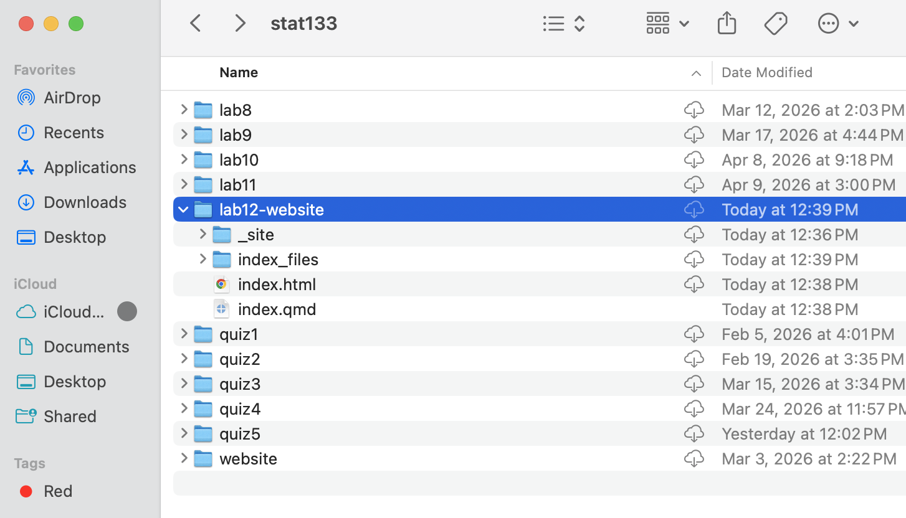
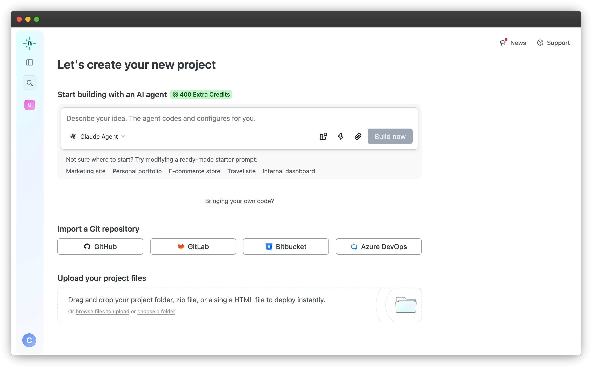
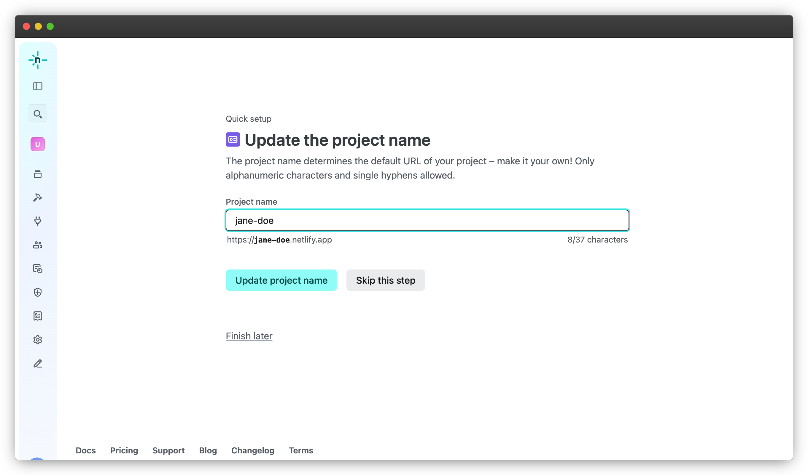

```{r setup, include=FALSE}
knitr::opts_chunk$set(echo = TRUE, error = TRUE)
library(tidyverse)
```


# Announcements

## Quiz Rescheduled

Quiz 6 will now take place on 4/30, during lab time as usual. 

- Next week during lab we will continue working on Quarto Websites. 


# Why a Quarto Website?

A personal website is a valuable tool to publish your work, and Quarto makes it easy:

- Host live demos, visualizations, and dashboards 

- No server is needed, so it's fast

- Free to host, easy to maintain

## Disclaimer on Data Privacy

Building a personal website is a great way to showcase your work to potential employers, but we recognize that not everyone is comfortable posting personal (resume) information publicly. For today's publication assignment, feel free to use placeholder/dummy information in place of anything you'd rather keep private.

# Examples

##

{.absolute top=20 left=100}

. . .

{.absolute top=50 left=130}

. . .

{.absolute top=70 left=160}

. . .

{.absolute top=110 left=190}


# Creating a Quarto Website

## New Quarto Website

:::: {.columns}
::: {.column}
[In Positron:]{.hilit}

1) Click [New]{.hilit} (top-left corner)
2) Select [New File ...]{.hilit}
3) Choose [Quarto Project]{.hilit}
4) Select [Website Project]{.hilit}
5) Choose a directory and name it (e.g. `webdemo`)
:::

::: {.column .fragment}
[In RStudio:]{.mdlit}

1) Click [File]{.mdlit} in the menu bar
2) Select [New Project ...]{.mdlit}
3) Choose [Quarto Website]{.mdlit}
4) Select a location and name it (e.g. `webdemo`)
5) Click [Create]{.mdlit}
:::
::::


#  Website's File Structure

## Files in default quarto website

Positron/Rstudio will open a new session containing your Quarto website[^1] with the following file structure:

. . .

:::: {.columns}
::: {.column}
[Filestructure in Positron:]{.hilit} [^2]

```
webdemo/
  .quarto/
  _quarto.yml
  index.qmd
  about.qmd
  styles.css
```
:::

::: {.column .fragment}
[Filestructure in RStudio:]{.mdlit} [^3]

```
webdemo/
  webdemo.Rproj
  _quarto.yml
  index.qmd
  about.qmd
  styles.css
```
:::
::::

[^1]: Assuming the name of the website is `webdemo`.

[^2]: Positron uses an auxiliary `.quarto/` directory. Don't touch it!

[^3]: Rstudio uses an "RStudio Project", hence the auxiliary `.Rproj` file. Don't touch it!


## Website preview


## Website preview

The main way to preview your website is with the `quarto preview` command. 

- In [Positron]{.hilit}, you simply click the `Preview` button.

- In [RStudio]{.mdlit}, there is no `Preview` button but you can click the `Render` button.

\ 

- If you are in the **terminal**, you can also type:

. . .

```{.markdown filename="Terminal" code-line-numbers="false"}
quarto preview
```


## Website's File Structure

- The yaml file `_quarto.yml` is the configuration file.

\ 

- The quarto files `index.qmd` and `about.qmd` are the default files that get
rendered into the pages of the actual website.

\ 

- The `styles.css` file is a _cascade style-sheet_ file to optionally customize the
appearance and format of your website.


## Default content of yaml file

:::: {.columns}
::: {.column width="47%"}
```{.markdown code-line-numbers="false"}
project:
  type: website

website:
  title: "webdemo"
  navbar:
    left:
      - href: index.qmd
        text: Home
      - about.qmd

format:
  html:
    theme: cosmo
    css: styles.css
    toc: true
```
:::

::: {.column width="6%"}
:::

::: {.column width="47%"}
- Type of Project: "website"

- Website layout:
    + title
    + navigation bar
    + home page (index)
    + about page

- Output format: html
    + cosmo theme
    + css style file
    + table of contents
:::
::::


## Index (Home) page: `index.qmd` file

```{.markdown code-line-numbers="false"}
---
title: "webdemo"
---

This is a Quarto website.

To learn more about Quarto websites visit 
<https://quarto.org/docs/websites>.
```


## About page: `about.qmd` file

```{.markdown code-line-numbers="false"}
---
title: "About"
---

About this site
```

## Folder `_site/`

When a website is previewed or rendered, you will see an additional folder, `_site/`, in the file structure of your website:

```
  webdemo/
    _quarto.yml
    index.qmd
    about.qmd
    styles.css
    _site/
```

- The `_site/` folder contains all the HTML files of your website.
- The content of these files come from the rendered `.qmd` files.
- It also contains other necessary files and directories.
- Upload the `_site/` folder when publishing your website to [Netlify]{.bold-hilit}.


# QMD files in Quarto website

## What kind of qmd files can you use in a Website?

- Regular `qmd` files (simple html output)

- Quarto revealjs slides

- Closeread documents

- Quarto dashboards (non-shiny)[^4]

[^4]: Quarto websites, by default, don't have a shiny server. While it is possible to have Shiny elements in a Quarto website, there is no simple-and-robust solution (yet) to this limitation.


# Your Turn

Navigate to `BCourses > Files > Lab Materials > Lab 12 > pub11-walkthrough.html` for a walkthrough of today's publication assignment. 

## Publication 11: Personal Website

For Pub 11, you will build and publish a personal Quarto website with four tabs/pages:

. . .

| Page | Content |
|------|---------|
| **Home** | Introduction / welcome |
| **About** | Background, interests, fun facts |
| **Resume** | Education, skills, experience |
| **Projects** | Your Pub 7 dashboard + brief description |


## Publishing website to Netlify

Once finished with the walkthrough, please upload your site to netlify:

- Locate the website folder (here named `lab12-website`)

- This is the folder that you need to upload to Netlify




## Publishing website to Netlify

- Click on 'Add new project' in Netlify

- Drag and drop your website folder to 'Upload your project files'




## Publishing website to Netlify

- Click on 'Quick Setup' to update project name 

- Rename the link to 'your-name.netlify.app'

- Submit netlify link to bCourses (Pub 11)



# Problem Set 10

## Pset 10

Available in bCourses:

See [Assignments tab \> Problem Sets \> PS10]{.bold-hilit}

You'll find 2 files:

-   `ps10.html`: instructions

-   `ps10.qmd`: template file to write your answers

. . .

In case of trouble: Go to Files tab, folder `problem-sets`, folder `ps10`, and download the `qmd` file.

Sometimes Safari blocks or denies you access. If this is the case you may want to use another browser (e.g. Chrome).

## Pset 10 Submission

-   Submit your `qmd` and `html` files to bCourses.
-   Use assignment problem set **ps10**
-   Graded credit / no-credit
-   Credit for evidence of earnest engagement (just don't submit a blank or empty template file)
