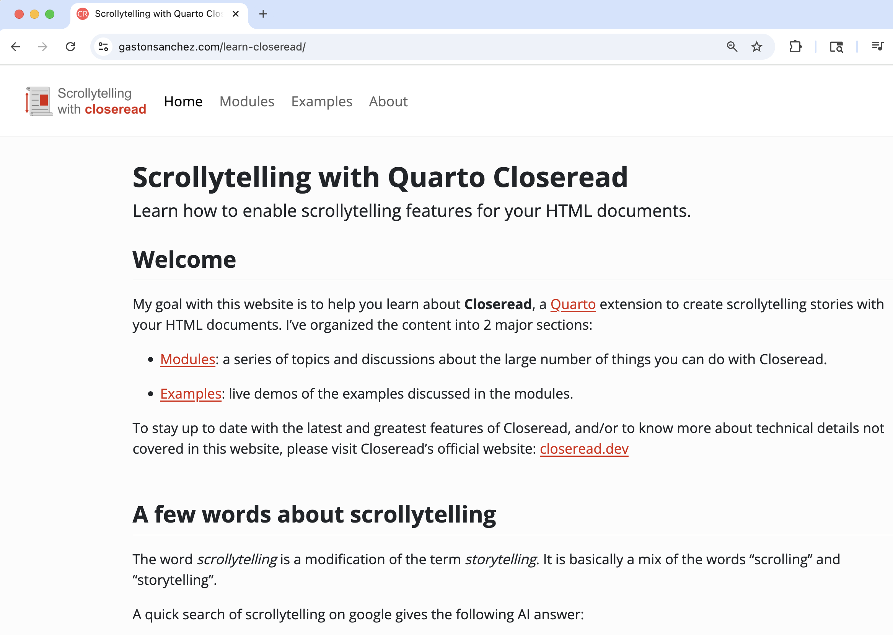
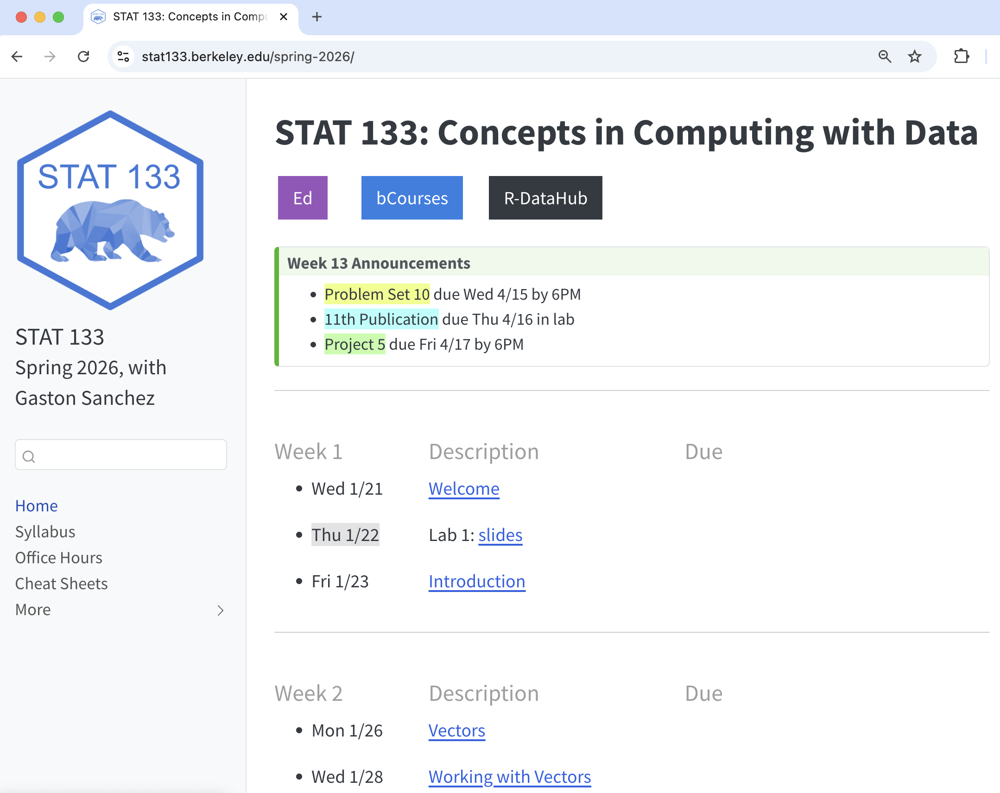
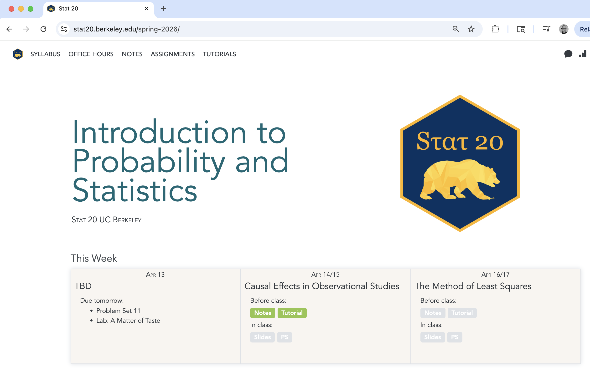
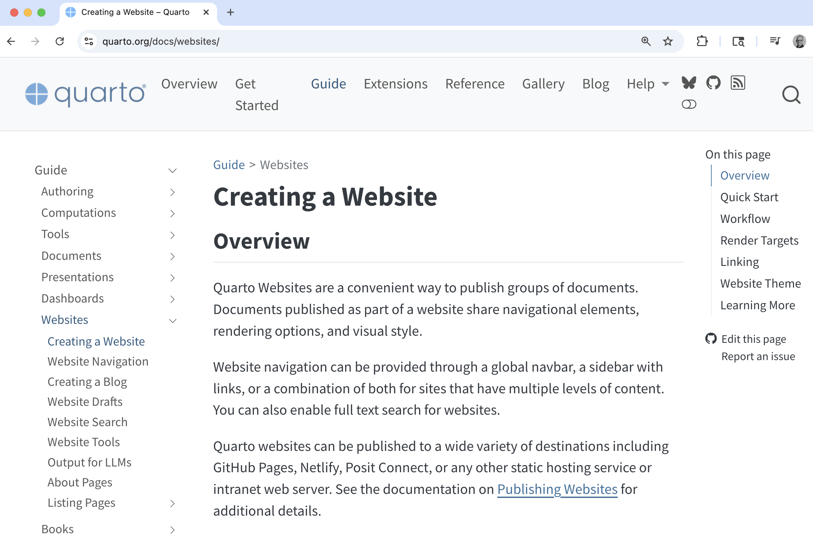
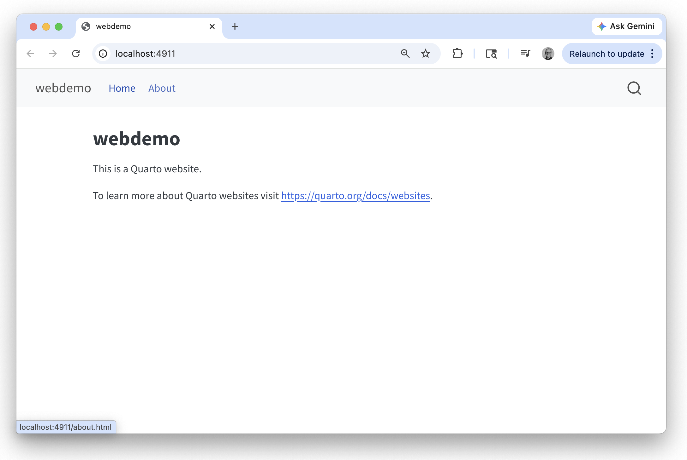

```{r setup, include=FALSE}
knitr::opts_chunk$set(echo = TRUE, error = TRUE)
library(tidyverse)
```


# Examples

##

{.absolute top=20 left=100}

. . .

{.absolute top=50 left=130}

. . .

{.absolute top=70 left=160}

. . .

{.absolute top=110 left=190}


# Creating a Quarto Website

## Open a New Quarto Website in Positron

Steps to open a new Quarto Website in Positron

1) Click the [New]{.hilit} button (top-left corner in Positron)

2) Select [New File ...]{.hilit}

3) Choose [Quarto Project Quarto]{.hilit}

4) Select [Website Project]{.hilit}

5) Choose a directory for the website, and give it a name (e.g. `webdemo`)


## Open a New Quarto Website in RStudio

Steps to open a new Quarto Website in RStudio

1) Click on the [File]{.mdlit} tab in the menu bar

2) Select [New Project ...]{.mdlit}

3) Choose [Quarto Website]{.mdlit}

4) Select a location for your project, and give it a name (e.g. `webdemo`)

5) Click [Create]{.mdlit}


#  Website's File Structure

## Files in default quarto website

Positron/Rstudio will open a new session containing your Quarto website[^1] with the following file structure:

. . .

:::: {.columns}
::: {.column}
[Filestructure in Positron:]{.hilit} [^2]

```
webdemo/
  .quarto/
  _quarto.yml
  index.qmd
  about.qmd
  styles.css
```
:::

::: {.column .fragment}
[Filestructure in RStudio:]{.mdlit} [^3]

```
webdemo/
  webdemo.Rproj
  _quarto.yml
  index.qmd
  about.qmd
  styles.css
```
:::
::::

[^1]: Assuming the name of the website is `webdemo`.

[^2]: Positron uses an auxiliary `.quarto/` directory. Don't touch it!

[^3]: Rstudio uses an "RStudio Project", hence the auxiliary `.Rproj` file. Don't touch it!


## Website preview




## Website preview

The main way to preview your website is with the `quarto preview` command. 

- In [Positron]{.hilit}, you simply click the `Preview` button.

- In [RStudio]{.mdlit}, there is no `Preview` button but you can click the `Render` button.

\ 

- If you are in the **terminal**, you can also type:

. . .

```{.markdown filename="Terminal" code-line-numbers="false"}
quarto preview
```


## Website's File Structure

- The yaml file `_quarto.yml` is the configuration file.

\ 

- The quarto files `index.qmd` and `about.qmd` are the default files that get
rendered into the pages of the actual website.

\ 

- The `styles.css` file is a _cascade style-sheet_ file to optionally customize the
appearance and format of your website.


## Default content of yaml file

:::: {.columns}
::: {.column width="47%"}
```{.markdown code-line-numbers="false"}
project:
  type: website

website:
  title: "webdemo"
  navbar:
    left:
      - href: index.qmd
        text: Home
      - about.qmd

format:
  html:
    theme: cosmo
    css: styles.css
    toc: true
```
:::

::: {.column width="6%"}
:::

::: {.column width="47%"}
- Type of Project: "website"

- Website layout:
    + title
    + navigation bar
    + home page (index)
    + about page

- Output format: html
    + cosmo theme
    + css style file
    + table of contents
:::
::::


## Index (Home) page: `index.qmd` file

```{.markdown code-line-numbers="false"}
---
title: "webdemo"
---

This is a Quarto website.

To learn more about Quarto websites visit 
<https://quarto.org/docs/websites>.
```


## About page: `about.qmd` file

```{.markdown code-line-numbers="false"}
---
title: "About"
---

About this site
```

## Folder `_site/`

When a website is previewed or rendered, you will see an additional folder, `_site/`, in the file structure of your website:

```
  webdemo/
    _quarto.yml
    index.qmd
    about.qmd
    styles.css
    _site/
```

- The `_site/` folder contains all the HTML files of your website.
- The content of these files come from the rendered `.qmd` files.
- It also contains other necessary files and directories.
- Upload the `_site/` folder when publishing your website to [Netlify]{.bold-hilit}.


# QMD files in Quarto website

## What kind of qmd files can you use in a Website?

- Regular `qmd` files (simple html output)

- Quarto revealjs slides

- Closeread documents

- Quarto dashboards (non-shiny)[^4]

[^4]: Quarto websites, by default, don't have a shiny server. While it is possible to have Shiny elements in a Quarto website, there is no simple-and-robust solution (yet) to this limitation.


# Your Turn

## Let's add more content

- Customize `index.qmd`
    + Write a welcome blurb
    + Insert an image

- Customize `about.qmd`
    + Your Name
    + Your Major(s)/Minor
    + Personal fun fact


## Add an `analysis.qmd` page

- Open a new `.qmd` file (to be used for a small analysis).
- Save this file as `analysis.qmd`
- In the YAML file, include `analysis.qmd` under `- about.qmd`
(so that your _analysis_ page shows up in the navbar)
- Add some content to `analysis.qmd`:
    + Include a yaml header (with a title)
    + Include a code chunk to load `tidyverse`
    + Write some narrative and more code chunks
    + e.g. obtain a graphic and some summary outputs using one of the data sets (`mtcars`, `storms`, `penguins` from `"palmerpenguins"`)


## Preview website

- After you've saved the changes in `analysis.qmd`, preview your website.

- Continue modifying website:
    + Try to include a simple quarto dashboard as another page.

- Keep previewing website


## Publish website to Netlify

- Locate the folder `_site/`
- This is the folder that you need to upload to Netlify
- Submit netlify link to bCourses (Pub 11)
