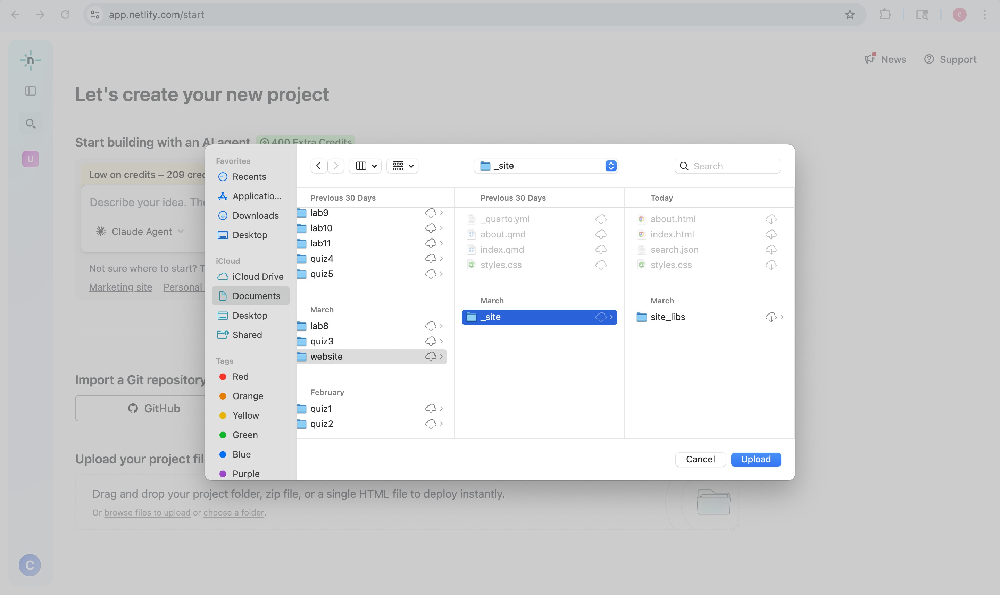
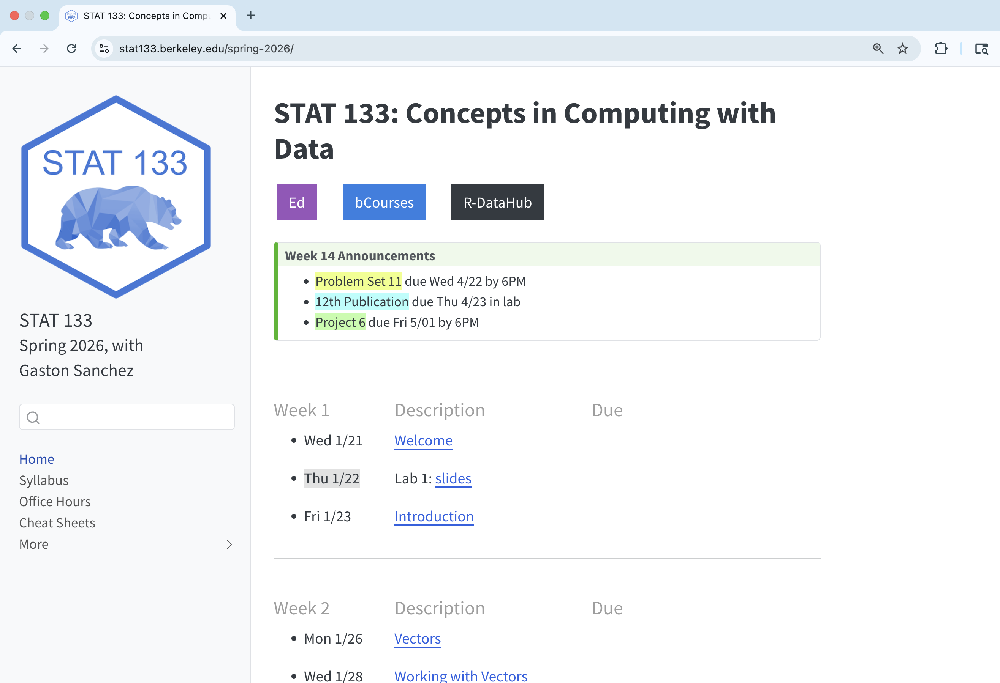
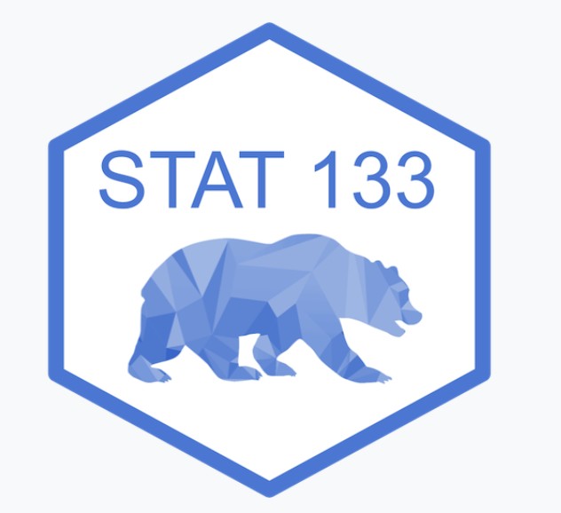

# Agenda

-   Project 6 Overview 
-   Review: Creating Quarto Websites
-   Pub Assignment

# Project 6 Overview

```{r}
countdown::countdown(7, top = 0)
```

Read through the [Project 6 Instructions](https://bcourses.berkeley.edu/courses/1551809/files/folder/projects/project6?preview=94377880)

On a small piece of paper, write down:

* A question about the project or something you are curious to learn how to do

* What text you would like to analyze

* Which 2 text analysis techniques you will use

# Review: Quarto Websites

Last week, we covered personal websites. This week, we will apply those same techniques to the website you are creating for Project 6, which will present text analysis Shiny Apps.

## Steps to Get Started

::::: columns
::: column
[In Positron:]{.hilit}

1)  Click [New]{.hilit} (top-left corner)
2)  Select [New File ...]{.hilit}
3)  Choose [Quarto Project]{.hilit}
4)  Select [Website Project]{.hilit}
5)  Choose a directory and name it (e.g. `webdemo`)
:::

::: {.column .fragment}
[In RStudio:]{.mdlit}

1)  Click [File]{.mdlit} in the menu bar
2)  Select [New Project ...]{.mdlit}
3)  Choose [Quarto Website]{.mdlit}
4)  Select a location and name it (e.g. `webdemo`)
5)  Click [Create]{.mdlit}
:::
:::::

## Website Project Parts

Creating a website project in your IDE will create the following files: 

| File | What it does |
|----|----|
| `_quarto.yml` | The "settings" file, which controls site title, navigation, theme, etc. |
| `.quarto/` | Internal info used by Quarto when rendering |
| `index.qmd` | Your homepage |
| `about.qmd` | A standard 'about this site' page |
| `styles.css` | Optional custom styling |

## Rendering your Website

Think of rendering like baking: Your `.qmd` files are the raw ingredients, and rendering is the oven that turns them into a finished website, consisting of `html` files.

When you run `quarto render` or click `preview`:

1.  Quarto reads each `.qmd` file

2.  Runs any code inside it

3.  Converts everything to `.html`

4.  Saves the result in the `_site/` folder

5.  The `_site/` folder is your actual website — that's what gets uploaded when you publish.


## Website Project Parts (After Rendering/Previewing)

Now you will have the following files:

| File | What it does |
|----|----|
| `_quarto.yml` | The "settings" file, which controls site title, navigation, theme, etc. |
| `.quarto/` | Internal info used by Quarto when rendering |
| `index.qmd` | Your homepage |
| `about.qmd` | A standard 'about this site' page |
| `styles.css` | Optional custom styling |
| *`_site/` folder* | *Where Quarto puts the finished HTML files (don't edit this!)* |

## Sample Website + Code

For illustration purposes, we have prepared a mockup website with some 
sample Quarto website content that you can preview at: 

<a href="https://dataviz.quarto.pub/ketzaly1/" target="_blank">https://dataviz.quarto.pub/ketzaly1</a>

The associated files are available in the following github repository:

<a href="https://github.com/gastonstat/quarto-website-ketzaly1" target="_blank">https://github.com/gastonstat/quarto-website-ketzaly1</a>


## Uploading to Netlify

::: {.callout-note}
As usual, we use the 'drag and drop' feature to upload our websites to [Netlify](https://app.netlify.com/login). In this case, you will drag and drop the `_site` folder that is created when you render/preview your website.
:::




# Favicons

Most websites have small icons in the tab. These are called *favicons.* 


::: {.columns}

::: {.column}

Our course website:



:::

::: {.column}

Corresponding favicon:



:::

:::

## Creating a Favicon

- Can be logos

- Easy way to create text-based favicon is [Favicon Icon Generator](https://favicon.io/favicon-generator/)

- Choose the __Generate From Text__ option

- Once you have designed your favicon in `favicon.io`, click on the download 
button > unzip the downloaded file > move or copy the file `favicon.ico` to 
the `assets` folder in your Quarto website.

# Your Turn

This week's publication assignment is to build the structure of your Project 6 website. You should have the following file structure:

```
project6-website/
  .quarto/
  _quarto.yml
  index.qmd
  about.qmd
  styles.css
  analysis1.qmd
  analysis2.qmd
  assets/
  data/
```

## Publication Assignment

In addition to the file structure, your website should have:

* A favicon

* A theme (find HTML theme options [here](https://quarto.org/docs/output-formats/html-themes.html))

* 4 pages linked in the navbar: Home (`index.qmd`), Analysis 1 (`analysis1.qmd`), Analysis 2 (`analysis2.qmd`), and About (`about.qmd`)

* Home page which links to the analysis 1 and analysis 2 pages

## Sample Layout

When completed, your website should have the same structure as this [sample](https://stat133-project6.netlify.app/).

For more a step-by-step walkthrough, refer to BCourses > Files > lab-materials > lab13 > pub12-walkthrough.qmd.

## Submitting to Netlify

After uploading your `_site` folder, don't forget to change the website link to `your-name-project6.netlify.app`.

# Problem Set 11

## Pset 11

Available in bCourses:

See [Assignments tab \> Problem Sets \> PS11]{.bold-hilit}

You'll find 2 files:

-   `ps11.html`: instructions

-   `ps11.qmd`: template file to write your answers

. . .

In case of trouble: Go to Files tab, folder `problem-sets`, folder `ps11`, and download the `qmd` file.

Sometimes Safari blocks or denies you access. If this is the case you may want to use another browser (e.g. Chrome).

## Pset 11 Submission

-   Submit your `qmd` and `html` files to bCourses.
-   Use assignment problem set **ps11**
-   Graded credit / no-credit
-   Credit for evidence of earnest engagement (just don't submit a blank or empty template file)
