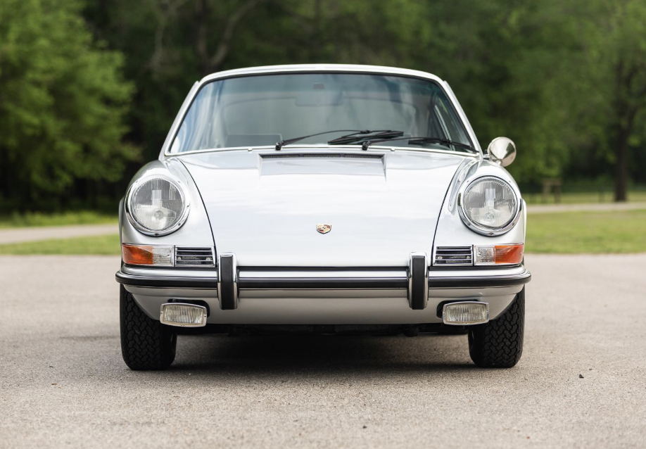

```{r setup, include=FALSE}
# load packages and/or import data set(s)
library(tidyverse)


# make row names usable as a column
mtcars_tbl <- mtcars |>
  rownames_to_column("model")
```

:::: {.cr-section}

This is a sample closeread document using the mtcars dataset. @cr-engine

The narrative appears in this sidebar (left margin), while visual elements appear on the right.

The mtcars dataset contains measurements for 32 cars from the 1970s, including fuel efficiency, engine size, horsepower, and transmission type.

::: {#cr-engine}


:::

We call this a sticky element because it stays fixed on the screen while you scroll through the explanation.

Engine displacement (disp) measures engine size. Larger engines typically generate more power but often consume more fuel.


Here is another sticky element showing the relationship between engine size and fuel efficiency. @cr-plot1

::: {#cr-plot1}


```{r}
ggplot(mtcars_tbl,
       aes(x = disp, y = mpg)) +
  geom_point(size = 3, alpha = 0.7) +
  geom_smooth(method = "lm", se = FALSE) +
  theme_bw() +
  labs(
    title = "Engine Size vs Fuel Efficiency",
    x = "Engine Displacement (cu. in.)",
    y = "Miles per Gallon (MPG)"
  )
```

:::

As you scroll, notice the downward trend: cars with larger engines tend to have lower miles per gallon.
This illustrates a common tradeoff between performance and efficiency.

| This narrative section continues as a single block of explanatory text.
|
| The mtcars dataset includes several important variables:
|
| - mpg: fuel efficiency
| - disp: engine displacement
| - hp: horsepower
| - wt: vehicle weight
| - am: transmission type (0 = automatic, 1 = manual)

Next is a sticky table summarizing average fuel efficiency by transmission type. @cr-table1

::: {#cr-table1}

```{r}
mtcars_tbl |>
  mutate(transmission = ifelse(am == 1, "Manual", "Automatic")) |>
  group_by(transmission) |>
  summarize(
    avg_mpg = mean(mpg),
    avg_hp = mean(hp),
    avg_weight = mean(wt)
  ) |>
  knitr::kable(format = "html",
               col.names = c("Transmission",
                             "Average MPG",
                             "Average Horsepower",
                             "Average Weight"))
```

:::

Tables allow us to move from individual observations to summarized comparisons across groups.


::::
