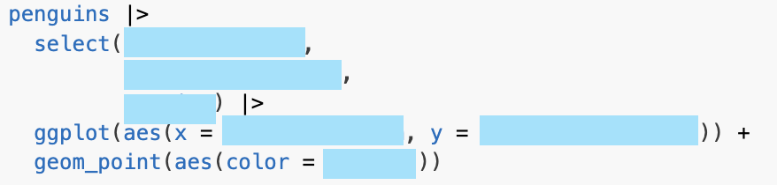
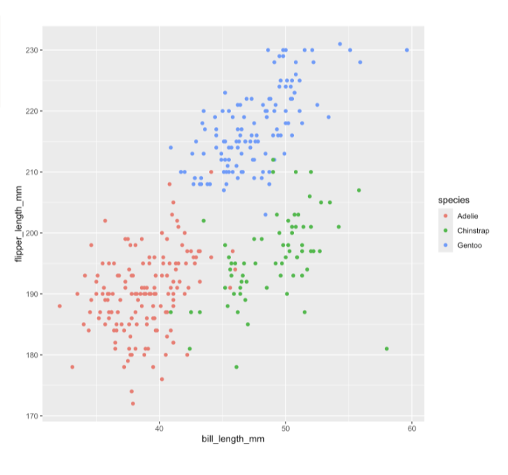
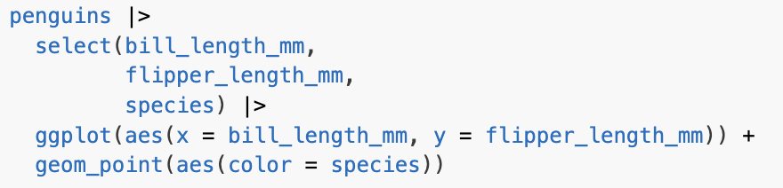

## Agenda

-   Warmup
-   Review: DataViz
-   Closeread
    -   How can we best present complex visual information to a reader?
-   5th Quarto Publication

```{r include = FALSE}
library(tidyverse)

# use this code chunk to import your data

```

# Warmup

How would you fill in this code to output this graph? Talk to a partner.

```{r}
#| echo: false
countdown::countdown(3, top = 0)
```

::::: columns
::: column

:::

::: column

:::
:::::

<!-- end columns -->

## Warmup Solution

::::: columns
::: column

:::

::: column

:::
:::::

<!-- end columns -->

# DataViz Review

`ggplot()` builds a plot layer by layer, each one added on top of one another with `+` (not `|>`).

-   `ggplot()` creates canvas
-   `aes()` creates mappings, called inside `ggplot()` or a `geom()`
-   `geom_()` puts down marks using declared geometry

## DataViz Review: Common `aes()`

::::: columns
::: {.column .fragment width="50%"}
-   `x`
-   `y`
-   `color`
-   `fill`
:::

::: {.column .fragment width="50%"}
-   `size`
-   `shape`
-   `alpha`
:::
:::::

## DataViz Review: Common `geom()`

::::: columns
::: {.column .fragment width="50%"}
-   `geom_point()`
-   `geom_bar()` / `geom_col()`
-   `geom_line()`
:::

::: {.column .fragment width="50%"}
-   `geom_histogram()`
-   `geom_density()`
-   `geom_boxplot()`
-   `geom_violin()`
:::
:::::

# Presenting complex visual information to a reader

\

A solution:

\

> Quarto-based Closeread Scrollytelling is a web design technique that uses visual and textual elements to tell a story as the reader scrolls through a page.

## Examples

*New York Times* Close-Reads

<https://www.nytimes.com/interactive/2021/arts/close-read.html>

. . .

\

Prof. Sanchez's example:

<https://www.gastonsanchez.com/learn-closeread/examples/example7/>

## Talk to a partner

What kinds of projects could you use Scrollytelling for?

```{r}
#| echo: false
countdown::countdown(3, top = 0)
```

-   Explaining complex data step by step

-   Teaching people how to read a chart or analyze an image

-   Revealing patterns, causality, etc

-   Communicating uncertainty and statistical methodology

-   Make research accessible to non-analysts

# Anatomy of Closeread docs

## How does the Closeread template look?

Basic components:

1.  Change the ***format*** in the YAML header
2.  Specify what part of the content will constitute a Closeread ***section***
3.  Indicate what elements (e.g. text, images, code) will become the ***sticky*** item (i.e. the component that will get stuck as we scroll through the page)
4.  Include a ***trigger*** among the narrative to cause the sticky to appear

## How does the Closeread template look?

To make a ***section*** and ***sticky*** item, we use a ***fenced div***, which we have previously used to create columns, incremental lists, and callouts:

-   Starts with a fence containing at least three consecutive colons plus some attributes

-   The Div ends with another line containing a string of at least three consecutive colons

``` {.markdown code-line-numbers="false"}
::: {.callout}
Here is a callout.
:::
```

## Anatomy of Closeread docs

``` {.markdown code-line-numbers="false"}
---
title: "Closeread story"
format: closeread-html
---

:::: {.cr-section}
Some interesting narrative 

::: {#cr-sticky}

:::

Trigger a sticky element @cr-sticky
::::
```

## 1. YAML Header

```         
-   `format: closeread-html`
```

## 2. Closeread Section

``` {.markdown code-line-numbers="false"}
:::: {.cr-section}

::::
```

-   Add narrative elements here:

``` {.markdown code-line-numbers="false"}
:::: {.cr-section}
Some interesting narrative
::::
```

## 3. Create Sticky elements

``` {.markdown code-line-numbers="false"}
:::: {.cr-section}
Some interesting narrative

::: {#cr-sticky}

:::
::::
```

## 4. Trigger sticky elements

``` {.markdown code-line-numbers="false"}
:::: {.cr-section}
Some interesting narrative

::: {#cr-sticky}

:::

Trigger a sticky element @cr-sticky
::::
```

# Your Turn

# Installing Closeread Extension

## Folder `stat133/`

``` {.markdown code-line-numbers="false"}
  stat133/
    labs/
        lab1/
        ...
        lab5/
    psets/
        pset1/
        ...
        pset4/
```

## Terminal in IDE

1)  Launch your IDE (Positron or RStudio)

2)  Launch your [Terminal]{.bold-hilit} (next to the *Console* tab)

3)  `cd` to your `stat133/labs/` folder

4)  create a folder for this lab: `mkdir lab6`

5)  `cd` to `lab6`

## Installing Closeread extension

In order to render a quarto document as a **closeread** document you need the closeread quarto extension (ideally in your working directory).

\

. . .

BTW: Quarto extensions are the equivalent of R packages.

## Installing Closeread extension

Run the following command in your working directory

``` {.markdown filename="Terminal" code-line-numbers="false"}
quarto add qmd-lab/closeread
```

. . .

\

You will be prompted with the following (type **Yes**)

```         
? Do you trust the authors of this extension (Y/n) ›
```

. . .

```         
? Would you like to continue (Y/n) › 
```

. . .

```         
? View documentation using default browser? (Y/n) › 
```

# Download Template

## 

Go to bCourses:

Files tab \> lab-materials \> lab6-quarto-closeread1

\

. . .

Download template file: `closeread-template.qmd`

<https://bcourses.berkeley.edu/courses/1551809/files/folder/lab-materials/lab6-quarto-closeread1>

\

. . .

Copy or move template file to your `lab6/` directory.

## 

::: callout-important
Make sure the template file `closeread-template.qmd` and the closeread extension are in the same working directory!
:::

\

. . .

Your `lab6/` folder should look like this:

``` {.markdown code-line-numbers="false"}
lab6/
  _extensions/
  closeread-template.qmd
```

\

. . .

Open the template file and preview it.

# Quarto Pub

We'll use the `mpg` data frame from `"ggplot2"` which is part of *tidyverse*.\

Your task:

-   Make a graphic of your choice using the `mpg` data

-   Create a scrollytelling document to reveal a trend in your graphic

-   Use at least 3 zoom scenes\

## Open a new qmd file

Copy the YAML header of the closeread template to your qmd file.

``` {.markdown filename="mycloseread.qmd" code-line-numbers="false"}
---
title: "My First Closeread Story"
author: "Your Name"
format: 
  closeread-html:
    theme: cosmo
    cr-style:
      section-background-color: white
      narrative-background-color-sidebar: black
      narrative-text-color-sidebar: white
      narrative-font-size: 2em
embed-resources: true
---
```

## Insert a setup code chunk

``` r
#| label: setup
#| include: false
# load packages and/or import data
library(tidyverse)
```

\

This is intended to load any required packages and/or to import external data files (e.g. data sets).

## Closeread Section

Include a pair of fenced elements to define the [closeread section]{.bold-hilit}

``` {.markdown code-line-numbers="false"}
:::: {.cr-section}


::::
```

## Sticky element

Define a sticky element.

``` {.markdown code-line-numbers="false"}
::: {#cr-plot1}

:::
```

\

Inside the sticky element, insert a code chunk to make a ggplot graphic of your choice, based on `mpg` data

``` r
ggplot(data = mpg,
       aes(...)) +
  geom_????()
```

## Trigger sticky element

Inside the closeread section, but outside the sticky element, write some narrative and [trigger]{.hilit} the sticky previously defined `@cr-plot1`

\

And then preview or render your quarto closeread.