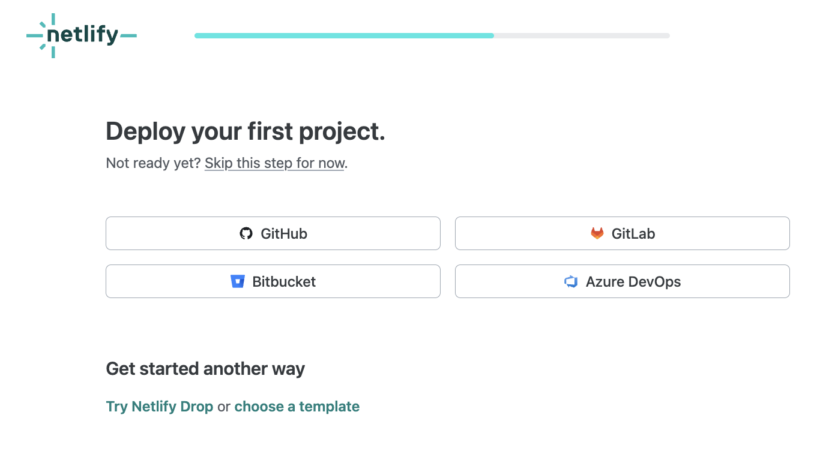
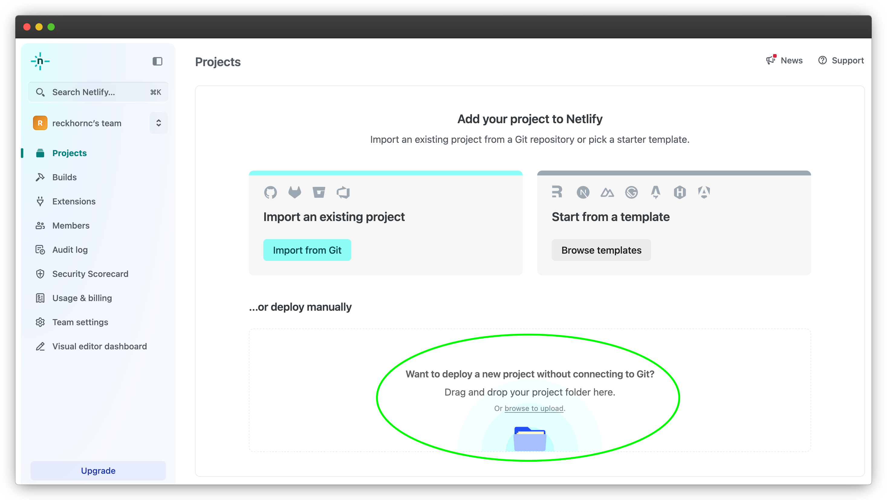
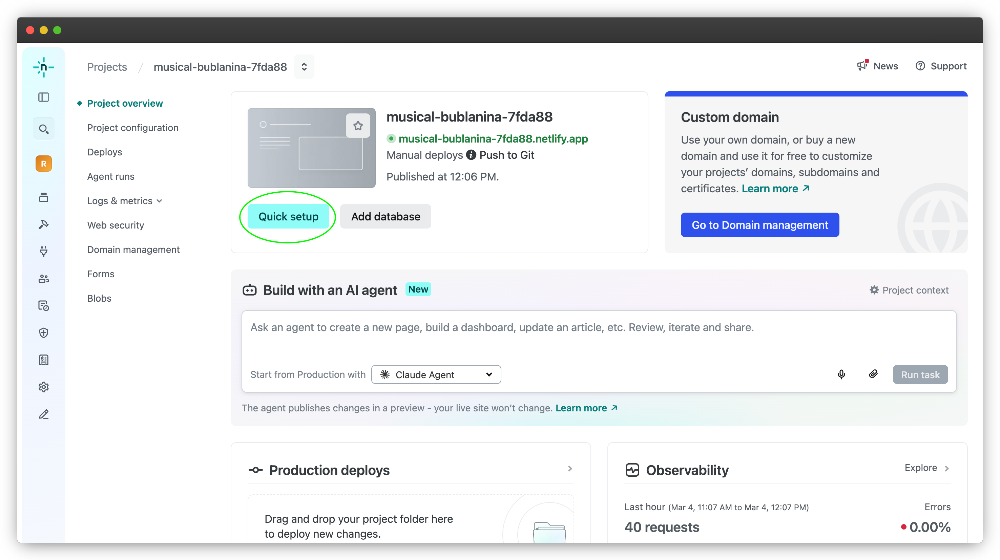

# Agenda

-   Quiz 3
-   Overview: Netlify
-   Quarto Scrollytelling
    -   How can we improve storytelling?
-   6th Quarto Publication

# Before the Quiz

::: callout-important
A note on academic integrity:
:::

\
Cheating is **100% not tolerated**. Talking with other individuals during the quiz, using your phone for any reason, looking at others' answers, etc. will result in a violation of the Academic Integrity Pledge. We reserve the right to give a 0 to anyone seen cheating.

## Before the Quiz

::: nonincremental
1.  Spread out as much as possible.
2.  🚽 If you need to use the bathroom, this is the time to do it.
3.  🧹 Clear your desk of everything except a pen/pencil and your ID.
4.  🧢 Remove hats, hoods, and sunglasses (don't hide your face please!)
5.  📱 All electronic devices (laptop, phone, airbuds, smart watch) should remain in your bag for the entire quiz period.
:::

## Quiz

```{r}
countdown::countdown(35, top = 0)
```

::: nonincremental
1.  Please be quiet.
2.  When you get a quiz, do not begin until we tell you so.
3.  Write your name and SID.
4.  Keep your eyes on your own quiz.
5.  Only one person allowed to use the bathroom at a time.
6.  If you finish early, please hold on to your quiz and wait.
7.  When the timer ends, hold up your quiz in the air immediately and put your writing utensils down or risk a 0.
:::

Good luck! 🍀

# Lab 7

# Netlify

*Our workaround for QuartoPub:* \ 

Netlify is a cloud hosting platform that makes it easy to publish static websites, including HTML documents generated from tools like R Markdown, Quarto, Typst, or plain HTML. Basically: \ 

> A service that takes your rendered HTML files and puts them online with a public URL.

## Basic Workflow

```{.markdown code-line-numbers="false"}
You write .qmd file
        ↓
Quarto renders → HTML
        ↓
Netlify hosts the HTML
        ↓
Public link you can submit/share
```

## Set Up {.smaller}

- Log in to [Netlify](https://app.netlify.com/) with Google using your Berkeley credentials

- Enter your name, use case, etc and click 'Continue to deploy'

- At 'Deploy your first project', click 'skip this step for now'



## Set Up {.smaller}



- Once you've created and finished your `.qmd` file for today's publication, you will drag and drop the rendered `.html` version into this box. \ 
- At 'Rename to index.html?', click 'Rename and deploy'

## Set Up {.smaller}


- Click on 'Quick Setup' \ 

- Under 'Project Name', rename the project to 'Your-Name-Pub6' \ 

- Now the project is publicly available online under Your-Name-Pub6.netlify.app!


# What is Scrollytelling?

**Scrollytelling** combines:

-   Narrative text

-   Visualizations

-   Scroll-triggered transitions

## Why Use Visual Effects?

Now that we’ve seen various introductory examples, we should take the next step and discuss the so-called **focus effects**.

> 'focus effects' = what you use to guide your readers’ attention to certain aspects of your stickies

## Focus Effects

Below is an abstract example:

``` {.markdown code-line-numbers="false"}
Trigger without focus effect @cr-sticky

Trigger with some focus effect [@cr-sticky]{effect="..."}
```

The reason why an effect is attached to a trigger is because a trigger is what Closeread uses to decide what to do with a sticky.

## Syntax to Specify Focus Effects

The syntax to specify a focus effect is the following:

-   You wrap the trigger `@cr-sticky` with brackets: `[@cr-sticky]`

-   You append an attribute effect using braces `[@cr-sticky]{effect="..."}`

-   Inside the braces, you specify the name of the effect, followed by the equals sign `=`, followed by the **value** of the effect surrounded in quotes `"..."`

## Available Effects in Closeread

Closeread comes with a handful of focus effects, and we will focus on:

-   **Scaling**: the `scale-by` effect is used to shrink or enlarge the size of a sticky (e.g. text, equations, images, code).

-   **Panning**: the `pan-to` effect is used to move a sticky up-down, and left-right, or if you prefer north-south, east-west (e.g. text, equations, images, code).

## Syntax: Scaling

The scaling effect works on text (including math equations, and code) and images. Keep in mind that you include this focus effect by attaching it to a trigger, for example:

``` {.markdown code-line-numbers="false"}
Normal scale @cr-sticky

Shrinking effect [@cr-sticky]{scale-by="0.5"}

Enlarging effect [@cr-sticky]{scale-by="2"}

Normal size again @cr-sticky
```

## {background-image="images/scaling-browser.png" background-size="contain" background-position="center"}

## Syntax: Panning

To move a sticky element you use the pan-to effect, e.g.  [@cr-sticky]{pan-to="10%,0%"}

``` {.markdown code-line-numbers="false"}

Normal position @cr-sticky

Panning to the left [@cr-sticky]{pan-to="-10px,0px"}

Panning to the right [@cr-sticky]{pan-to="0px,10px"}

Normal position again @cr-sticky

```

## {background-image="images/panning-browser.png" background-size="contain" background-position="center"}

## Demo

Example of visual effects


## More Scrollytelling Effects

[DataViz example](https://www.gastonsanchez.com/learn-closeread/examples/example7/) \ 

Incrementally reveal portions of a graph by: \ 

- Using the scrollytelling format \ 

- Creating separate versions of the graph which incrementally add elements \ 

- Using scrollytelling sections to wrap each graph and trigger them to give the impression of an incremental reveal

## Demo

Example of incrementally revealing a graph

# Your Turn {.smaller}

Create a scrollytelling document that either includes:

::: {.columns}
::: {.column}

*Option 1:*

- Panning and Scaling effects \ 

- 3 separate elements: image, graph, and table \ 

:::
::: {.column}

or *Option 2:*

- An incrementally revealed graph \ 

- 3 separate stages of the graph \

:::
:::
<!-- end columns -->

Choose a dataset (from baseR or tidyverse) to make your graphics with, such as `iris`, `mtcars`, `airquality`, `economics`, `mpg`, etc. If you are running low on time, you can reuse your closeread doc from last week and add visual effects. \ 
*Hint:* you may need to install the closeread extension to your working directory again like last week.


## Submission to BCourses

Submit the Netlify URL (link) of your published document to the corresponding assignment in bCourses.

See [Assignments tab \> Quarto Publications \> Pub6]{.bold-hilit}

# Problem Set 6

## Pset 6

Available in bCourses:

See [Assignments tab \> Problem Sets \> PS6]{.bold-hilit}

You'll find 2 files:

-   `ps6.html`: instructions

-   `ps6.qmd`: template file to write your answers

. . .

In case of trouble: Go to Files tab, folder `problem-sets`, folder `ps6`, and download the `qmd` file.

Sometimes Safari blocks or denies you access. If this is the case you may want to use another browser (e.g. Chrome).

## Pset 6 Submission

-   Submit your `qmd` and `html` files to bCourses.
-   Use assignment problem set **ps5**
-   Graded credit / no-credit
-   Credit for evidence of earnest engagement (just don't submit a blank or empty template file)