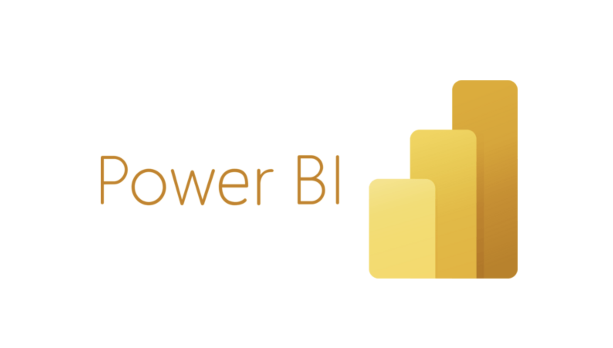
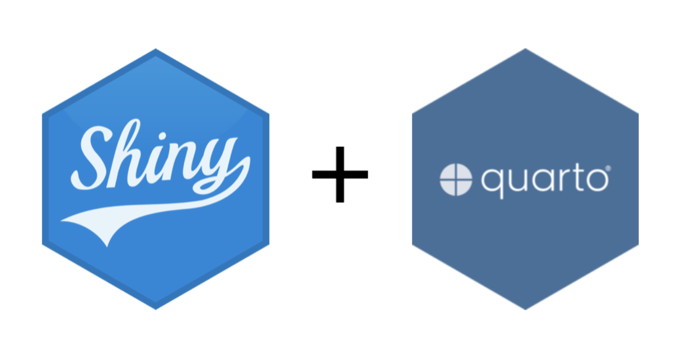
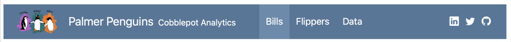

# Agenda

-   Overview: Dashboards
-   7th Quarto Publication

## Data Dashboards {auto-animate=true}

A *Data Dashboard* is an interactive display of selected statistics and plots to allow the user to quickly monitor, explore, and understand patterns in data.

Used for:

::: {.columns}
::: {.column}
1. **Real-time Monitoring**
   - [California Power Outages Map](https://www.arcgis.com/apps/dashboards/2f50a16613fa4f7f801b27a09a0be241){preview-link=true}
   - [TikTok Personal Analytics](https://app.coupler.io/templates/ee4a4932-66c9-4f16-a6f5-0776bad4922f/preview?originpath=%2Ftiktok-analytics-dashboard%2F%2C%2Ftiktok-analytics-dashboard%2F)
   - [Fremont Climate Action](https://www.fremont.gov/government/citywide-initiatives/data-dashboards/climate-action-dashboard){preview-link=true}
:::
::: {.column .fragment}
2. **Data Exploration**
   - [COVID 19 Data Explorer](https://ourworldindata.org/explorers/covid?Metric=Excess+mortality+%28estimates%29&Interval=Cumulative&Relative+to+population=true&country=USA~BRA~JPN~DEU){preview-link=true}
   - [TikTok Business](https://ads.tiktok.com/business/en-US/insights){preview-link=true}
   - [CalViz Degrees](https://calviz.berkeley.edu/t/OPAP/views/DegreeRecipientsByMajor/ExecutiveSummary)
:::
:::


## Tools for Dashboards

{.fragment .absolute top=150 left=30 width=600}

{.fragment .absolute top=-30 left=800 width=600}

{.fragment .absolute top=520 left=30 width=600}

{.fragment .absolute top=500 left=800 width=600}


# Let's Try it Out! 

## Links:

*Documentation:* <https://quarto.org/docs/dashboards/>

*Demo Dashboard:* Log into Bcourses and find the `.qmd` under Assignments > Pub7

::: notes
Click on link yourself and edit the dashboard on DataHub. First steps:

1. Render the doc as is and discuss how there are code cells that run and show but no output.
1. Have them add their name as author (so you can tell their submissions apart).
1. Run quarto publish to publish the HTML file.
1. Ask a student for their URL and project it to show that it is indeed publicly available.
2. Add format: dashboard.
:::

# Anatomy of a Dashboard


## 

<div style="position:relative; width:100%; height:80vh;">
  <iframe
    src="https://jjallaire.github.io/customer-churn-dashboard/"
    style="position:absolute; top:0; left:0; width:100%; height:100%; border:none;"
  ></iframe>
</div>


## 

<div style="position:relative; width:100%; height:80vh;">
  <iframe
    src="https://ivelasq.github.io/mortgage-dashboard/"
    style="position:absolute; top:0; left:0; width:100%; height:100%; border:none;"
  ></iframe>
</div>


## Navbar

{fig-align="center"}

. . .

```markdown
--- 
title: "Palmer Penguins"
author: "Cobblepot Analytics"
format: 
  dashboard:
    logo: images/penguins.png
    nav-buttons: [linkedin, twitter, github]
---
```

<https://quarto.org/docs/reference/projects/websites.html#nav-items>{preview-link=true}


## Layout

- Define new row with `## Row`, new column with `## Column`
- Nest one inside the other using `###` for child (e.g. `### Column`)
- Defaults to row-by-row layout. Change by using

. . .

```markdown
---
format:
  dashboard:
    orientation: columns
---
```

- In general, each code cell creates one card
- Tune dimensions by adding e.g. `## Row {height=30%}`


## Layout by row {.smaller}

. . .

::: {.columns}
::: {.column}

````markdown
---
format: dashboard
---
    
## Row {height=70%}

```{{r}}
```

## Row {height=30%}

```{{r}}
```

```{{r}}
```
````
:::
::: {.column}
:::
:::

## Layout by column {.smaller}

. . .

::: {.columns}
::: {.column}
````markdown
---
format: 
  dashboard:
    orientation: columns
---
    
## Column {width=60%}

```{{r}}
```

## Column {width=40%}

```{{r}}
```

```{{r}}
```
````
:::
::: {.column}
:::
:::

## Your turn

1. Add four empty cards to your document by adding inserting four blank code cells at the bottom.
2. Arrange them in a 2 x 2 grid layout.



# Data Display

## Plots {.smaller}

. . .

You can insert graphics from ggplot, base R, or an interactive library. It can be helpful to tweak `fig-width` and `fig-height`.

. . .

::: {.columns}
::: {.column}

````markdown
## Row {height="65%"}

```{{r}}
#| fig-width: 10
#| fig-height: 8
plot(cars)
```

## Row {height="35%"}
        
```{{r}}
#| fig-width: 5
#| fig-height: 4
plot(pressure)
```
    
```{{r}}
#| fig-width: 5
#| fig-height: 4
plot(airmiles)
```
````
:::
::: {.column}
:::
:::

## Tables {auto-animate=true}

1. Static table: `gt::gt`, `knitr::kable()`.
1. Interactive table: `DT::datatable()`


## `kable()` {.smaller}

```{r}
#| echo: true
library(knitr)
kable(mtcars)
```


## `datatable()` {.smaller}
```{r}
#| echo: true
library(DT)
datatable(mtcars)
```


## Value boxes

You can create a dynamic value box using the following.

````markdown
```{{r}}
#| component: valuebox
#| title: My big number
list(
  icon = "stopwatch",
  color = "primary",
  value = x
)
```
````

## Blank Cards

. . .

You can create a blank card to fill with anything (code, images, markdown) using:

```markdown
::: {.card}
Gapminder combines data from multiple sources into
unique coherent time-series that can’t be found
elsewhere. Learn more about the Gampminder dataset at
<https://www.gapminder.org/data/>.
:::
```

## Your Turn

Display the data on earthquakes in your dashboard according to the following layout.




## Pages {.smaller}

Split your dashboard into multiple pages by adding level one headers with the page name. This example uses two pages, "Bills" and "Flippers", that will be linked in the navbar.

::: {.columns}
::: {.column}
````markdown
---
title: "Palmer Penguins"
format: dashboard
---
    
# Bills 

```{{r}}
```

# Flippers

## Column

```{{r}}
```

```{{r}}
```

## Column 

```{{r}}
```
````
:::
::: {.column}
:::
:::

# Your Turn

You will create your own dashboard document with 3 pane elements (a table, a graph, and a summary)

## 1. Create New Folder in `stat133/`

Begin the same way as always: \

``` {.markdown code-line-numbers="false"}
  stat133/
    labs/
        lab1/
        ...
        lab5/
    psets/
        pset1/
        ...
        pset5/
```

## Terminal in IDE

1)  Launch your IDE (Positron or RStudio)

2)  Launch your [Terminal]{.bold-hilit} (next to the *Console* tab)

3)  `cd` to your `stat133/labs/` folder

4)  create a folder for this lab: `mkdir lab7`

5)  `cd` to `lab7`

## 2. Your Task: Quarto Dashboard

You will: 

- Decide a research question to explore \

- Build a dashboard explaining a pattern in the data \

- Include at least 3 elements: a research question, a graph, a table, and a report summary \

## 3. Open a new qmd file

Copy the YAML header of the demo dashboard to your qmd file.

``` {.markdown filename="mydash.qmd" code-line-numbers="false"}
---
title: "My First Quarto Dashboard"
author: "Your Name"
format: 
  dashboard
embed-resources: true
---
```

## 4. Insert a setup code chunk

This chunk loads required packages and runs before the document renders.

``` r
#| label: setup
#| include: false
# load packages and/or import data
library(tidyverse)
```

## 5. Choose a Research Question

Choose a dataset (from baseR or tidyverse) to make your graphics with, such as `iris`, `mtcars`, `airquality`, `economics`, `mpg`, etc.

What is an interesting trend in this data? What can be 

## 6. Create your Graphics and Dashboard

## Submission to BCourses

Submit the Netlify URL (link) of your published document to the corresponding assignment in bCourses.

See [Assignments tab \> Quarto Publications \> Pub7]{.bold-hilit}

# Problem Set 7

## Pset 7

Available in bCourses:

See [Assignments tab \> Problem Sets \> PS7]{.bold-hilit}

You'll find 2 files:

-   `ps7.html`: instructions

-   `ps7.qmd`: template file to write your answers

. . .

In case of trouble: Go to Files tab, folder `problem-sets`, folder `ps7`, and download the `qmd` file.

Sometimes Safari blocks or denies you access. If this is the case you may want to use another browser (e.g. Chrome).

## Pset 7 Submission

-   Submit your `qmd` and `html` files to bCourses.
-   Use assignment problem set **ps5**
-   Graded credit / no-credit
-   Credit for evidence of earnest engagement (just don't submit a blank or empty template file)