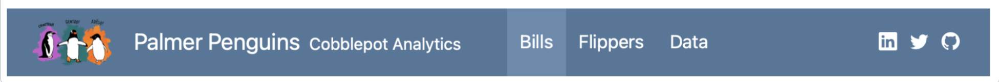
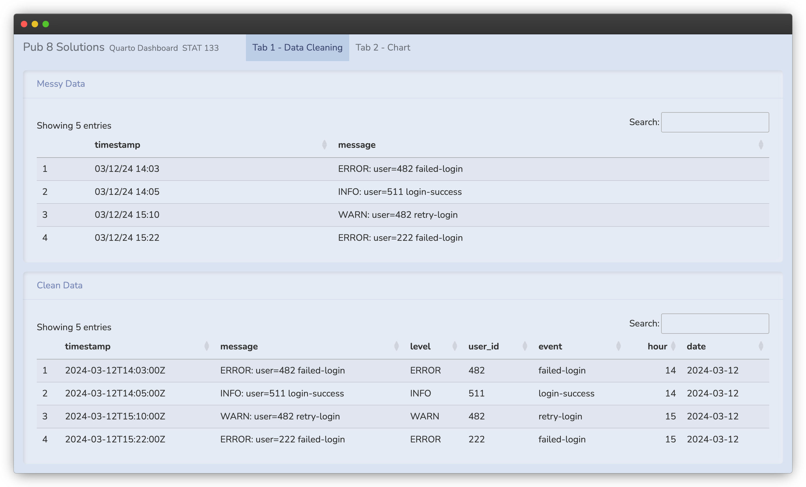

# Agenda

-   Quiz 4
-   Review: Dates+Times
-   Quarto Dashboards (continued)
-   Pub Assignment

# Before the Quiz

::: callout-important
A note on academic integrity:
:::

\
Cheating is **100% not tolerated**. Talking with other individuals during the quiz, using your phone for any reason, looking at others' answers, etc. will result in a violation of the Academic Integrity Pledge. We reserve the right to give a 0 to anyone seen cheating.

## Before the Quiz

::: nonincremental
1.  Spread out as much as possible.
2.  🚽 If you need to use the bathroom, this is the time to do it.
3.  🧹 Clear your desk of everything except a pen/pencil and your ID.
4.  🧢 Remove hats, hoods, and sunglasses (don't hide your face please!)
5.  📱 All electronic devices (laptop, phone, airbuds, smart watch) should remain in your bag for the entire quiz period.
:::

## Quiz

```{r}
countdown::countdown(35, top = 0)
```

::: nonincremental
1.  Please be quiet.
2.  When you get a quiz, do not begin until we tell you so.
3.  Write your name and SID.
4.  Keep your eyes on your own quiz.
5.  Only one person allowed to use the bathroom at a time.
6.  If you finish early, please hold on to your quiz and wait.
7.  When the timer ends, hold up your quiz in the air immediately and put your writing utensils down or risk a 0.
:::

Good luck! 🍀

# Lab 9

# Review: Dates+Times

> Dates and times represent points in time (e.g., days, hours, minutes).

They often appear as text in raw data, so we need to parse them into proper date-time formats before analysis.  

Example:

`"2024-03-12 14:05:23"`

Once converted, we can filter, sort, and summarize events over time.

## Why Dates and Times Matter

Many datasets include time information:

::::: columns
::: column
*Examples:*

-   transaction timestamps

-   website logs

-   sensor measurements

-   survey submission times
:::

::: column
*After parsing, we can analyze patterns such as:*

-   activity by **day**

-   trends over **time**

-   events by **hour**
:::
:::::

## Key Techniques for Dates and Times

Package `lubridate`

-   `ymd()` : Convert text to a **date** in year-month-day format

-   `mdy()` : Convert text in month-day-year format

-   `ymd_hms()` : Convert text to a **date-time** (year, month, day, hour, minute, second)

-   `now()` : Returns the current date and time

-   `today()` : Returns today's date

## Common Date-Time Formats

Dates can appear in many formats:

```{.markdown code-line-numbers="false"}
2024-03-12
03/12/2024
Mar 12, 2024
2024-03-12 14:05:23
```

With `lubridate` we can convert these into a standard format that R can analyze.

# Dashboards

*Last week:* Dashboard Basics \ 

\ 

*This week:* \ 

- NavBar Options

- Tabs

- Themes

- Scrolling Dashboard


## Navbar

More personalizations to explore:

{fig-align="center"}

. . .

```markdown
--- 
title: "Palmer Penguins"
author: "Cobblepot Analytics"
format: 
  dashboard:
    logo: images/penguins.png
    nav-buttons: [linkedin, twitter, github]
---
```

<https://quarto.org/docs/reference/projects/websites.html#nav-items>{preview-link=true}


## YAML Options and NavBar {.smaller}

The **navbar** appears at the top of the dashboard and helps with navigation.

```{.yaml}
---
title: "My Dashboard"
format:
  dashboard:
    logo: logo.png
    nav-buttons:
      - icon: github
        href: https://github.com/your-repo
      - icon: linkedin
        href: https://linkedin.com
---
```

| Option | Description |
|---|---|
| `logo:` | Image file shown in top-left |
| `nav-buttons:` | Icon links in the top-right corner |
| `scrolling: true` | Makes the dashboard scroll rather than fill the viewport |


## Dashboard Tabs

Use `# Tab Title` to a column/row to create tabs.

``` {.markdown code-line-numbers="false"}
---
title: "My Dashboard"
format: dashboard
---

# Tab 1

## Row 1 - Chart A

content

# Tab 2

## Row 1 - Chart B

content

```

Tabs help **organize content** across multiple views without overwhelming the reader.

## Dashboard Tabs

Example: \ 


[COVID 19 Data Explorer](https://ourworldindata.org/explorers/covid?Metric=Excess+mortality+%28estimates%29&Interval=Cumulative&Relative+to+population=true&country=USA~BRA~JPN~DEU){preview-link=true}

## Dashboard Themes

Apply a theme using the `theme:` option in the YAML header.

```{.markdown code-line-numbers="false"}
---
title: "My Dashboard"
format:
  dashboard:
    theme: morph
---
```

[Available themes](https://quarto.org/docs/output-formats/html-themes.html) (from Bootswatch)

## Putting It All Together {.smaller}

A complete dashboard YAML example:

```{.yaml}
---
title: "STAT 133 Dashboard"
format:
  dashboard:
    theme: flatly
    logo: bear.png
    scrolling: false
    nav-buttons:
      - icon: github
        href: https://github.com/stat133
---
```

## Quick Reference: Dashboard Syntax

| Element | Syntax |
|---|---|
| New tab | `# Page Title` |
| New row | `## Row` |
| Value box | `#\| content: valuebox` |
| Row height | `::: {.row height="40%"}` |
| Column width | `::: {.column width="40%"}` |
| Scrolling layout | `scrolling: true` in YAML |
| Theme | `theme: flatly` in YAML |


# Pub Assignment

With the given messy dataset, use regex and date-time tools to clean and display results in a Quarto dashboard.

- Navigate to BCourses > Pub 8 

- Download both `.qmd` files, `pub8-your-name.qmd` and `data-prep.qmd`

- Follow the instructions to prepare the data and transfer the necessary code chunks to your dashboard documents. 

- Upload your finished dashboard to Netlify and submit the link to BCourses.

## Finished Product

::: {.columns}
::: {.column}
Your finished pub should have 2 tabs: 

- Tab 1: Your data before and after cleaning

- Tab 2: A basic chart and an explanatory analysis section

View an interactive example solution [here](https://stat133-pub8.netlify.app/).
:::
::: {.column}

:::
:::
<!-- end columns -->


# Problem Set 8

## Pset 8

Available in bCourses:

See [Assignments tab \> Problem Sets \> PS8]{.bold-hilit}

You'll find 2 files:

-   `ps8.html`: instructions

-   `ps8.qmd`: template file to write your answers

. . .

In case of trouble: Go to Files tab, folder `problem-sets`, folder `ps8`, and download the `qmd` file.

Sometimes Safari blocks or denies you access. If this is the case you may want to use another browser (e.g. Chrome).

## Pset 8 Submission

-   Submit your `qmd` and `html` files to bCourses.
-   Use assignment problem set **ps8**
-   Graded credit / no-credit
-   Credit for evidence of earnest engagement (just don't submit a blank or empty template file)