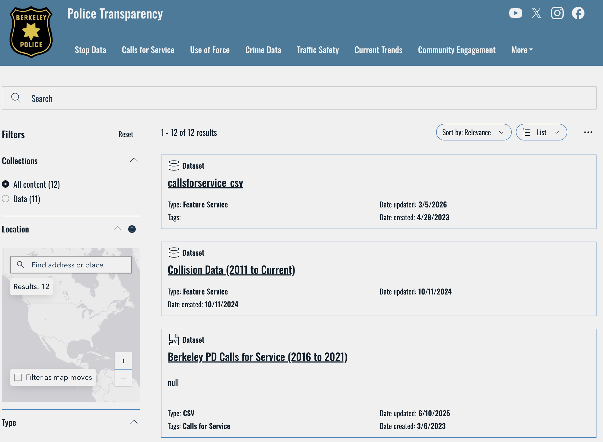
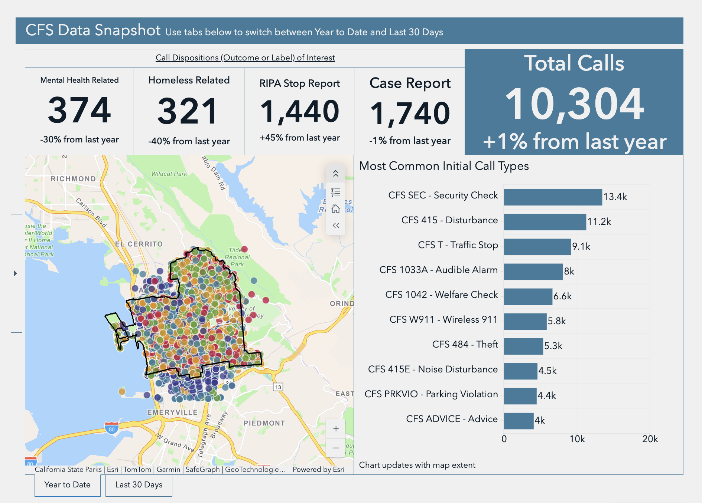
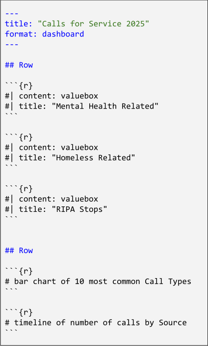
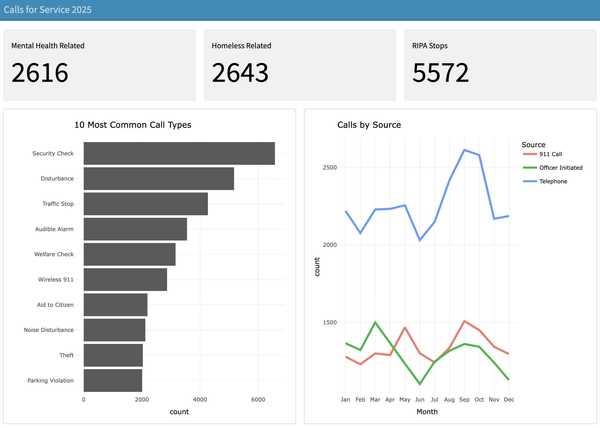

```{r setup, include=FALSE}
knitr::opts_chunk$set(echo = TRUE, error = TRUE)
library(tidyverse)
library(dygraphs)
```


# Berkeley Police Transparency Hub

<https://bpd-transparency-initiative-berkeleypd.hub.arcgis.com/>


## {background-image="images/transparency-hub-website1.jpg" background-size="contain"}

# Calls For Service

<https://bpd-transparency-initiative-berkeleypd.hub.arcgis.com/pages/46dfef2f4ecd453ba7b7ff74c8318aee>

## CFS Dashboard Page

The Calls for Service Page contains 2 dashboards:

1) CFS Data Snapshot

2) CFS Data Dashboard

## {background-image="images/cfs-dashboard-page2.png" background-size="contain"}


## Calls for Service (CFS) Data {.smaller .nostretch}

{fig-align="center" width="60%"}

Data from 2021-present is available in [callsforservice_csv]{.bold-hilit}

<https://bpd-transparency-initiative-berkeleypd.hub.arcgis.com/datasets/3be134af40954e19a3d308779a65f175_0/explore>


## Data `callsforservice_csv`

:::: {.columns}
::: {.column .nonincremental width="50%"}
- `Incident_Number`
- `CreateDatetime`
- `Call_Type`
- `Source`
- `Progress`
- `Priority`
:::

::: {.column .nonincremental width="50%"}
- `Dispositions`
- `Block_Address`
- `City`
- `ZIP_Code`
- `NonBerkeley_Address`
- `ObjectId`
:::
::::

\

I've curated a CSV file `callsforservice_2025.csv` available in bCourses:

<https://bcourses.berkeley.edu/courses/1551809/files/folder/misc>


## `callsforservice_2025.csv` {.smaller}

```{r}
cfs <- read_csv("callsforservice_2025.csv")

select(cfs, Incident_Number, CreateDatetime, Dispositions, Source)
```


## {.smaller}

```{r}
select(cfs, Incident_Number, CreateDatetime, Source) |> slice_head(n=6)
```


\

```{r}
select(cfs, Incident_Number, Call_Type, Dispositions) |> slice_head(n=6)
```


## Snapshot Dashboard (revisited)

{width="80%" fig-align="center"}


## Comments

- Focus on value boxes:
    + Mental Health Related
    + Homeless Related
    + RIPA Stop
- Let's ignore the map; replace it with timeline of calls by Source
- Bar chart of 10 most comon Call Types


# Regex & Date-Times

##

```{r}
cfs |> select(CreateDatetime) |> slice_head(n = 4)
```

. . .

```{r}
# converting CreateDatetime to "datetime" type
cfs <- mutate(cfs, CreateDatetime = as_datetime(CreateDatetime))

cfs |> select(CreateDatetime) |> slice_head(n = 4)
```


## Dispositions

::: {.nonincremental}
+ Mental Health Related
+ Homeless Related
+ RIPA Stop
:::


## {.smaller}

```{r}
#| output-location: fragment
# Mental Health Related
cfs |> 
  filter(str_detect(Dispositions, "Mental")) |> 
  count()
```

. . .

```{r}
#| output-location: fragment
# Homeless Related
cfs |> 
  filter(str_detect(Dispositions, "Homeless")) |> 
  count()
```

. . .

```{r}
#| output-location: fragment
# RIPA Stop
cfs |> 
  filter(str_detect(Dispositions, "RIPA")) |> 
  count()
```


##

```{r}
#| output-location: fragment
# counting dispositions of interests
dispositions <- cfs |> 
  summarize(
    mental = sum(str_detect(Dispositions, "Mental"), na.rm = TRUE), 
    homeless = sum(str_detect(Dispositions, "Homeless"), na.rm = TRUE),
    ripa = sum(str_detect(Dispositions, "RIPA"), na.rm = TRUE))

dispositions
```


## 10 most common Call Types

```{r}
#| code-fold: true
cfs |> 
  filter(Source %in% c("911 Call",
                       "Telephone",
                       "Officer Initiated")) |> 
  count(Call_Type, name = "count", sort = TRUE) |> 
  slice_head(n = 10)
```


## 10 most common Call Types

```{r}
#| code-fold: true
cfs |> 
  filter(Source %in% c("911 Call",
                       "Telephone",
                       "Officer Initiated")) |> 
  count(Call_Type, name = "count", sort = TRUE) |> 
  slice_head(n = 10) |> 
  ggplot(aes(x = count, y = reorder(Call_Type, count))) +
  geom_col() +
  labs(title = "10 Most Common Call Types",
       x = "count",
       y = "") +
  theme_minimal()
```


## Calls by Source

Interest in the following `Source` categories:

- `911 Call`
- `Telephone`
- `Officer Initiated`


##

```{r}
#| output-location: fragment
cfs |> 
  filter(Source %in% c("911 Call",
                       "Telephone",
                       "Officer Initiated")) |> 
  count(Source)
```


## {auto-animate=true}

```{r}
cfs |> 
  filter(Source %in% c("911 Call",
                       "Telephone",
                       "Officer Initiated")) |> 
  mutate(Month = month(CreateDatetime)) |> 
  count(Source, Month)
```


##

```{r}
#| code-fold: true
cfs |> 
  filter(Source %in% c("911 Call",
                       "Telephone",
                       "Officer Initiated")) |> 
  mutate(Month = month(CreateDatetime)) |> 
  count(Source, Month) |> 
  ggplot(aes(x = Month, y = n, color = Source)) +
  geom_line() +
  labs(title = "Calls by Source",
       y = "count") +
  scale_x_continuous(breaks = 1:12) +
  theme_minimal() +
  theme(legend.position = "bottom")
```


# Dashboard

##

:::: {.columns}
::: {.column width="35%"}

:::

::: {.column .fragment width="65%"}

:::
::::


## 

```{{r}}
#| content: valuebox
#| title: "Mental Health Related"
list(color = "secondary", value = dispositions$mental)
```
. . .

\

```{{r}}
#| content: valuebox
#| title: "Homeless Related"
list(color = "secondary", value = dispositions$homeless)
```

. . .

\

```{{r}}
#| content: valuebox
#| title: "RIPA Stops"
list(color = "secondary", value = dispositions$ripa)
```

##

```{{r}}
# bar chart of 10 most common Call Types
ggplotly(
  cfs |> 
  filter(Source %in% c("911 Call",
                       "Telephone",
                       "Officer Initiated")) |> 
  count(Call_Type, name = "count", sort = TRUE) |> 
  slice_head(n = 10) |> 
  ggplot(aes(x = count, y = reorder(Call_Type, count))) +
  geom_col() +
  labs(title = "10 Most Common Call Types",
       x = "count",
       y = "") +
  theme_minimal())
```


##

```{{r}}
# timeline of number of calls by Source
ggplotly(
  cfs |> 
  filter(Source %in% c("911 Call",
                       "Telephone",
                       "Officer Initiated")) |> 
  mutate(Month = month(CreateDatetime)) |> 
  count(Source, Month) |> 
  ggplot(aes(x = Month, y = n, color = Source)) +
  geom_line(linewidth = 1.2) +
  labs(title = "Calls by Source",
       y = "count") +
  scale_x_continuous(breaks = 1:12, labels = month.abb) +
  theme_minimal() +
  theme(legend.position = "bottom")
)
```