```{r setup, include=FALSE}
knitr::opts_chunk$set(echo = TRUE, error = TRUE)
library(tidyverse)
```


## Agenda

- Dashboards with Shiny

- Shiny elements


# Dashboard with Shiny

## Old Faithful {background-color="black" background-image="images/old-faithful.jpg" background-repeat="no-repeat"}

##

<iframe width="1100" height="800" src="https://www.youtube.com/embed/4In-VEMmX_8?si=-jSzL4HZOQE_Wwv7" title="YouTube video player" frameborder="0" allow="accelerometer; autoplay; clipboard-write; encrypted-media; gyroscope; picture-in-picture; web-share" referrerpolicy="strict-origin-when-cross-origin" allowfullscreen></iframe>


## Old Faithful Geyser Data

```{r}
#| output-location: fragment
head(faithful, n = 10)
```

\

- `eruptions`: time of eruption (min)
- `waiting`: waiting time till next eruption (min)


##

```{r}
#| output-location: fragment
ggplot(data = faithful, aes(x = waiting)) +
  geom_histogram(bins = 30, color = "white") +
  theme_minimal()
```


## {background-image="images/shiny-old-faithful1.png" background-size="contain"}

## {background-image="images/quarto-dashboard-shiny1.png" background-size="contain"}

## {background-image="images/quarto-dashboard-shiny2.png" background-size="contain"}

## {background-image="images/quarto-dashboard-shiny3.png" background-size="contain"}

## {background-image="images/quarto-dashboard-shiny4.png" background-size="contain"}

## {background-image="images/quarto-dashboard-shiny5.png" background-size="contain"}

## {background-image="images/quarto-dashboard-shiny6.png" background-size="contain"}

## {background-image="images/quarto-dashboard-shiny7.png" background-size="contain"}

# Understanding the Architecture

## {.nostretch}

Every Shiny app is maintained by a computer[^1] running R

\

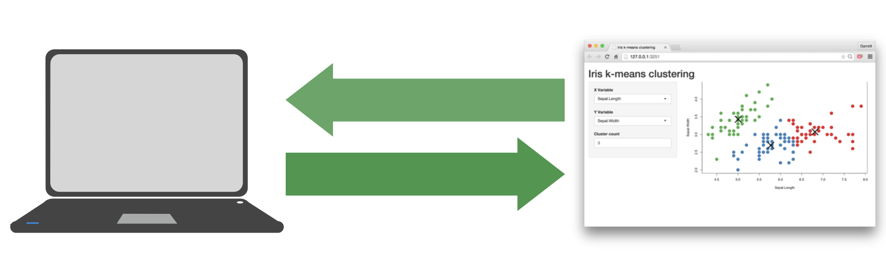{width="70%" fig-align="center"}

[^1]: Shiny app run locally on your computer.


## {.nostretch}

Every Shiny app is maintained by a computer[^2] running R

\

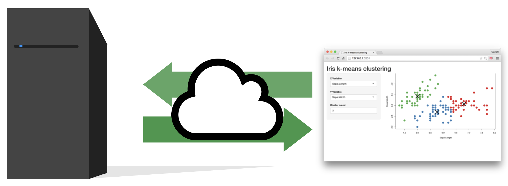{width="70%" fig-align="center"}

[^2]: Shiny app run on the "cloud" (i.e. remote server)


## {.nostretch}

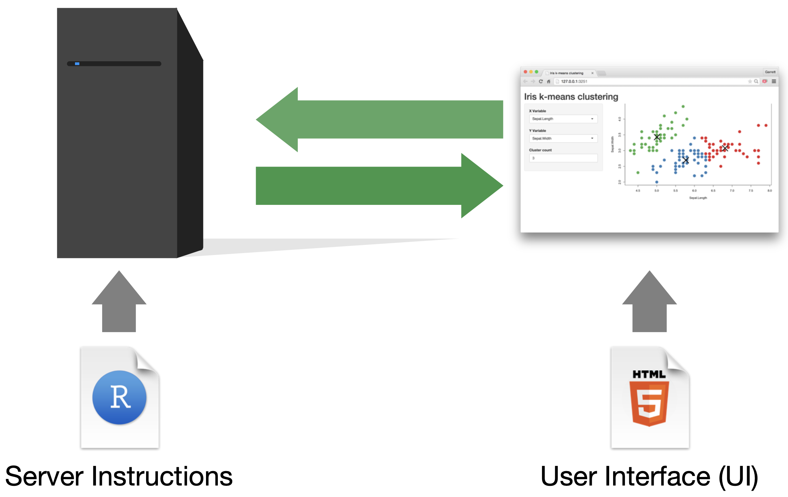{width="80%" fig-align="center"}


## {.nostretch}

Build your app around [__inputs__]{style="color: green;"} and outputs

. . .

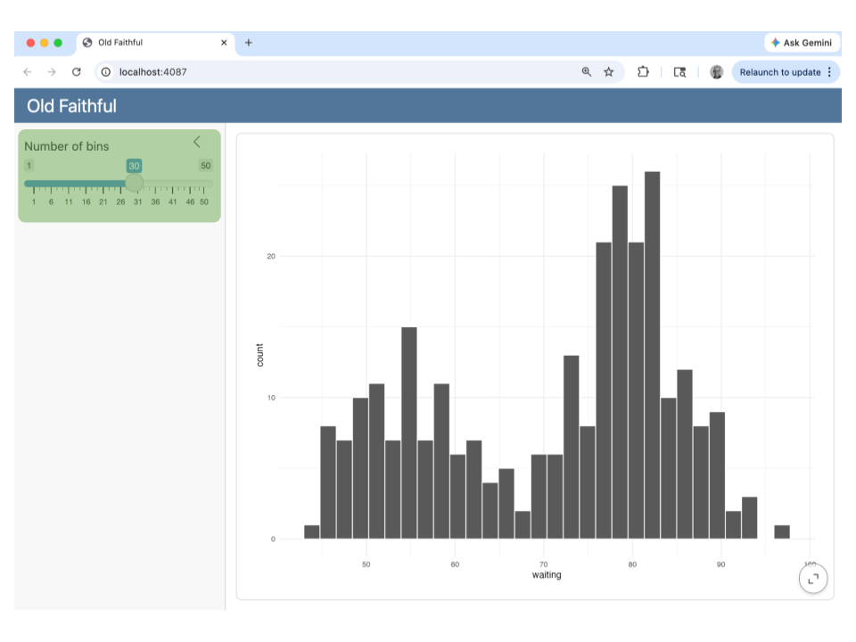{width="73%" fig-align="center"}


## {.nostretch}

Build your app around inputs and [__outputs__]{style="color: blue;"}

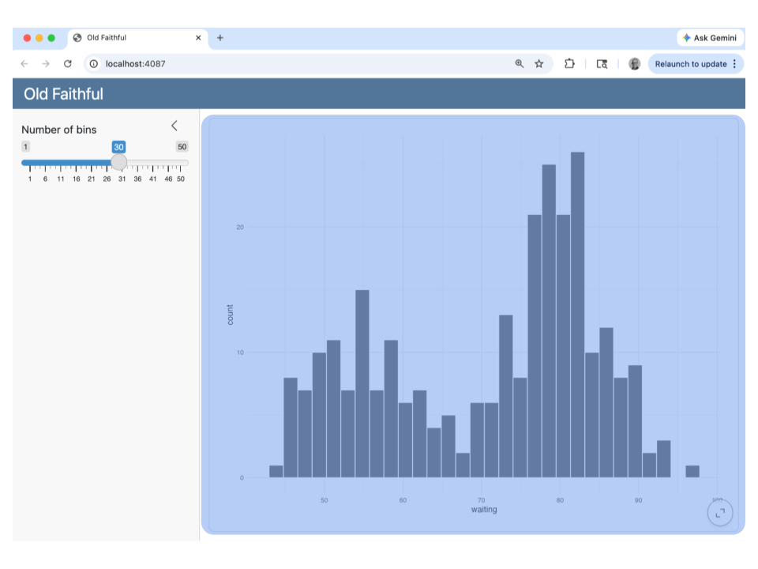{width="73%" fig-align="center"}


# Inputs

##

:::: {.columns}
::: {.column}
```{{r}}
sliderInput(
  inputId = "bins",
  label = "Number of bins",
  min = 1, 
  max = 50,
  value = 30)
```
:::

::: {.column .fragment}
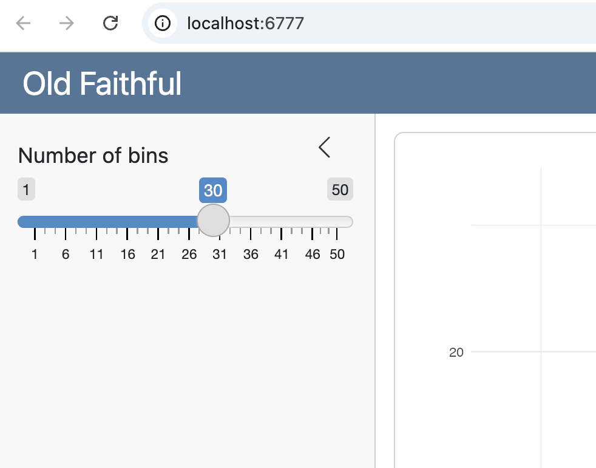
:::
::::


##

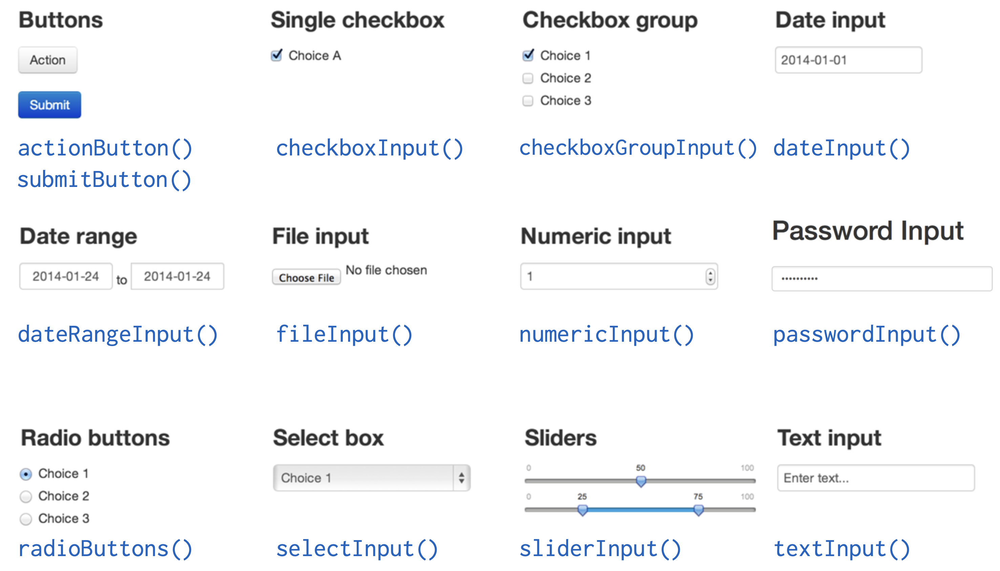{fig-align="center"}


## Syntax

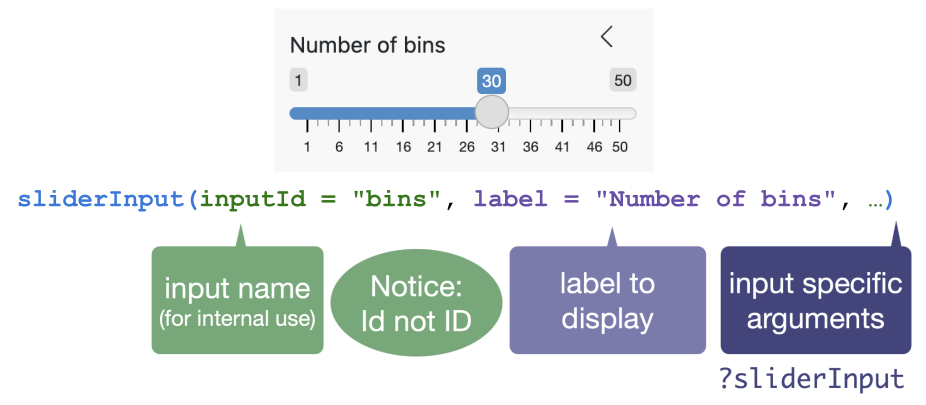{fig-align="center"}


## Shiny Widget Gallery

<https://shiny.posit.co/r/gallery/widgets/widget-gallery/>

{fig-align="center"}


# Outputs

## {.nostretch}

Build your app around [__inputs__]{style="color: green;"} and [__outputs__]{style="color: blue;"}

{width="73%" fig-align="center"}

##

| Function          | Inserts |
|-------------------|---------|
| `plotOutput()`    | plot |
| `girafeOutput()`  | ggiraph plot |
| `plotlyOutput()`  | plotly |
| `leafletOutput()` | leaflet map |
| `tableOutput()`   | table (non-interactive) |
| `DT::DTOutput()`  | table (interactive) |
| `textOutput()`    | text |
| `verbatimTextOutput()` | text |
| `imageOutput()`   | image |
| `htmlOutput()`    | raw HTML |


##

:::: {.columns}
::: {.column}
```{{r}}
sliderInput(
  inputId = "bins",
  label = "Number of bins",
  min = 1, 
  max = 50,
  value = 30)
```

\

```{{r}}
plotOutput(outputId = "plot")
```
:::

::: {.column .fragment}
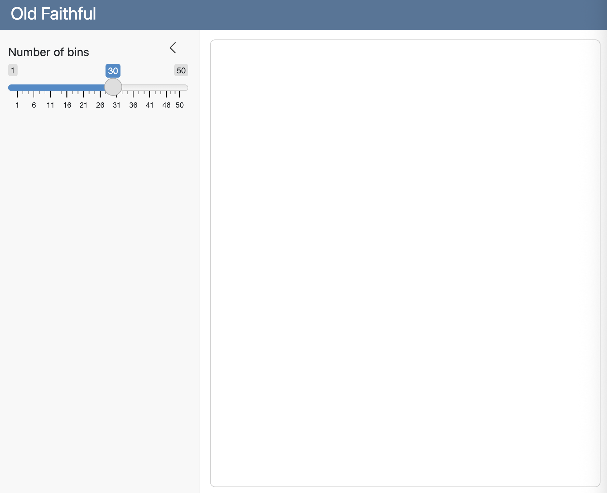
:::
::::

\

- `plotOutput()` adds a space in the UI for an R object.
- You must build the output object in the [server]{.hilit} context.


# Server

##

:::: {.columns}
::: {.column}
```{{r}}
#| context: server
output$plot <- renderPlot({
  ggplot(data = faithful, 
    aes(x = waiting)) +
    geom_histogram(
      bins = input$bins, 
      color = "white") +
    theme_minimal()
})
```
:::

::: {.column .fragment}
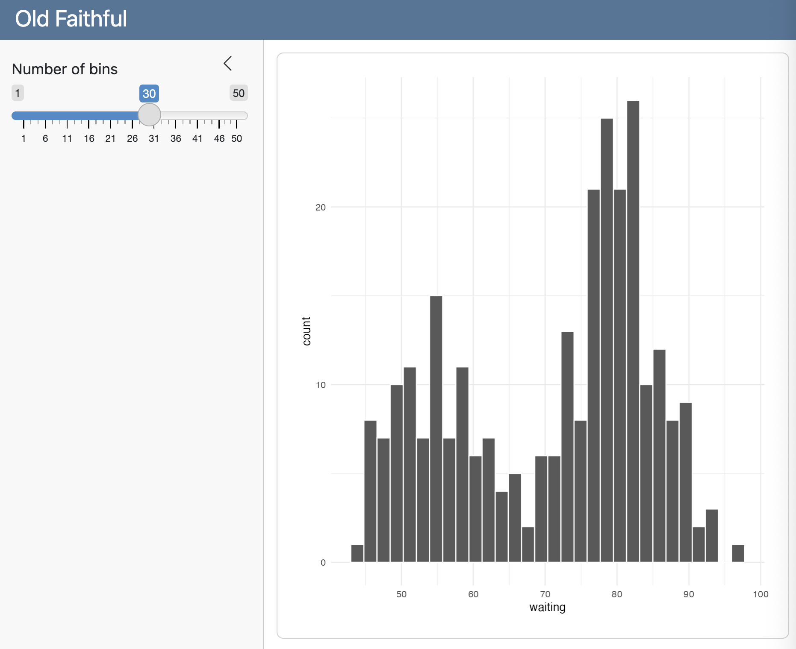
:::
::::

. . .

\

Tell the server how to assemble inputs into outputs.


## 3 rules to write the server

1) Save objects to display to `output$`

\

2) Build objects to display with `render*()`

\

3) Access input values with `input$`


## 3 rules to write the server

:::: {.columns}
::: {.column}
```{r}
#| eval: false
#| code-line-numbers: "1|1"
output$plot <- renderPlot({
  ggplot(data = faithful, 
    aes(x = waiting)) +
    geom_histogram(
      bins = input$bins, 
      color = "white") +
    theme_minimal()
})
```
:::

::: {.column}
__1)__ Save objects to display to `output$`
:::
::::


## 3 rules to write the server

:::: {.columns}
::: {.column}
```{r}
#| eval: false
#| code-line-numbers: "1|1"
output$plot <- renderPlot({
  ggplot(data = faithful, 
    aes(x = waiting)) +
    geom_histogram(
      bins = input$bins, 
      color = "white") +
    theme_minimal()
})
```
:::

::: {.column}
__1)__ Save objects to display to `output$`

\

__2)__ Build objects to display with `render*()`
:::
::::


## 3 rules to write the server

:::: {.columns}
::: {.column}
```{r}
#| eval: false
#| code-line-numbers: "1,5"
output$plot <- renderPlot({
  ggplot(data = faithful, 
    aes(x = waiting)) +
    geom_histogram(
      bins = input$bins, 
      color = "white") +
    theme_minimal()
})
```
:::

::: {.column}
__1)__ Save objects to display to `output$`

\

__2)__ Build objects to display with `render*()`

\

__3)__ Access input values with `input$`
:::
::::


## Build objects to display

Build objects to display with `render*()`

```{r}
#| eval: false
output$plot <- renderPlot({
  ggplot(data = faithful, 
    aes(x = waiting)) +
    geom_histogram(
      bins = input$bins, 
      color = "white") +
    theme_minimal()
})
```


## Render Functions

| Function          | Creates            |
|-------------------|-------------------|
| `renderPlot()`    | A plot    |
| `renderGirafe()`  | A ggiraph plot  |
| `renderPlotly()`  | A plotly graphic  |
| `renderLeaflet()` | A leaflet map |
| `renderTable()`   | A non-interactive table |
| `DT::renderDT()`  | An interactive table  |
| `renderText()`    | A character string    |
| `renderPrint()`   | A code block of printed output |
| `renderImage()`   | An image (savied as a link to a source file) |


## Render Functions

::: {.nonincremental}
- A render function builds reactive output to display in UI.

- You use a render function, e.g. `renderPlot()`, to indicate the type of output object to build.

- Inside the render function you include code block that builds the object:
:::

```{{r}}
renderPlot({
  ggplot(data = faithful, 
    aes(x = waiting)) +
    geom_histogram(
      bins = input$bins, 
      color = "white") +
    theme_minimal()
})
```


## Outputs $\rightarrow$ Renderers

| Output            | Render            |
|-------------------|-------------------|
| `plotOutput()`    | `renderPlot()`    |
| `girafeOutput()`  | `renderGirafe()`  |
| `plotlyOutput()`  | `renderPlotly()`  |
| `leafletOutput()` | `renderLeaflet()` |
| `tableOutput()`   | `renderTable()`   |
| `DT::DTOutput()`  | `DT::renderDT()`  |
| `textOutput()`    | `renderText()`    |
| `verbatimTextOutput()` | `renderPrint()` |
| `imageOutput()`   | `renderImage()`   |


# Anatomy of Shiny Dashboard

## Typical Structure

:::: {.columns}
::: {.column}
- YAML header
    + `format: dashboard`
    + `server: shiny`

- Setup code chunk: 
    + `#| context: setup` 
    + load packages
    + import files
    + data preparation
:::

::: {.column}
- Sidebar or Menubar: 
    + `## {.sidebar}` (local)
    + `## {.menubar}` (local)
    + to declare input elements

- Optional tabs: 
    + `# Tab`
    + to declare output elements

- Server code chunk: 
    + `#| context: server`
    + assemble inputs into outputs
:::
::::


# Recap

##

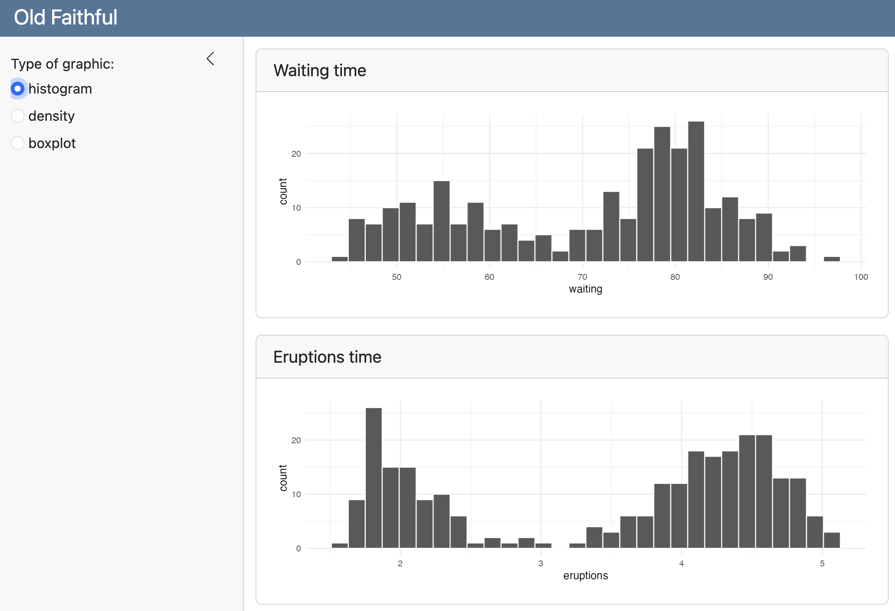{fig-align="center"}


##

{fig-align="center"}

How many [__inputs__]{style="color: green;"} and [__outputs__]{style="color: blue;"} are present?

```{r}
#| echo: false
countdown::countdown(0.5, bottom = 0)
```

## Inputs and Outputs

:::: {.columns}
::: {.column}
One Input

```{{r}}
radioButtons(
  inputId = "graphic",
  label = "Type of graphic:",
  choices = c("histogram", 
              "density", 
              "boxplot"), 
  selected = "histogram"
)
```
:::

::: {.column .fragment}
Two Outputs

```{{r}}
#| title: "Waiting time"
plotOutput(outputId = 'plot1')
```

\

```{{r}}
#| title: "Eruptions time"
plotOutput(outputId = 'plot2')
```
:::
::::


## Server: `#| context: server`

Object `output$plot1` built with `renderPlot()`

. . .

```{{r}}
output$plot1 <- renderPlot({
  gg1 = ggplot(data = faithful, 
    aes(x = waiting)) +
    theme_minimal()
  
  if (input$graphic == "histogram") {
    gg1 + geom_histogram(bins = 30, color = "white")
  } else if (input$graphic == "density") {
    gg1 + geom_density()
  } else {
    gg1 + geom_boxplot()
  }
})
```

Notice access of input object with `input$graphic`


## Server: `#| context: server`

Object `output$plot2` built with `renderPlot()`

. . .

```{{r}}
output$plot2 <- renderPlot({
  gg2 = ggplot(data = faithful, 
    aes(x = eruptions)) +
    theme_minimal()
  
  if (input$graphic == "histogram") {
    gg2 + geom_histogram(bins = 30, color = "white")
  } else if (input$graphic == "density") {
    gg2 + geom_density()
  } else {
    gg2 + geom_boxplot()
  }
})
```

Notice access of input object with `input$graphic`


##

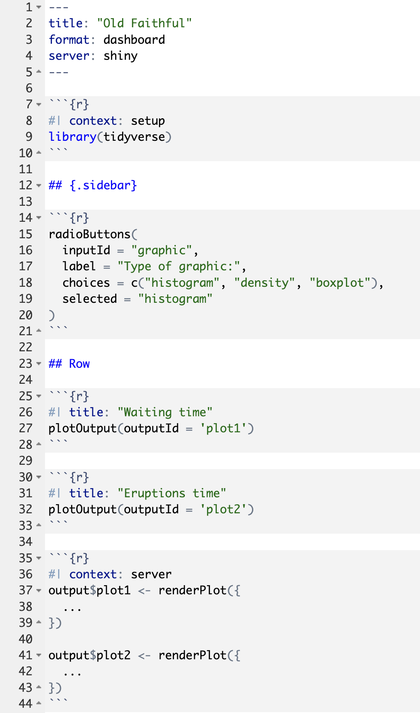{fig-align="center"}
