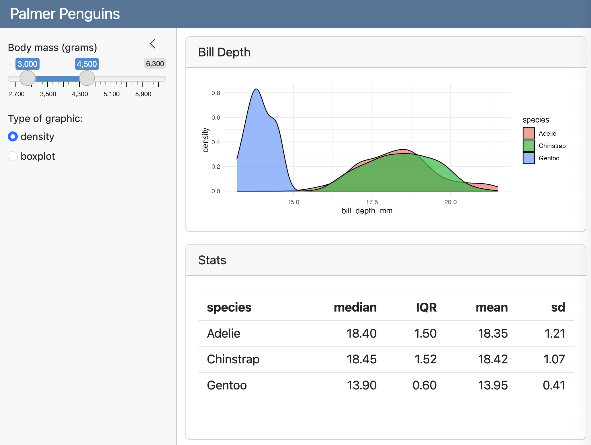
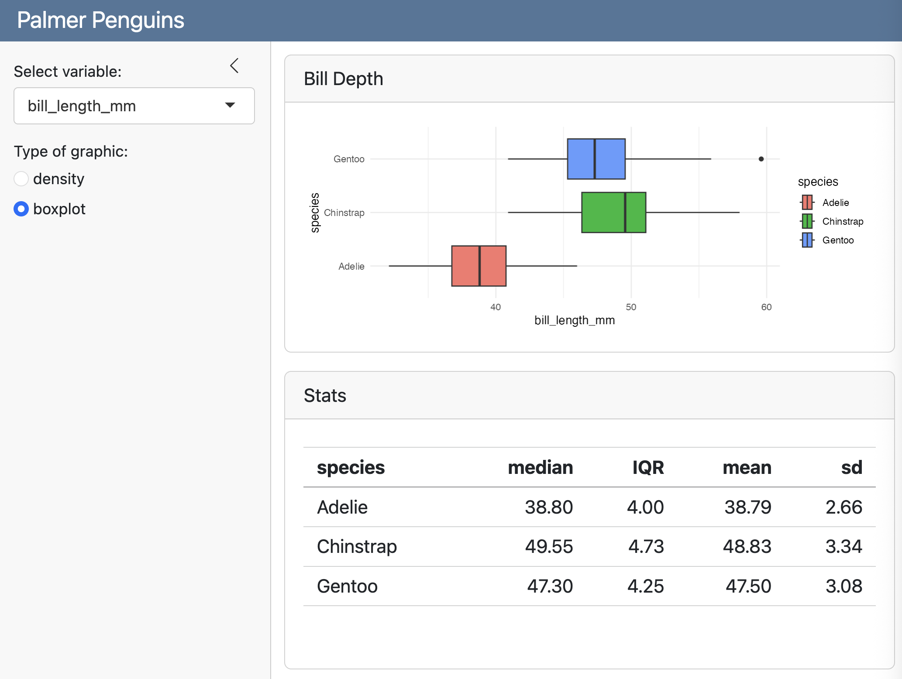

```{r setup, include=FALSE}
knitr::opts_chunk$set(echo = TRUE, error = TRUE)
library(tidyverse)
library(palmerpenguins)
```


# Recap

## {background-image="images/shiny-old-faithful1.png" background-size="contain"}

## {.nostretch}

Build your app around [__inputs__]{style="color: green;"} and outputs

{width="73%" fig-align="center"}


## {.nostretch}

Build your app around inputs and [__outputs__]{style="color: blue;"}

{width="73%" fig-align="center"}


## {background-image="images/quarto-dashboard-shiny7.png" background-size="contain"}


## 3 rules to write the server

:::: {.columns}
::: {.column}
```{r}
#| eval: false
#| code-line-numbers: "1,5"
output$plot <- renderPlot({
  ggplot(data = faithful, 
    aes(x = waiting)) +
    geom_histogram(
      bins = input$bins, 
      color = "white") +
    theme_minimal()
})
```
:::

::: {.column}
__1)__ Save objects to display to `output$`

\

__2)__ Build objects to display with `render*()`

\

__3)__ Access input values with `input$`
:::
::::


# Reactivity

## Reactivity 101

Reactivity automatically occurs whenever you use an input value to render an output object

```{r}
#| eval: false
output$plot <- renderPlot({
  ggplot(data = faithful, aes(x = waiting)) +
    geom_histogram(bins = input$bins, color = "white") +
    theme_minimal()
})
```

. . .

With Shiny you create reactivity by using Inputs to build rendered Outputs.


## Reactivity 101

- Shiny uses [reactive programming]{.bold-hilit}

- Supports reactive variables
    + When value of variable `x` changes, anything that relies on `x` is re-evaluated
    + Contrast with regular R:

. . .

```{r}
x <- 5
y <- x + 1
x <- 10
# y is still 6
```


## Reactivity

- `input$bins` is a [reactive]{.bold-hilit} value

. . .

```{r}
#| eval: false
output$plot <- renderPlot({
  ggplot(data = faithful, aes(x = waiting)) +
    geom_histogram(bins = input$bins, color = "white") +
    theme_minimal()
})
```

- `output$plot` depends on `input$bins`
    + `input$bins` changes $\rightarrow$ `output$plot` [reacts]{.hilit}

- All inputs are automatically reactive, so if you use any `input$` inside a `render*()` function, the output will re-render any time `input$` changes.


## Reactivity

- Reactive `input$` objects **can only be used** inside [reactive contexts]{.bold-hilit}

- Any `render*()` function is a reactive context.

. . .

:::: {.columns}
::: {.column}
```{r}
#| eval: false
# This is okay
output$plot <- renderPlot({
  ggplot(data = faithful, 
    aes(x = waiting)) +
    geom_histogram(
      bins = input$bins, 
      color = "white") +
    theme_minimal()
})
```
:::

::: {.column .fragment}
```{r}
#| eval: false
# This is NOT okay
num_bins <- input$bins

output$plot <- renderPlot({
  ggplot(data = faithful, 
    aes(x = waiting)) +
    geom_histogram(
      bins = num_bins, 
      color = "white") +
    theme_minimal()
})
```
:::
::::


## Reactivity

- You can define your own reactive variables.

- Use `reactive({...})`  to assign/define a reactive variable.

. . .

```{r}
#| eval: false
# Assign/define a reactive variable
num_bins <- reactive({input$bins})

output$plot <- renderPlot({
  ggplot(data = faithful, aes(x = waiting)) +
    geom_histogram(bins = num_bins(), color = "white") +
    theme_minimal()
})
```

- Notice the use of parenthesis when referring to reactive variable: `num_bins()`

- Reactive variables are objects of class function.


# Palmer Penguins

##

{fig-align="center"}

How many [__inputs__]{style="color: green;"} and [__outputs__]{style="color: blue;"} are present?

```{r}
#| echo: false
countdown::countdown(0.5, bottom = 0)
```


## Setup Context

```{{r}}
#| context: setup
library(tidyverse)
library(palmerpenguins)
```


## Inputs

```{{r}}
sliderInput(
  inputId = 'mass', 
  label = 'Body mass (grams)',
  min = min(penguins$body_mass_g, na.rm = TRUE),
  max = max(penguins$body_mass_g, na.rm = TRUE),
  value = c(3000, 4500))
```

\

```{{r}}
radioButtons(
  inputId = "graphic", 
  label = "Type of graphic:",
  choices = c("density", "boxplot"),
  selected = "density")
```


## Outputs

```{{r}}
#| title: "Bill Depth"
plotOutput(outputId = 'plot')
```

\

```{{r}}
#| title: "Stats"
tableOutput(outputId = 'table')
```


## `#| context: server` {.smaller}

:::: {.columns}
::: {.column}
```{r}
#| eval: false
# plot
output$plot <- renderPlot({
  gg <- penguins |> 
    filter(body_mass_g >= input$mass[1],
           body_mass_g <= input$mass[2]) |>
    ggplot(aes(x = bill_depth_mm, 
               fill = species)) +
    theme_minimal()

  if (input$graphic == "density") {
    gg + geom_density(alpha = 0.7)
  } else {
    gg + geom_boxplot(aes(y = species))
  }
})
```
:::

::: {.column .fragment}
```{r}
#| eval: false
# summary statistics
output$table <- renderTable({
  penguins |> 
    filter(body_mass_g >= input$mass[1],
           body_mass_g <= input$mass[2]) |>
    group_by(species) |> 
    summarize(
      median = median(bill_depth_mm),
      IQR = IQR(bill_depth_mm),
      mean = mean(bill_depth_mm),
      sd = sd(bill_depth_mm))
})
```
:::
::::

. . .

\

Can you see any redundant code?


## `#| context: server` {.smaller}

:::: {.columns}
::: {.column}
```{r}
#| eval: false
#| code-line-numbers: "3-5"
# plot
output$plot <- renderPlot({
  gg <- penguins |> 
    filter(body_mass_g >= input$mass[1],
           body_mass_g <= input$mass[2]) |>
    ggplot(aes(x = bill_depth_mm, 
               fill = species)) +
    theme_minimal()

  if (input$graphic == "density") {
    gg + geom_density(alpha = 0.7)
  } else {
    gg + geom_boxplot(aes(y = species))
  }
})
```
:::

::: {.column}
```{r}
#| eval: false
#| code-line-numbers: "3-5"
# summary statistics
output$table <- renderTable({
  penguins |> 
    filter(body_mass_g >= input$mass[1],
           body_mass_g <= input$mass[2]) |>
    group_by(species) |> 
    summarize(
      median = median(bill_depth_mm),
      IQR = IQR(bill_depth_mm),
      mean = mean(bill_depth_mm),
      sd = sd(bill_depth_mm))
})
```
:::
::::

. . .

\

To reduce redundant code we can use a [reactive variable]{.bold-hilit}.


## `#| context: server` {.smaller}

```{r}
#| eval: false
# reactive object
penguins_filtered <- reactive({
  penguins |> 
    filter(body_mass_g >= input$mass[1],
           body_mass_g <= input$mass[2])
})
```


## `#| context: server` {auto-animate=true .smaller}

```{r}
#| eval: false
# reactive object
penguins_filtered <- reactive({
  penguins |> 
    filter(body_mass_g >= input$mass[1],
           body_mass_g <= input$mass[2])
})

output$plot <- renderPlot({
  gg = ggplot(data = penguins_filtered(), 
         aes(x = bill_depth_mm, fill = species)) +
    theme_minimal()
  
  if (input$graphic == "density") {
    gg + geom_density(alpha = 0.7)
  } else {
    gg + geom_boxplot(aes(y = species))
  }
})
```


## `#| context: server` {auto-animate=true .smaller}

```{r}
#| eval: false
#| code-line-numbers: "2,9"
# reactive object
penguins_filtered <- reactive({
  penguins |> 
    filter(body_mass_g >= input$mass[1],
           body_mass_g <= input$mass[2])
})

output$plot <- renderPlot({
  gg = ggplot(data = penguins_filtered(), 
         aes(x = bill_depth_mm, fill = species)) +
    theme_minimal()
  
  if (input$graphic == "density") {
    gg + geom_density(alpha = 0.7)
  } else {
    gg + geom_boxplot(aes(y = species))
  }
})
```


## `#| context: server` {auto-animate=true .smaller}

```{r}
#| eval: false
# reactive object
penguins_filtered <- reactive({
  penguins |> 
    filter(body_mass_g >= input$mass[1],
           body_mass_g <= input$mass[2])
})

output$plot <- renderPlot({
  ...
})

output$table <- renderTable({
  penguins_filtered() |> 
    group_by(species) |> 
    summarize(
      median = median(bill_depth_mm),
      IQR = IQR(bill_depth_mm),
      mean = mean(bill_depth_mm),
      sd = sd(bill_depth_mm)
    )
})
```


## `#| context: server` {auto-animate=true .smaller}

```{r}
#| eval: false
#| code-line-numbers: "2,13"
# reactive object
penguins_filtered <- reactive({
  penguins |> 
    filter(body_mass_g >= input$mass[1],
           body_mass_g <= input$mass[2])
})

output$plot <- renderPlot({
  ...
})

output$table <- renderTable({
  penguins_filtered() |> 
    group_by(species) |> 
    summarize(
      median = median(bill_depth_mm),
      IQR = IQR(bill_depth_mm),
      mean = mean(bill_depth_mm),
      sd = sd(bill_depth_mm)
    )
})
```


# A brief detour

## 

:::: {.columns}
::: {.column}
```{r}
#| eval: false
ggplot(
  data = penguins,
  aes(x = bill_length_mm,
      fill = species)) +
  geom_density(alpha = 0.7)
```
:::

::: {.column .fragment}
```{r}
#| echo: false
ggplot(
  data = penguins,
  aes(x = bill_length_mm,
      fill = species)) +
  geom_density(alpha = 0.7)
```
:::
::::


:::: {.columns}
::: {.column .fragment}
```{r}
#| eval: false
variable = "bill_length_mm"

ggplot(
  data = penguins,
  aes(x = variable,
      fill = species)) +
  geom_density(alpha = 0.7)
```
:::

::: {.column .fragment}
```{r}
#| echo: false
variable = "bill_length_mm"

ggplot(
  data = penguins,
  aes(x = variable,
      fill = species)) +
  geom_density(alpha = 0.7)
```
:::
::::

. . .

🧐 What's the issue?


## Non-standard evaluation

In R, Non-Standard Evaluation (NSE) is a property where a function captures the code you typed rather than just the value it produces.

. . .

\

```{r}
#| output-location: fragment
my_summary <- function(df, col_name) {
  df |> summarize(avg = mean(col_name)) 
}

# If you pass the column name as a string
my_summary(mtcars, "mpg")
```


## The Solution: `.data[[ ]]`

. . .

The `.data` pronoun (from the `"rlang"` package, used heavily in _tidyverse_) is a way to be explicit. 

It tells R: "Look for this variable inside the data frame, not in the global environment."

. . .

```{r}
my_summary <- function(df, col_name) {
  df |> summarize(avg = mean(.data[[col_name]])) 
}

# Now you can pass the column name as a string
my_summary(mtcars, "mpg")
```

. . .

The double brackets `[[ ]]` allow you to use a string or a variable containing a string to pick a column.

## 

:::: {.columns}
::: {.column}
```{r}
#| eval: false
ggplot(
  data = penguins,
  aes(x = bill_length_mm,
      fill = species)) +
  geom_density(alpha = 0.7)
```
:::

::: {.column .fragment}
```{r}
#| echo: false
ggplot(
  data = penguins,
  aes(x = bill_length_mm,
      fill = species)) +
  geom_density(alpha = 0.7)
```
:::
::::


:::: {.columns}
::: {.column .fragment}
```{r}
#| eval: false
variable = "bill_length_mm"

ggplot(
  data = penguins,
  aes(x = .data[[variable]],
      fill = species)) +
  geom_density(alpha = 0.7)
```
:::

::: {.column .fragment}
```{r}
#| echo: false
variable = "bill_length_mm"

ggplot(
  data = penguins,
  aes(x = .data[[variable]],
      fill = species)) +
  geom_density(alpha = 0.7)
```
:::
::::


# Selecting Columns in shiny dashboards & tidyverse

##

{fig-align="center"}

How many [__inputs__]{style="color: green;"} and [__outputs__]{style="color: blue;"} are present?

```{r}
#| echo: false
countdown::countdown(0.5, bottom = 0)
```


## Setup Context

```{{r}}
#| context: setup
library(tidyverse)
library(palmerpenguins)
```


## Inputs

```{{r}}
selectInput(
  inputId = 'variable', 
  label = 'Select variable:',
  choices = colnames(penguins)[3:6],
  selected = "bill_length_m")
```

\

```{{r}}
radioButtons(
  inputId = "graphic", 
  label = "Type of graphic:",
  choices = c("density", "boxplot"),
  selected = "density")
```


## Outputs

```{{r}}
#| title: "Bill Depth"
plotOutput(outputId = 'plot')
```

\

```{{r}}
#| title: "Stats"
tableOutput(outputId = 'table')
```


## `#| context: server` {auto-animate=true}

```{r}
#| eval: false
output$plot <- renderPlot({
  gg = ggplot(data = penguins, 
         aes(x = .data[[input$variable]], 
             fill = species)) +
    theme_minimal()
  
  if (input$graphic == "density") {
    gg + geom_density(alpha = 0.7)
  } else {
    gg + geom_boxplot(aes(y = species))
  }
})
```


## `#| context: server` {auto-animate=true}

```{r}
#| eval: false
#| code-line-numbers: "3"
output$plot <- renderPlot({
  gg = ggplot(data = penguins, 
         aes(x = .data[[input$variable]], 
             fill = species)) +
    theme_minimal()
  
  if (input$graphic == "density") {
    gg + geom_density(alpha = 0.7)
  } else {
    gg + geom_boxplot(aes(y = species))
  }
})
```


## `#| context: server` {auto-animate=true}

```{r}
#| eval: false
output$table <- renderTable({
  penguins |> 
    group_by(species) |> 
    summarize(
      median = median(.data[[input$variable]], na.rm = TRUE),
      IQR = IQR(.data[[input$variable]], na.rm = TRUE),
      mean = mean(.data[[input$variable]], na.rm = TRUE),
      sd = sd(.data[[input$variable]], na.rm = TRUE)
    )
})
```


## `#| context: server` {auto-animate=true}

```{r}
#| eval: false
#| code-line-numbers: "5-8"
output$table <- renderTable({
  penguins |> 
    group_by(species) |> 
    summarize(
      median = median(.data[[input$variable]], na.rm = TRUE),
      IQR = IQR(.data[[input$variable]], na.rm = TRUE),
      mean = mean(.data[[input$variable]], na.rm = TRUE),
      sd = sd(.data[[input$variable]], na.rm = TRUE)
    )
})
```

