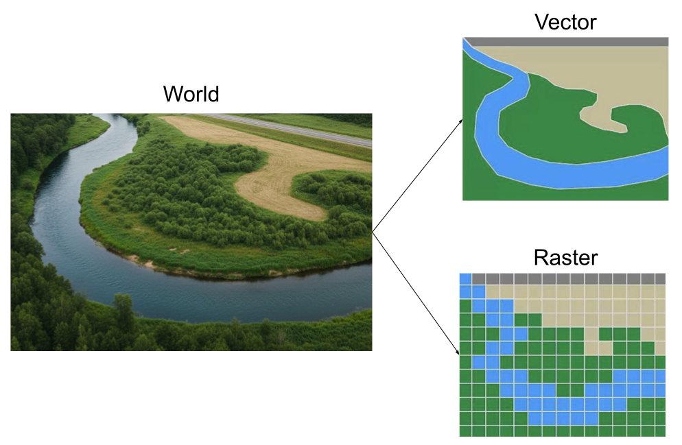
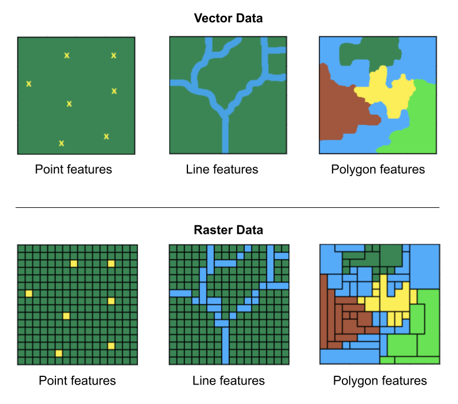

```{r setup, include=FALSE}
knitr::opts_chunk$set(echo = TRUE, error = TRUE)
library(tidyverse)
library(terra)
library(viridis)

dat = rast("nclimgrid_tavg_april_2025.nc")
```


# Types of Spatial Data


## Mapping the World in 2 styles {.nostretch}

. . .

{width="80%" fig-align="center"}


## Vector Data -vs- Raster Data

:::: {.columns}
::: {.column width="50%"}
Vector data are better for discretely bounded data, e.g. bike racks, rivers, political boundaries, etc.


:::

::: {.column .fragment  width="50%"}
Raster data are better for continuous data, e.g. temperature, elevation, rainfall, etc.


:::
::::

## {.nostretch}

{width="65%" fig-align="center"}


## Raster Data {.nostretch}

{width="65%" fig-align="center"}

## Raster Data (regular grids)

A location is represented by a grid cell

Cells have regular size, e.g. 30x30m

Grid has dimension: fixed number of rows and columns

Each cell has a value that represents the attribute of interest, e.g. elevation


# NetCDF files

## About NetCDF files

- NetCDF: Network Common Data Form

- Binary file format specifically designed for storing and sharing multidimensional data (e.g. data cube or data hypercube).

- Popular format for storing scientific data, especially when dealing with gridded or multidimensional information like temperature, precipitation, or satellite imagery. 

- Commonly used in fields such as meteorology, climatology, and GIS to store data like temperature, precipitation, humidity, wind speed, and direction.


## NetCDF Data Format

- NetCDF files are self-describing, containing all the necessary information about the data, including its structure, data types, and units.

- It can handle various data types, including floats, integers, and strings. 

- Variables in NetCDF files are associated with dimensions, allowing for organization of the data based on spatial and temporal coordinates. 


## Essential netCDF vocabulary

- Dimension

- Variables

- Coordinate Variables


## Dimension

- A NetCDF dimension has both a name and a size.

- A dimension size is an arbitrary positive integer.

- A dimension can be used to represent a real physical dimension, for example, time, latitude, longitude, or height. 

- A dimension can also be used to index other quantities, for example, station or model run number. 

- It is possible to use the same dimension more than once in specifying a variable shape.

- The number of dimensions is called the rank (or dimensionality). 


## Variables

- A variable represents an array of values of the same type. 

- Variables are used to store the bulk of the data in a netCDF file. 

- A variable has a name, a data type, and a shape described by its list of dimensions specified when the variable is created. 
        + A scalar variable has rank 0,
        + A vector has rank 1, 
        + A matrix has rank 2. 

- A variable can also have associated attributes that can be added, deleted, or changed after the variable is created.


# NOAA Monthly U.S. Climate Gridded Dataset

## NetCDF Example

NOAA Monthly U.S. Climate Gridded Dataset (NClimGrid)

<https://www.ncei.noaa.gov/access/metadata/landing-page/bin/iso?id=gov.noaa.ncdc:C00332>

. . .

\

Four Climate variables:

1) Maximum Temperature
2) Minimum Temperature
3) Average Temperature
4) Precipitation


## {background-image="images/NClimGrid-website.png" background-size="contain"}


## {.nostretch}

Monthly average temperature file `nclimgrid_tavg.nc` available at:

<https://www.ncei.noaa.gov/data/nclimgrid-monthly/access/>

{width="60%"}


## R Package `"terra"`

The `"terra"` package provides methods for spatial data analysis with vector (points, lines, polygons) and raster (grid) data.

```{r}
#| eval: false
library(terra)
```


## Importing NetCDF files with `rast()`

```{r}
#| eval: false
# NClimGrid data as of Feb-2026
dat <- rast("nclimgrid_tavg.nc")
dat
```

. . .

```
class       : SpatRaster 
dimensions  : 596, 1385, 1574  (nrow, ncol, nlyr)
resolution  : 0.04166666, 0.04166667  (x, y)
extent      : -124.7083, -67, 24.5417, 49.37503  (xmin, xmax, ymin, ymax)
coord. ref. : lon/lat WGS 84 (CRS84) (OGC:CRS84) 
source      : nclimgrid_tavg.nc 
varname     : tavg (Temperature, monthly average of daily averages) 
names       :         tavg_1,         tavg_2,         tavg_3,         tavg_4,         tavg_5,         tavg_6, ... 
unit        : degree_Celsius, degree_Celsius, degree_Celsius, degree_Celsius, degree_Celsius, degree_Celsius, ... 
time (days) : 1895-01-01 to 2026-02-01 (2 steps) 
```

##

Dimensions:

- nrow: 596
- ncol: 1385
- nlyr: 1574

. . .

One layer per month:

- 1st layer: January 1895
- 12th layer: December 1895
- layer 120: December 1904
- layer 1564: April 2025

## Layer 1: January 1895 {.smaller}

```{r}
#| eval: false
# first layer
dat[[1]]
```

```
class       : SpatRaster 
dimensions  : 596, 1385, 1  (nrow, ncol, nlyr)
resolution  : 0.04166666, 0.04166667  (x, y)
extent      : -124.7083, -67, 24.5417, 49.37503  (xmin, xmax, ymin, ymax)
coord. ref. : lon/lat WGS 84 (CRS84) (OGC:CRS84) 
source      : nclimgrid_tavg.nc 
varname     : tavg (Temperature, monthly average of daily averages) 
name        :         tavg_1 
unit        : degree_Celsius 
time (days) : 1895-01-01 
```


## Layer 1564: April 2025 {.smaller}

```{r}
#| eval: false
# layer 1564 - April: (2025-1895)*12 + 4
dat[[1564]]
```

```
class       : SpatRaster 
dimensions  : 596, 1385, 1  (nrow, ncol, nlyr)
resolution  : 0.04166666, 0.04166667  (x, y)
extent      : -124.7083, -67, 24.5417, 49.37503  (xmin, xmax, ymin, ymax)
coord. ref. : lon/lat WGS 84 (CRS84) (OGC:CRS84) 
source      : nclimgrid_tavg.nc 
varname     : tavg (Temperature, monthly average of daily averages) 
name        :      tavg_1564 
unit        : degree_Celsius 
time (days) : 2025-04-01 
```

## Layer 1564: April 2025 {.smaller}

```{r}
#| eval: false
plot(dat[[1564]])
```

```{r}
#| echo: false
plot(dat)
```


## {.smaller}

:::: {.columns}
::: {.column width="50%"}

```{r}
#| eval: false
plot(dat[[1564]], col = viridis(n = 100))
```

```{r}
#| echo: false
plot(dat, col = viridis(n = 100))
```

```{r}
#| eval: false
plot(dat[[1564]], col = plasma(n = 100))
```

```{r}
#| echo: false
plot(dat, col = plasma(n = 100))
```
:::

::: {.column width="50%"}
```{r}
#| eval: false
plot(dat[[1564]], col = magma(n = 100))
```

```{r}
#| echo: false
plot(dat, col = magma(n = 100))
```

```{r}
#| eval: false
plot(dat[[1564]], col = inferno(n = 100))
```

```{r}
#| echo: false
plot(dat, col = inferno(n = 100))
```

:::
::::


##

```{r}
#| eval: false
plot(dat[[1564]], col = viridis(n = 6))
```

```{r}
#| echo: false
plot(dat, col = viridis(n = 6))
```


## Converting temp to Fahrenheit


```{r}
#| eval: false
plot(dat_raster[[1564]] * (9/5) + 32)
```

```{r}
#| echo: false
plot(dat * (9/5) + 32)
```
