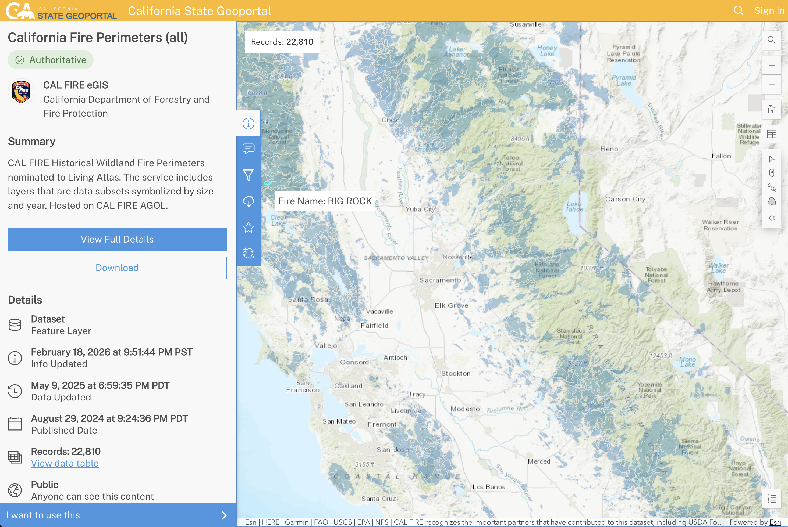
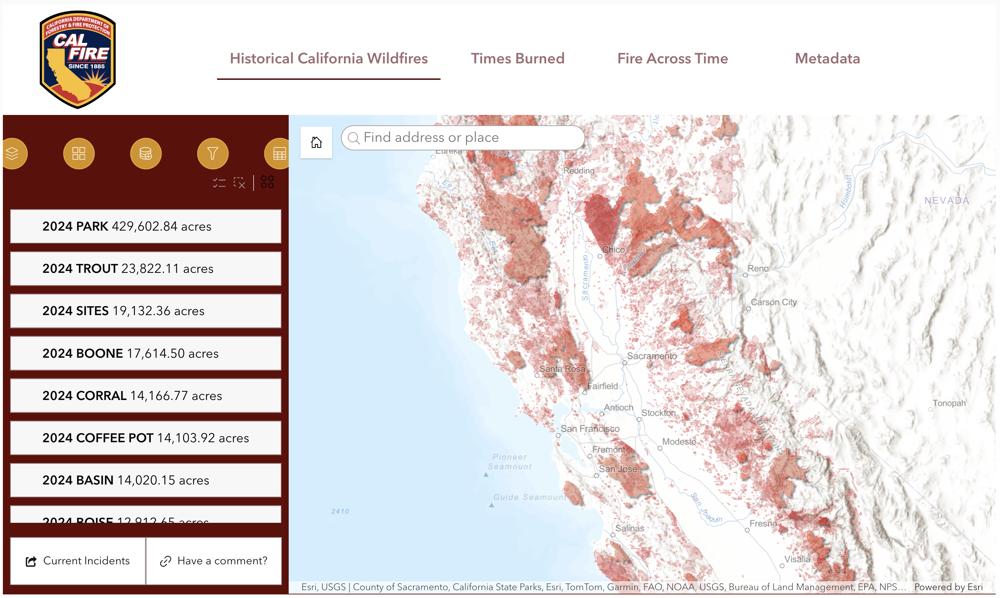

```{r setup, include=FALSE}
knitr::opts_chunk$set(echo = TRUE, error = TRUE)
library(tidyverse)     # ecosystem of data science packages
library(sf)            # "simple features" (classes for maps)
library(rnaturalearth) # data base of maps
library(maps)          # maps of US states (with counties)
library(leaflet)       # web interactive maps

# import cal_perims_2014.RData
load("cal_perims_2014.RData")
```


## About

In this lecture we'll work with geospatial data in [shapefile]{.bold-hilit} format which is perhaps the most common format of geospatial vector data.

\

```{r}
#| eval: false
# packages
library(tidyverse)     # ecosystem of data science packages

library(sf)            # "simple features" (classes for maps)

library(rnaturalearth) # data base of maps

library(maps)          # maps of US states (with counties)

library(leaflet)       # web interactive maps
```


# California Wildfire Perimeters 

## Meadow Fire, Sep 2014 {background-color="black" background-image="images/Meadow_Fire_Sep_7_2014.jpg" background-repeat="no-repeat"}


## Meadow Fire, Sep 2014

- The **Meadow Fire** was a wildfire which burned areas near _Half Dome_ in Yosemite National Park, California.

- Park officials believe it was started near Starr King Lake, during a lightning storm, on July 19, 2014

- On September 16, 2014 the fire burned 4,971 acres (2,012 ha) and was 80% contained.

- On September 29, the Meadow Fire was 100% contained.


## Fire Perimeters Data

CAL FIRE Historical Wildland Fire Perimeters

<https://gis.data.ca.gov/datasets/CALFIRE-Forestry::california-fire-perimeters-all/>




## {background-image="images/fire-perim-app.png" background-size="contain"}

## {background-image="images/fire-perim-2014.png" background-size="contain"}

## {background-image="images/fire-perim-2014-meadow.png" background-size="contain"}


## Data in Shapefile format {.nostretch .smaller}

{width="75%"}

<https://gis.data.ca.gov/datasets/CALFIRE-Forestry::california-fire-perimeters-all/about>


## Data in Shapefile format {.nostretch .smaller}

{width="75%"}


# Geospatial Data in Shapefile Format

## What is a shapefile?

- A [shapefile]{.hilit} is one particular file format to store geospatial vector data.

- It's the most common, _de facto standard_ format for handling vector data.

- It's developed by [ESRI](https://en.wikipedia.org/wiki/Esri) as a mostly open format for [Geographic Information System (GIS)]{.mdlit} software products (e.g. ArcGIS).

- Confusingly, a shapefile is NOT a single file, but a set of files.

- You must keep files with the same name together in one folder.


## What files are in a shapefile?

. . .

There are 3 core files to have at a minimum for a shapefile:

1) [.shp]{.bold-hilit} stores the feature geometry (e.g. points, lines, polygons). [^1]

2) [.dbf]{.bold-hilit} stores attributes information.

3) [.shx]{.bold-hilit} index (i.e. link) between [.shp]{.bold-hilit} and [.dbf]{.bold-hilit} files.

. . .

Usually, although not always, there are other files:

4) [.prj]{.mdlit} stores the coordinate reference system (CRS) and map projection information; used by ArcGIS.

5) [.xml]{.mdlit} metadata in XML format about the shapefile.

6) [.cpg]{.mdlit} codepage for identifying the characterset to be used.

[^1]: `.shp` and `.dbf` are in binary file format: cannot be opened directly in a text editor to read the content.


## More Fire Perimeters Data

There are several web apps to visualize historical Fire Perimeters in California

<https://www.fire.ca.gov/what-we-do/fire-resource-assessment-program/fire-perimeters>




## {background-image="images/calfire-app.png" background-size="contain"}


# CalFire Perimeters (1950+)

## Demo based on 1950+ data {.nostretch .smaller}

{width="70%"}

<https://data.ca.gov/dataset/california-fire-perimeters-1950>


## CalFire Perimeters (1950+)

Downloading [California_Fire_Perimeters_(1950+)]{.bold-hilit} will give you a shapefile with the following files:

- `California_Fire_Perimeters_(1950+).shp`
- `California_Fire_Perimeters_(1950+).dbf`
- `California_Fire_Perimeters_(1950+).shx`
- `California_Fire_Perimeters_(1950+).prj`
- `California_Fire_Perimeters_(1950+).shp.xml`
- `California_Fire_Perimeters_(1950+).cpg`

[^2]: As of March 2026


## Import Data in R

Shapefiles can be easily imported in R with the `"sf"` function `st_read()`[^3]

[^3]: The `st_` prefix of many `"sf"` functions stands for **Spatial and Temporal**

. . .

```{r}
#| eval: false
cal_perims <- st_read("California_Fire_Perimeters_(1950+)")
```

. . .

```
Reading layer `California_Fire_Perimeters_(1950+)' from data source 
using driver `ESRI Shapefile'
Simple feature collection with 17540 features and 18 fields
Geometry type: MULTIPOLYGON
Dimension:     XY
Bounding box:  xmin: -13848330 ymin: 3833204 xmax: -12705610 ymax: 5255380
Projected CRS: WGS 84 / Pseudo-Mercator
```

. . .

```{r}
#| eval: false
class(cal_perims)
```

```
[1] "sf"         "data.frame"
```


## Columns

- `YEAR_`: Fire Year
- `STATE`: State
- `AGENCY`: Protection agency responsible for fire
- `UNIT_ID`: ICS code for unit
- `FIRE_NAME`: Name of the fire
- `INC_NUM`: Number assigned by the Emergency Command
- `ALARM_DATE`: Alarm date for fire

## Columns (cont'd)

- `CONT_DATE`: Containment date for fire
- `CAUSE`: Reason fire ignited
- `C_METHOD`: Method used to collect perimeter data
- `OBJECTIVE`: Either supression or resource benefit
- `GIS_ACRES`: GIS calculated area in acres
- `COMMENTS`: Miscellaneous comments
- `FIRE_NUM`: Former numbering system

. . .

[A bit of context about fire perimeters in next slide.]{.mdlit}


## 

1) A fire is reported.
2) Crews are called to the scene (`ALARM_DATE`).
3) They give the fire a name (`FIRE_NAME`), often geography related.
4) Fire crews do a size up and respond appropriately.
    + Most fires are supressed when they are small.
    + A few that escape initial attack become very large (burn for months).
5) When "containment lines" around the entire fire perimeter stop further spread, it is considered contained (`CONT_DATE`).
6) The difference between `ALARM_DATE` and `CONT_DATE` = how long the fire burned.
7) `GIS_ACRES` is the final total area within the containment line (i.e. fire perimeter).


## Wildfires in 2014

. . .

```{r}
#| eval: false
cal_perims_2014 = cal_perims |> 
  filter(YEAR_ == 2014)

names(cal_perims_2014)
```

. . .

```{r}
#| echo: false
names(cal_perims_2014)
```


## Top-5 largest fires in 2014 {.smaller}

. . .

```{r}
#| output-location: fragment
top5_fires_2014 <- cal_perims_2014 |> 
  arrange(desc(GIS_ACRES)) |> 
  slice_head(n = 5) |> 
  select(FIRE_NAME, ALARM_DATE, CONT_DATE, GIS_ACRES)

top5_fires_2014
```

. . .

\

Since `cal_perims_2014` is an `"sf"` object, you'll be dragging the `geometry` column.


## Top-5 largest fires in 2014 {.smaller}

Optional: If you don't want your derived tables to include the `geometry` column, you'll have to drop it:

. . .

```{r}
#| output-location: fragment
# drop "geometry"
top5_fires_2014$geometry = NULL

top5_fires_2014 |> 
  mutate(DURATION = CONT_DATE - ALARM_DATE)
```


# Fire Perimeters Map

## Plot 1 (naive)

:::: {.columns}
::: {.column}
```{r}
#| output-location: fragment
#| out-width: 99%
#| fig-width: 8 # width in inches
#| fig-height: 7 # height in inches
ggplot(cal_perims_2014) +
  geom_sf()
```
:::

::: {.column .fragment}
```{r}
#| output-location: fragment
#| out-width: 99%
#| fig-width: 8 # width in inches
#| fig-height: 7 # height in inches
ggplot(cal_perims_2014) +
  geom_sf(fill = "red")
```
:::
::::


## 

:::: {.columns}
::: {.column}
```{r}
#| echo: false
#| out-width: 99%
#| fig-width: 8 # width in inches
#| fig-height: 7 # height in inches
ggplot(cal_perims_2014) +
  geom_sf()
```
:::

::: {.column}
```{r}
#| echo: false
#| out-width: 99%
#| fig-width: 8 # width in inches
#| fig-height: 7 # height in inches
ggplot(cal_perims_2014) +
  geom_sf(fill = "red")
```
:::
::::

How can we visualize these fire perimeters on a map of California?

```{r}
#| echo: false
countdown::countdown(3/4, bottom = 0)
```


##

To visualize fire perimeters on a map of California we need to get data[^4] for the polygon(s) of California.

. . .

\

There are several options:

1) Map of California (simple map, no county lines).

2) Map of California with counties.

3) Map of California with districts.

4) Map of California with other kind of meaningful divisions.


[^4]: Recall that R has several packages with data bases of maps, e.g. `"rnaturalearth"`, `"maps"`, `"usmap"`, ETC


## Map of California (option 1) {.smaller}

. . .

:::: {.columns}
::: {.column width="45%"}
```{r}
#| eval: false
# from package "rnaturalearth"
cal_map = ne_states(
  country = "United States of America", 
  returnclass = "sf") |> 
  filter(name == "California")

ggplot() + 
  geom_sf(data = cal_map)
```
:::

::: {.column .fragment width="55%"}
```{r}
#| echo: false
#| fig-width: 9 # width in inches
#| fig-height: 7 # height in inches
#| out-width: "105%"
cal_map = ne_states(
    country = "United States of America", 
    returnclass = "sf") |> 
  filter(name == "California")

ggplot() + 
  geom_sf(data = cal_map)
```
:::
::::


## Map of California (option 2) {.smaller}

. . .

:::: {.columns}
::: {.column width="45%"}
```{r}
#| eval: false
# from package "maps"
cal_county_map = st_as_sf(
  maps::map(database = "county", 
      plot = FALSE, 
      fill = TRUE)) |>
  filter(str_detect(ID, "^california"))

ggplot() +
  geom_sf(data = cal_county_map)
```
:::

::: {.column .fragment width="55%"}
```{r}
#| echo: false
#| fig-width: 9 # width in inches
#| fig-height: 7 # height in inches
#| out-width: "105%"
cal_county_map = st_as_sf(
  maps::map(database = "county", plot = FALSE, fill = TRUE)) |>
  filter(str_detect(ID, "^california"))

ggplot() +
  geom_sf(data = cal_county_map)
```
:::
::::

. . .

Let's use this map!


## So far: we have 2 tables

. . .

:::: {.columns}
::: {.column}
`cal_perims_2014`: [sf table]{.hilit} of fire perimeters and their geometries 
with `r nrow(cal_perims_2014)` rows and `r ncol(cal_perims_2014)` columns, e.g.:

::: {.nonincremental}
+ `YEAR_`: year of fire
+ `FIRE_NAME`: name of fire
+ `ALARM_DATE`: alarm date for fire
+ `CONT_DATE`: containment date
+ `geometry`: polygon geometry
:::
:::

::: {.column .fragment}
`cal_county_map`: [sf table]{.hilit} of county polygons with `r nrow(cal_county_map)` rows and the 
following `r ncol(cal_county_map)` columns:

::: {.nonincremental}
+ `ID`: name of state and name of county 
+ `geom`: polygon geometry
:::
:::
::::


##

```{r}
#| code-fold: true
ggplot() +
  geom_sf(data = cal_county_map) +
  geom_sf(data = cal_perims_2014, fill = "red", color = "red3") +
  theme_void() +
  labs(title = "Wildfires in California 2014")
```


## Our workflow {.nostretch}

{width="100%" fig-align="center"}


# Shapefiles with Leaflet

## Can we get an interactive map with leaflet?

. . .

```{r}
#| eval: false
cal_perims_2014 |> 
  leaflet() |> 
  addTiles() |> 
  addPolygons()
```

. . .

```
Warning messages:
1: sf layer is not long-lat data 
2: sf layer has inconsistent datum (+proj=merc +a=6378137 +b=6378137 +lat_ts=0 +lon_0=0 +x_0=0 +y_0=0 +k=1 +units=m +nadgrids=@null +wktext +no_defs).
Need '+proj=longlat +datum=WGS84' 
```

\

- `cal_perims_2014` is in meters (not in degrees).
- But `"leaflet"` needs data in decimal degrees (latitude and longitude).


## What's going on

The issue is that `"leaflet"` requires data to be in unprojected (WGS84) coordinates (latitude and longitude in degrees), but `cal_perims_2014` is using a projected coordinate system.

\

Specifically, `cal_perims_2014` is using a Pseudo-Mercator projection (indicated by `+proj=merc` and `units=m` in the warning message), where coordinates are expressed in meters rather than degrees. 

\

While `"leaflet"` can display maps in various projections, its R functions for adding markers, polygons, and lines almost always expect **EPSG:4326 (WGS 84)** input.


## Transforming `cal_perims_2014`

We need to transform `cal_perims_2014` so that it is expressed in geographic coordinate system [CRS 4326]{.bold-hilit} using `st_transform()`

. . .

```{r}
#| eval: false
cal_perims_2014 |> 
  st_transform(crs = 4326) |> 
  leaflet() |> 
  addProviderTiles(provider = "Esri.WorldTopoMap") |> 
  addPolygons(
    color = "red",
    fillOpacity = 0.5,
    weight = 1, 
    label = ~FIRE_NAME)
```


## Interactive Map

```{r}
#| code-fold: true
#| fig-width: 9 # width in inches
#| fig-height: 7 # height in inches
#| out-width: "90%"
cal_perims_2014 |> 
  st_transform(crs = 4326) |> 
  leaflet() |> 
  addProviderTiles(provider = "Esri.WorldTopoMap") |> 
  addPolygons(
    color = "red",
    fillOpacity = 0.5,
    weight = 1, 
    label = ~FIRE_NAME)
```


## Common "Gotchas"

- Missing Files: Trying to load a `.shp` without the `.dbf` or `.shx` present in the folder.

- CRS Mismatch: Trying to plot two layers that use different coordinate systems (they won't line up!).

- Size limit: Shapefiles have a 2GB size limit and truncate column names to 10 characters.
