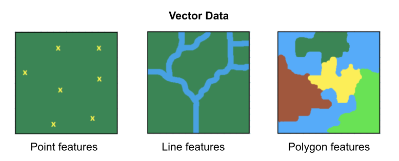
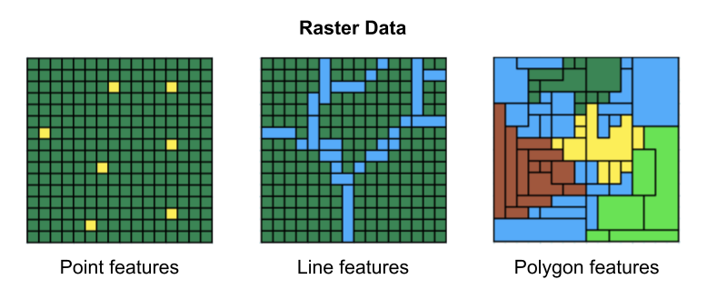
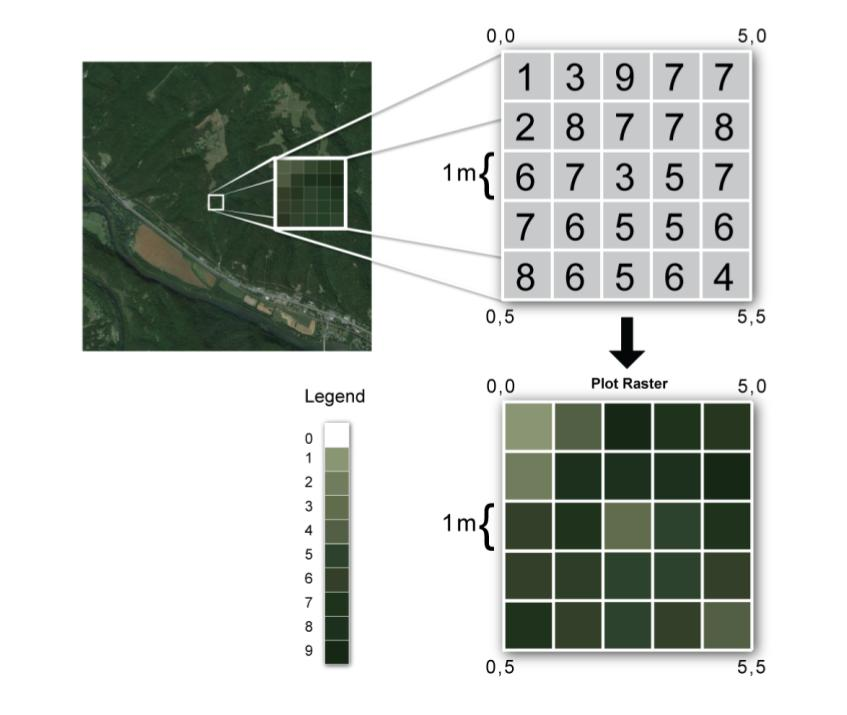
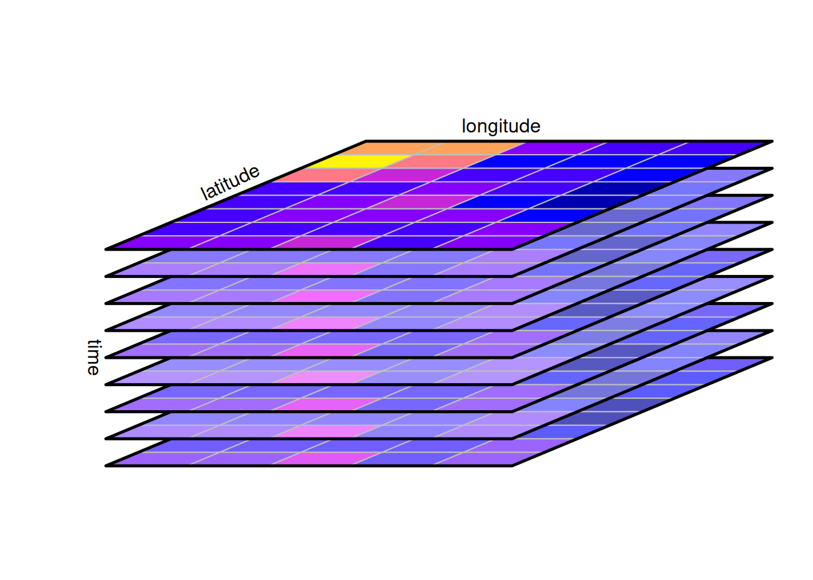
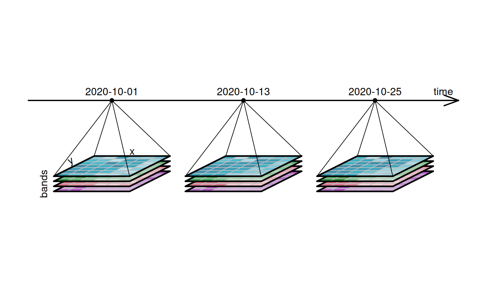
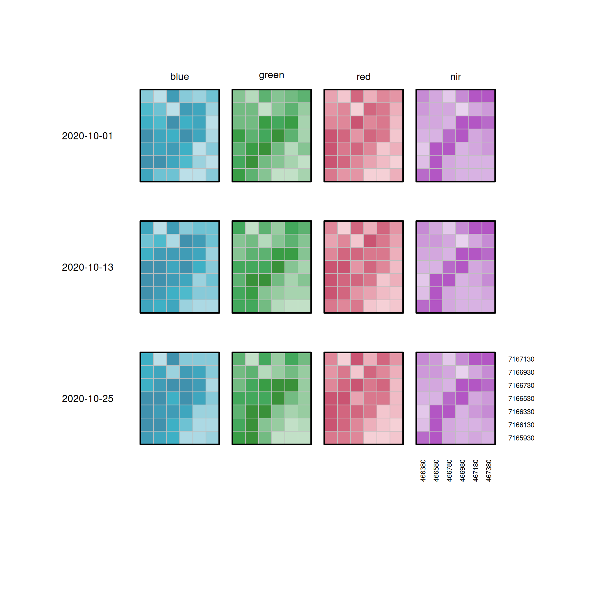
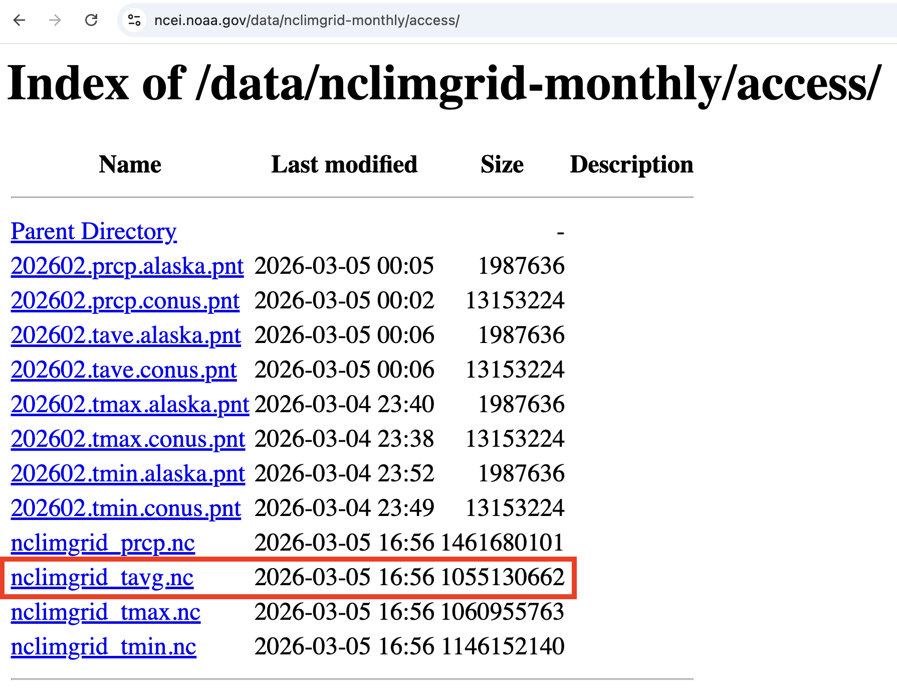
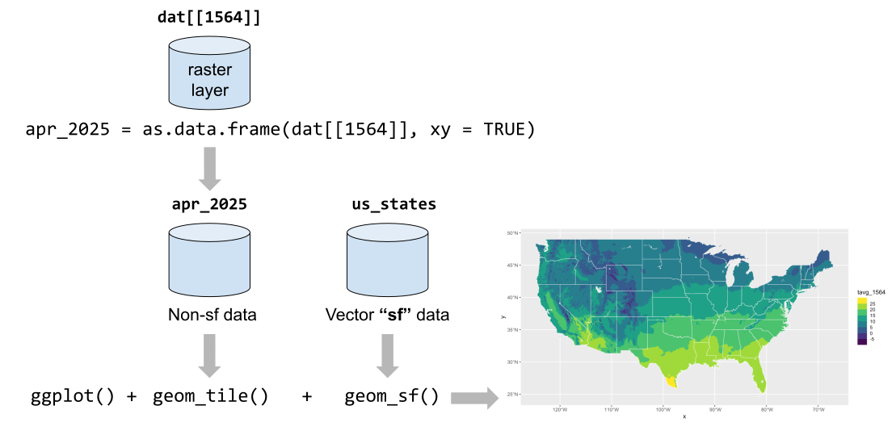

```{r setup, include=FALSE}
knitr::opts_chunk$set(echo = TRUE, error = TRUE)
library(tidyverse)     # ecosystem of data science packages
library(terra)         # for spatial data in raster and vector form
library(viridis)       # colorblind-friendly color schemes
library(rnaturalearth) # maps data from www.naturalearthdata.com

# import Temperature average layer number 1564
dat = rast("tavg_1564.nc")
```


##

```{r}
#| eval: false
# packages
library(tidyverse)     # ecosystem of data science packages

library(terra)         # for spatial data in raster and vector form

library(viridis)       # colorblind-friendly color schemes

library(rnaturalearth) # maps data from www.naturalearthdata.com
```


# Types of Spatial Data


## Mapping the World in 2 styles {.nostretch}

. . .

{width="80%" fig-align="center"}


## Vector Data -vs- Raster Data

:::: {.columns}
::: {.column width="50%"}
Vector data are better for discretely bounded data, e.g. bike racks, rivers, political boundaries, etc.


:::

::: {.column .fragment  width="50%"}
Raster data are better for continuous data, e.g. temperature, elevation, rainfall, etc.


:::
::::


## Raster Data {.nostretch}

{width="65%" fig-align="center"}

## Raster Data (regular grids)

. . .

Rasters are spatial data models that define space as an [array of equally sized cells]{.bold-hilit}, and composed of single or multiple bands.

- A location is represented by a grid cell.

- Cells have regular size, e.g. 30x30m.

- Grid has dimension: fixed number of rows and columns.

- Each cell has a value that represents the attribute of interest, e.g. temperature, elevation, precipitation, pollution, etc.

- Cell values can be either positive or negative, integer, or floating point.


# Raster example with NetCDF files

## About NetCDF files

- NetCDF: [Network Common Data]{.hilit} Form

- Binary file format specifically designed for storing and sharing [multidimensional data]{.mdlit} (e.g. data cube or data hypercube).

- Popular format for storing scientific data, especially when dealing with gridded or multidimensional information like temperature, precipitation, or satellite imagery. 

- Commonly used in fields such as meteorology, climatology, and GIS to store data like temperature, precipitation, humidity, wind speed, and direction.


## NetCDF of Data Cubes

Many NetCDF files are used to store __data cubes__ or __hypercubes__.

. . .

:::: {.columns}
::: {.column}
3-dim cube


:::

::: {.column .fragment}
4-dim hypercube


:::
::::

. . .

Images by Edzer Pebesma,  <https://r-spatial.org/python/06-Cubes.html>

##

A 4-dim raster data cube layed out flat over two dimensions

{fig-align="center" width="80%"}

. . .

Images by Edzer Pebesma,  <https://r-spatial.org/python/06-Cubes.html>


## NetCDF Data Format

- NetCDF files are self-describing, containing all the necessary information about the data, including its structure, data types, and units.

- It can handle various data types, including floats, integers, and strings. 

- Variables in NetCDF files are associated with dimensions, allowing for organization of the data based on spatial and temporal coordinates. 


# NOAA Monthly U.S. Climate Gridded Dataset (NetCDF)

## NetCDF Example

NOAA Monthly U.S. Climate Gridded Dataset (NClimGrid)

<https://www.ncei.noaa.gov/access/metadata/landing-page/bin/iso?id=gov.noaa.ncdc:C00332>

. . .

\

Four Climate variables:

1) Maximum Temperature
2) Minimum Temperature
3) [Average Temperature]{.bold-hilit} (we'll focus on this one)
4) Precipitation


## {background-image="images/NClimGrid-website.png" background-size="contain"}


## {.nostretch}

Monthly average temperature NetCDF file `nclimgrid_tavg.nc` available at:

<https://www.ncei.noaa.gov/data/nclimgrid-monthly/access/>

{width="60%"}


## R Package `"terra"`

The `"terra"` package provides methods for spatial data analysis with [vector]{.mdlit} (points, lines, polygons) and [raster]{.hilit} (grid) data.

\

```{r}
#| eval: false
# install.packages("terra")
library(terra)
```


## Importing NetCDF files with `rast()`

Assuming you've downloaded `"nclimgrid_tavg.nc"` to your working directory

. . .

```{r}
#| eval: false
# NClimGrid data as of Feb-2026
dat <- rast("nclimgrid_tavg.nc")
dat
```

. . .

```
class       : SpatRaster 
dimensions  : 596, 1385, 1574  (nrow, ncol, nlyr)
resolution  : 0.04166666, 0.04166667  (x, y)
extent      : -124.7083, -67, 24.5417, 49.37503  (xmin, xmax, ymin, ymax)
coord. ref. : lon/lat WGS 84 (CRS84) (OGC:CRS84) 
source      : nclimgrid_tavg.nc 
varname     : tavg (Temperature, monthly average of daily averages) 
names       :         tavg_1,         tavg_2,         tavg_3,         tavg_4,         tavg_5,         tavg_6, ... 
unit        : degree_Celsius, degree_Celsius, degree_Celsius, degree_Celsius, degree_Celsius, degree_Celsius, ... 
time (days) : 1895-01-01 to 2026-02-01 (2 steps) 
```

## Essential netCDF vocabulary

- Dimension

- Variables

- Coordinate Variables


## Dimension

- A NetCDF dimension has both a [name]{.hilit} and a [size]{.mdlit}.

- A dimension size is an arbitrary positive integer.

- A dimension can be used to represent a real physical dimension, for example, time, latitude, longitude, or height. 

- A dimension can also be used to index other quantities, for example, station or model run number. 

- It is possible to use the same dimension more than once in specifying a variable shape.

- The number of dimensions is called the rank (or dimensionality). 


## Variables

- A variable represents an array of values of the same type. 

- Variables are used to store the bulk of the data in a netCDF file. 

- A variable has a name, a data type, and a shape described by its list of dimensions specified when the variable is created. 
    + A scalar variable has rank 0,
    + A vector has rank 1, 
    + A matrix has rank 2. 

- A variable can also have associated attributes that can be added, deleted, or changed after the variable is created.


## NOAA Monthly U.S. Climate Gridded Dataset

```{r}
#| eval: false
# NClimGrid data as of Feb-2026
dat <- rast("nclimgrid_tavg.nc")
dat
```

. . .

```
class       : SpatRaster 
dimensions  : 596, 1385, 1574  (nrow, ncol, nlyr)
resolution  : 0.04166666, 0.04166667  (x, y)
extent      : -124.7083, -67, 24.5417, 49.37503  (xmin, xmax, ymin, ymax)
coord. ref. : lon/lat WGS 84 (CRS84) (OGC:CRS84) 
source      : nclimgrid_tavg.nc 
varname     : tavg (Temperature, monthly average of daily averages) 
names       :         tavg_1,         tavg_2,         tavg_3,         tavg_4,         tavg_5,  ...
unit        : degree_Celsius, degree_Celsius, degree_Celsius, degree_Celsius, degree_Celsius,  ... 
time (days) : 1895-01-01 to 2026-02-01 (2 steps) 
```


##

Dimensions:

- nrow: 596
- ncol: 1385
- nlyr: 1574

. . .

One layer per month:

- 1st layer: January 1895
- 12th layer: December 1895
- layer 120: December 1904
- layer 1564: April 2025

## Layer 1: January 1895 {.smaller}

```{r}
#| eval: false
# first layer
dat[[1]]
```

```
class       : SpatRaster 
dimensions  : 596, 1385, 1  (nrow, ncol, nlyr)
resolution  : 0.04166666, 0.04166667  (x, y)
extent      : -124.7083, -67, 24.5417, 49.37503  (xmin, xmax, ymin, ymax)
coord. ref. : lon/lat WGS 84 (CRS84) (OGC:CRS84) 
source      : nclimgrid_tavg.nc 
varname     : tavg (Temperature, monthly average of daily averages) 
name        :         tavg_1 
unit        : degree_Celsius 
time (days) : 1895-01-01 
```


## Layer 1564: April 2025 {.smaller}

```{r}
#| eval: false
# layer 1564 - April: (2025-1895)*12 + 4
dat[[1564]]
```

```
class       : SpatRaster 
dimensions  : 596, 1385, 1  (nrow, ncol, nlyr)
resolution  : 0.04166666, 0.04166667  (x, y)
extent      : -124.7083, -67, 24.5417, 49.37503  (xmin, xmax, ymin, ymax)
coord. ref. : lon/lat WGS 84 (CRS84) (OGC:CRS84) 
source      : nclimgrid_tavg.nc 
varname     : tavg (Temperature, monthly average of daily averages) 
name        :      tavg_1564 
unit        : degree_Celsius 
time (days) : 2025-04-01 
```

## Layer 1564: April 2025 {.smaller}

```{r}
#| eval: false
# "terra" has its plot() method
plot(dat[[1564]])
```

. . .

```{r}
#| echo: false
plot(dat)
```


## {.smaller}

:::: {.columns}
::: {.column width="50%"}

```{r}
#| eval: false
plot(dat[[1564]], col = viridis(n = 100))
```

```{r}
#| echo: false
plot(dat, col = viridis(n = 100))
```

```{r}
#| eval: false
plot(dat[[1564]], col = plasma(n = 100))
```

```{r}
#| echo: false
plot(dat, col = plasma(n = 100))
```
:::

::: {.column width="50%"}
```{r}
#| eval: false
plot(dat[[1564]], col = magma(n = 100))
```

```{r}
#| echo: false
plot(dat, col = magma(n = 100))
```

```{r}
#| eval: false
plot(dat[[1564]], col = inferno(n = 100))
```

```{r}
#| echo: false
plot(dat, col = inferno(n = 100))
```

:::
::::


##

```{r}
#| eval: false
plot(dat[[1564]], col = viridis(n = 6))
```

```{r}
#| echo: false
plot(dat, col = viridis(n = 6))
```


## Converting temp to Fahrenheit

```{r}
#| eval: false
plot(dat[[1564]] * (9/5) + 32)
```

. . .

```{r}
#| echo: false
plot(dat * (9/5) + 32)
```


# Raster Maps with `"ggplot2"`

## Raster to data.frame (or tibble)

To use `ggplot()` first we need to convert the raster object into a table (data.frame or tibble)

. . .

```{r}
#| eval: false
apr_2025 = as.data.frame(dat[[1564]], xy = TRUE)

head(apr_2025)
```

```{r}
#| echo: false
apr_2025 = as.data.frame(dat, xy = TRUE)
head(apr_2025)
```


##

```{r}
#| output-location: fragment
ggplot() +
  geom_tile(data = apr_2025, aes(x = x, y = y, fill = tavg_1564))
```


##

```{r}
ggplot() +
  geom_tile(data = apr_2025, aes(x = x, y = y, fill = tavg_1564)) +
  scale_fill_viridis_c()
```


## Reminder: Map of US States

. . .

```{r}
us_states = ne_states(
  country = "United States of America", 
  returnclass = "sf")

ggplot() +
  geom_sf(data = us_states) +
  coord_sf(xlim = c(-124.7083, -67), ylim = c(24.5417, 49.37503))
```


## 

```{r}
#| output-location: fragment
# Superimposing polygons to temperatures
ggplot() +
  geom_tile(data = apr_2025, aes(x = x, y = y, fill = tavg_1564)) +
  geom_sf(data = us_states, fill = "#FFFFFF00", color = "white") +
  coord_sf(xlim = c(-124.7083, -67), ylim = c(24.5417, 49.37503))
```

. . .

Note that `geom_sf()` sets `fill` to a fully transparent color so that only the polygon borders are shown in white.


##

```{r}
#| code-fold: true
# color gradient: binned viridis (discrete)
ggplot() +
  geom_tile(data = apr_2025, aes(x = x, y = y, fill = tavg_1564)) + 
  scale_fill_viridis_b(breaks = seq(from = -10, to = 25, by = 5)) +
  geom_sf(data = us_states, fill = "#FFFFFF00", color = "white") +
  coord_sf(xlim = c(-124.7083, -67), ylim = c(24.5417, 49.37503))
```


## Our workflow {.nostretch}

{width="100%" fig-align="center"}

