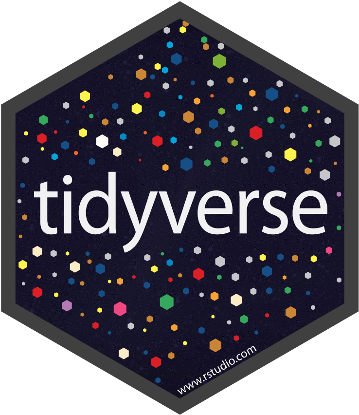
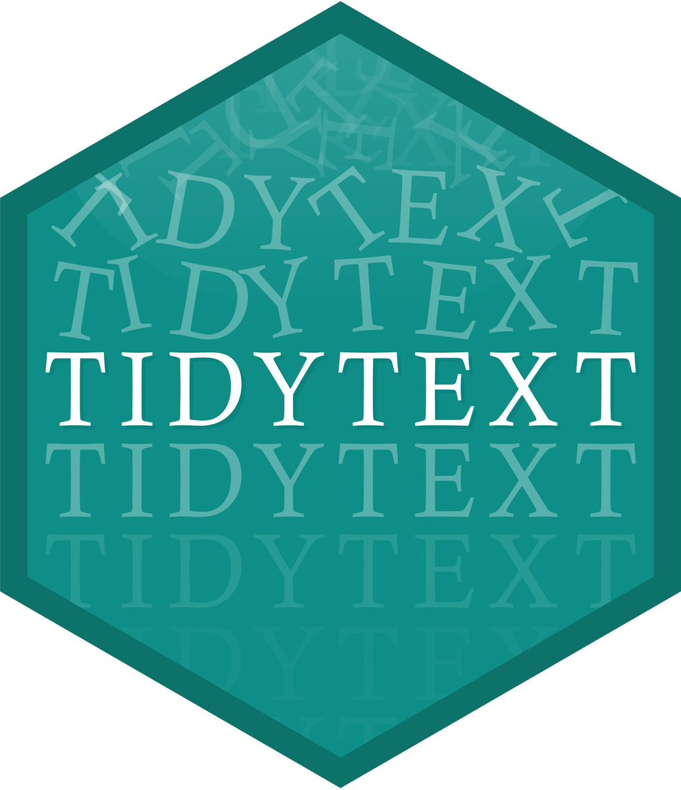

```{r setup, include=FALSE}
knitr::opts_chunk$set(echo = TRUE, error = TRUE)
library(tidyverse)
library(tidytext)
library(gutenbergr)
library(janeaustenr)
library(wordcloud)
```


##

```{r}
#| eval: false
# packages
library(tidyverse)     # ecosystem of data science packages

library(tidytext)      # text mining using tidy tools

library(gutenbergr)    # download works from Project Gutenberg

library(janeaustenr)   # full texts for Jane Austen's 6 completed novels

library(wordcloud)     # for plotting word clouds
```


# Text Analysis

## Sources of text

- Papers, articles, journals

- Novels, fiction, non-fiction, books

- Scripts: e.g. movie, plays, code

- Reviews: e.g amazon, yelp, etc

- Tweets, and similar social media outlets

- Political speeches

- questionnaires, surveys, polls, etc

- ETC


# Pride and Prejudice by Jane Austen

## Pride and Prejudice (Jane Austen, 1813)

:::: {.columns}
::: {.column width="40%"}
{width="75%"}
:::

::: {.column width="60%"}
- Questions:
    1) What words are most commonly used?
    2) What is the emotional arc of the novel?


- Steps:
    1) Access text as computer file
    2) Read into R
    3) Data cleaning
    4) Summary statistics
    5) Visualization
:::
::::


## {background-image="images/project-gutenberg.png" background-size="contain"}

## {background-image="images/pride-prejudice-gutenberg.png" background-size="contain"}

## {background-image="images/pride-prejudice-gutenberg-1342.png" background-size="contain"}

## Option 1.1: Read txt file directly from the web

```{r}
#| echo: false
pp_raw <- readLines("pride-prejudice.txt") # directly from web
```

```{r}
#| eval: false
txt <- "https://www.gutenberg.org/cache/epub/1342/pg1342.txt"

pp_raw <- readLines(txt) # direct from web!
```

. . .

```{r}
#| echo: false
head(pp_raw, n = 5)
```


## Option 1.2: Read text from downloaded file

. . .

```{r}
#| eval: false
# download txt to working directory
download.file(
  url = "https://www.gutenberg.org/cache/epub/1342/pg1342.txt", 
  destfile = "pride-prejudice.txt")
```

. . .

\

```{r}
#| output-location: fragment
# assuming txt file in working directory
pp_raw <- readLines("pride-prejudice.txt")

head(pp_raw, n = 5)
```


## {background-image="images/gutenbergr.png" background-size="contain"}

## Option 2: Read from `"gutenbergr"` package {.smaller}

. . .

```{r}
#| eval: false
# install.packages("gutenbergr")
library(gutenbergr)

pp_raw <- gutenberg_download(
  gutenberg_id = 1342,
  mirror = "https://aleph.pglaf.org/")

slice(pp_raw, 1:10)
```

. . .

```
# A tibble: 10 × 2
   gutenberg_id text                                            
          <int> <chr>                                           
 1         1342 "                            [Illustration:"    
 2         1342 ""                                              
 3         1342 "                             GEORGE ALLEN"     
 4         1342 "                               PUBLISHER"      
 5         1342 ""                                              
 6         1342 "                        156 CHARING CROSS ROAD"
 7         1342 "                                LONDON"        
 8         1342 ""                                              
 9         1342 "                             RUSKIN HOUSE"     
10         1342 "                                   ]"          
```


## {background-image="images/janeaustenr.png" background-size="contain"}

## Option 3: Text from `"janeaustenr"` package {.smaller}

. . .

```{r}
#| eval: false
# install.packages("janeaustenr")
library(janeaustenr)

# text in character vector
prideprejudice[1:10]
```

. . .

```
[1] "PRIDE AND PREJUDICE"                                                    
 [2] ""                                                                       
 [3] "By Jane Austen"                                                         
 [4] ""                                                                       
 [5] ""                                                                       
 [6] ""                                                                       
 [7] "Chapter 1"                                                              
 [8] ""                                                                       
 [9] ""                                                                       
[10] "It is a truth universally acknowledged, that a single man in possession"
```

# Package `"tidytext"`

## {auto-animate=true}

{fig-align="center"}


## {auto-animate=true}

::: {.columns}
::: {.column width="50%"}

:::

::: {.column width="50%"}

:::
:::

## About `"tidytext"`

`"tidytext"` (by Julia Silge and David Robinson) is an R package specifically designed for text mining analysis using Tidy tools[^1].

. . .

While not a core component of _tidyverse_, `"tidytext"` is part of the companion or satellite packages that expand the core functionalities of the core tidy tools.


```{r}
#| eval: false
# install.packages("tidytext")

library(tidytext)
```


[^1]: In `"tidytext"`, like in many other _tidy-companion_ packages, the data must be in a data.frame or tibble.


# Question 1

## What words are most commonly used?

. . .

To answer this question, we should consider a few key concepts/ideas:

- [Word]{.hilit} or [token]{.hilit}: a single unit of text

- [Tokenize]{.mdlit} or [Tokenization]{.mdlit}: Decompose (break down) a text into individuals tokens.

- [Bag-of-Words Analysis]{.bold-hilit}: this is perhaps the most basic type of text analysis based on counting frequencies of words or tokens.


## Tokenize

- Given some object containig text, e.g. vector `prideprejudice`, there are a couple of different ways to tokenize it.

- At its core, you need to split the text into "words".

- You can tokenize "by-hand" with regex functions such as `str_split()`.

- More often than not, you will not only split text into tokens but also:
    + convert to lower case
    + remove punctuation symbols
    + remove extra spaces
    + remove digits


## Tokenize

Conveniently, you can also use the `unnest_tokens()` function from package `"tidytext"`. This requires data in a tabular format.[^2]

. . .

```{r}
#| output-location: fragment
# Reshaping text data into a table
pride_tbl = tibble("text" = prideprejudice)
pride_tbl
```

[^2]: The text data must be in a data.frame or tibble.


## Tokenization with `unnest_tokens()`

. . .

```{r}
#| output-location: fragment
pride_tokens = unnest_tokens(tbl = pride_tbl, input = text, output = word)
pride_tokens
```


## Frequency Analysis {auto-animate=true}

Next step: getting frequencies (i.e. counts)

. . .

```{r}
#| output-location: fragment
pride_tokens |> 
  count(word, name = "count", sort = TRUE) |> 
  slice(1:20)
```


## Frequency Analysis {auto-animate=true}

Next step: getting frequencies (i.e. counts)

```{r}
#| output-location: fragment
pride_tokens |> 
  count(word, name = "count", sort = TRUE) |> 
  slice(1:20) |> 
  ggplot(aes(x = count, y = reorder(word, count))) +
  geom_col()
```


## Stop-Words

. . .

[Stop-words]{.bold-hilit}: very common, uninteresting words that are typically removed in text analyses. `"tidytext"` comes with built-in `stop_words` 

. . .

:::: {.columns}
::: {.column}
```{r}
stop_words
```
:::

::: {.column .fragment}
```{r}
stop_words |> 
  distinct(lexicon)
```
:::
::::


## Removing stop-words

. . .

So far we have 2 tables: 

:::: {.columns}
::: {.column .fragment}
```{r}
pride_tokens
```
:::

::: {.column .fragment}
```{r}
stop_words
```
:::
::::

. . .

\ 

How would you remove stop words from `pride_tokens`?

```{r}
#| echo: false
countdown::countdown(3/4, bottom = 0)
```


## Removing stop-words {auto-animate=true}

. . .

```{r}
#| eval: false
pride_tokens = anti_join(pride_tokens, stop_words, by = "word")
```


## Removing stop-words {auto-animate=true}

```{r}
#| output-location: fragment
pride_tokens = anti_join(pride_tokens, stop_words, by = "word")

pride_tokens |> count(word, name = "count", sort = TRUE)
```


# Wordclouds

##

```{r}
top50_tokens = pride_tokens |> 
  count(word, name = "count", sort = TRUE) |> 
  slice_head(n = 50)

top50_tokens
```


## 

```{r}
#| eval: false
# install.packages("wordcloud")
library(wordcloud)

wordcloud(
  words = top50_tokens$word,
  freq = top50_tokens$count, 
  max.words = 100, 
  colors = c("red", "orange", "green", "cyan", "blue", "purple"))
```

. . .

```{r}
#| echo: false
wordcloud(
  words = top50_tokens$word,
  freq = top50_tokens$count, 
  max.words = 100, 
  colors = c("red", "orange", "green", "cyan", "blue", "purple"))
```


# Bigram Analysis

## N-grams

In addition to decomposing a text into single words, we can also look for 
sets of 2 or more consecutive words, which are called [n-grams]{.bold-hilit}. 

. . .

\ 

The good news is that `unnest_tokens()` can also be used to obtain these
kind of tokens:

- bigrams: `n=2`, decompose text into pairs (2 consecutive words)
- trigrams: `n=3`, decompose text into triplets (3 consecutive words)
- 4-grams: `n=4`, decompose text into sets of 4 (4 consecutive words)


## Bigrams in Pride and Prejudice

:::: {.columns}
::: {.column .fragment}
```{r pride_bigrams}
#| eval: false
pride_bigrams = unnest_tokens(
  tbl = pride_tbl,
  input = text,
  output = bigram,
  token = "ngrams",
  n = 2)

pride_bigrams
```
:::

::: {.column .fragment}
```{r pride_bigrams, echo = FALSE}
```
:::
::::


##

Getting rid of `NA`'s in `pride_bigrams`

```{r}
#| output-location: fragment
pride_bigrams = pride_bigrams |> filter(!is.na(bigram))

# get frequencies
pride_bigrams |> count(bigram, name = "count", sort = TRUE)
```


## Bigrams containing "darcy" (Fitzwilliam Darcy)

```{r}
# male protagonist
pride_bigrams |> 
  filter(str_detect(bigram, pattern = "darcy")) |> 
  count(bigram, name = "count", sort = TRUE)
```


## Removing Stop Words when working with n-grams

. . .

```{r eval = FALSE}
# last time, when working with single tokens
anti_join(tbl, stop_words, by = "word")
```

. . .

What about removing stop-words from bigrams?

. . .

```{r}
anti_join(pride_bigrams, stop_words, by = c("bigram" = "word"))
```

. . .

👎


##

Decompose the bigrams into individual words, and then filter out the entries
that correspond to stop-words:

. . .

```{r}
pride_bigrams2 = pride_bigrams |> 
  mutate(word1 = str_extract(bigram, "^\\w+"),
         word2 = str_extract(bigram, "\\w+$")) |> 
  filter(!(word1 %in% stop_words$word),
         !(word2 %in% stop_words$word))
```


##

```{r}
#| output-location: fragment
#| out-width: 85%
pride_bigrams2 |> 
  count(bigram, word1, word2, name = "count", sort = TRUE) |> 
  filter(count > 20) |> 
  ggplot(aes(x = count, y = reorder(bigram, count))) +
  geom_col()
```
