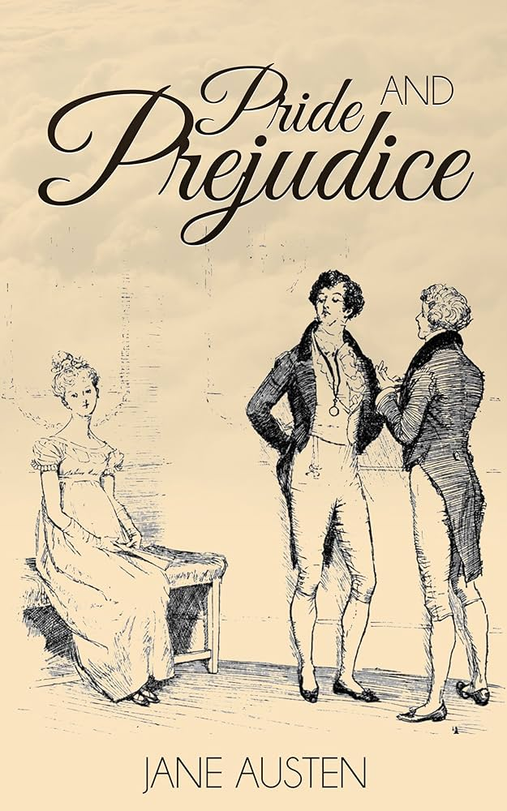
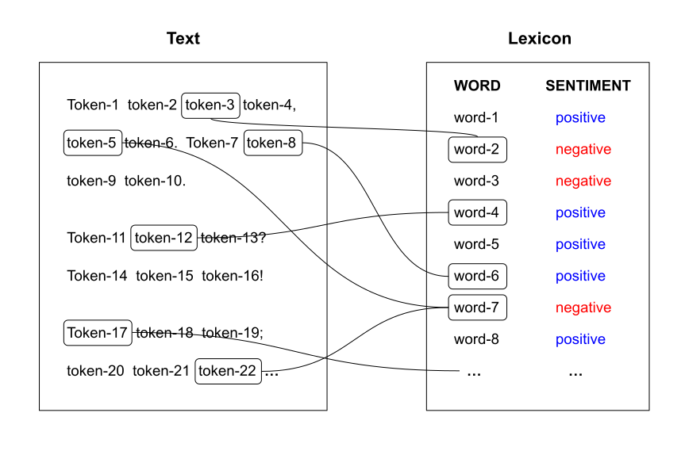
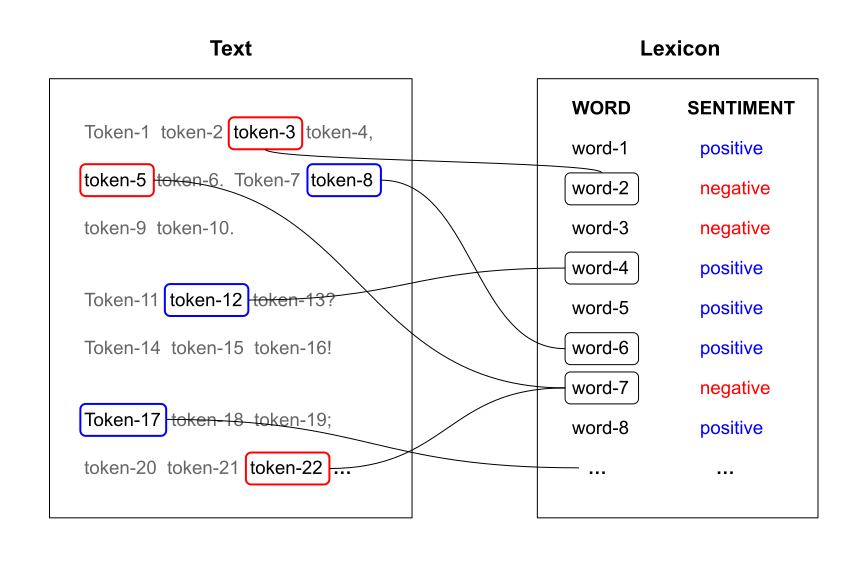
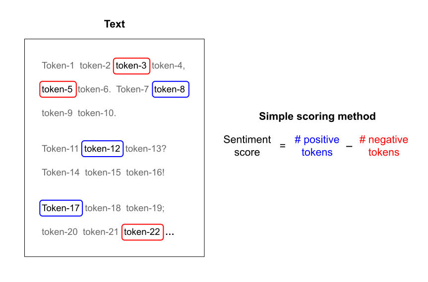
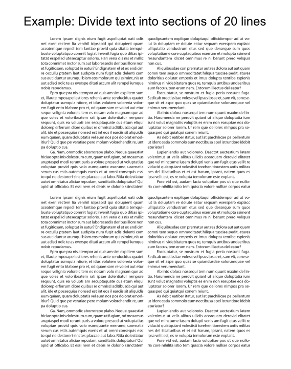
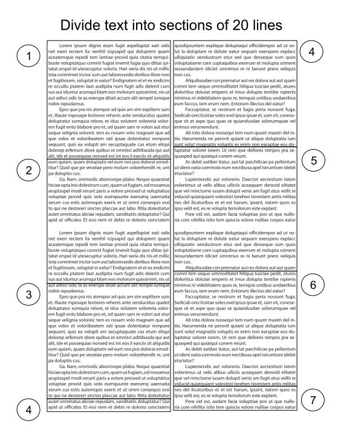
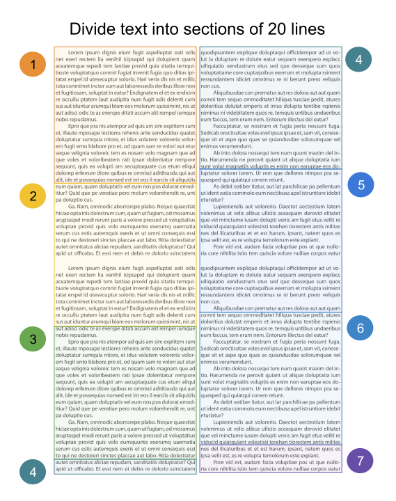
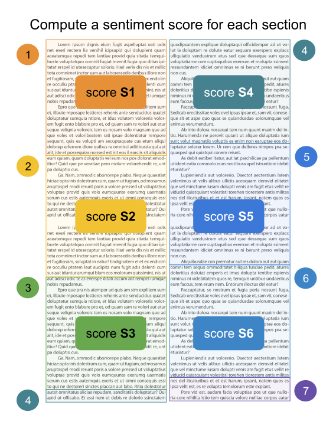

```{r setup, include=FALSE}
knitr::opts_chunk$set(echo = TRUE, error = TRUE)
library(tidyverse)
library(tidytext)
library(textdata)
library(janeaustenr)
library(plotly)

bing = read_csv("bing.csv")
afinn = read_csv("afinn.csv")
loughran = read_csv("loughran.csv")
nrc = read_csv("nrc.csv")
```


##

```{r}
#| eval: false
# packages
library(tidyverse)     # ecosystem of data science packages

library(tidytext)      # text mining using tidy tools

library(textdata)      # various text datasets

library(janeaustenr)   # full texts for Jane Austen's 6 completed novels

library(plotly)        # web interactive plots
```


# Analysis of Pride and Prejudice

## Pride and Prejudice (Jane Austen, 1813)

:::: {.columns}
::: {.column width="40%"}
{width="75%"}
:::

::: {.column width="60%"}
- Questions:
    1) ~~What words are most commonly used?~~
    2) What is the emotional arc of the novel?


- Steps:
    1) Access text as computer file
    2) Read into R
    3) Data cleaning
    4) Summary statistics
    5) Visualization
:::
::::


## Last time ...

1) We used the vector `prideprejudice` from the package `"janeaustenr"`,
2) Put it into a tibble for _tidytext_ convenience,
3) Tokenize into words.

. . .

```{r}
#| output-location: fragment
pride_tbl = tibble(text = prideprejudice)

pride_tokens = unnest_tokens(pride_tbl, input = text, output = word)
pride_tokens
```


# Sentiment Analysis

##

Goal: Determine the emotional content of text.

\

One common approach is to consider the text as a combination of its individual words or tokens, and the [sentiment]{.bold-hilit} of the whole text as the sum of the sentiment content of the individual words.

\ 

This involves assigning a sentiment category to each token, which in turn requires using a [Sentiment Lexicon]{.bold-hilit}


##

{fig-align="center" width=70%}

##

{fig-align="center" width=70%}

##

{fig-align="center" width=70%}

##

{fig-align="center" width=70%}

##

{fig-align="center" width=70%}


## Sentiment lexicon example

`"tidytext"` provides a default sentiment lexicon `sentiments`

. . .

```{r}
sentiments
```

. . .

This lexicon has a list of words and their associated sentiment classified into binary categories: `negative` and `positive`.


## Sentiment lexicons

You can get four lexicons with `get_lexicon()`:[^1]

- `"bing"`: from Bing Liu; this lexicon[^2] categorizes words in a binary fashion
into positive and negative categories.

- `"afinn"`: from Finn Arup Nielsen; this lexicon assigns words with a score
that runs between -5 and 5, with negative scores indicating negative sentiment
and positive scores indicating positive sentiment.

- `"nrc"`: from Saif Mohammad and Peter Turney; this lexicon categorizes words 
in a binary fashion (`"yes"` / `"no"`) into categories of positive, negative, 
anger, anticipation, disgust, fear, joy, sadness, surprise, and trust.

- `"loughran"`: another lexicon somewhat similar to `"afinn"`.

[^1]: Lexicons from `"tidytext"` sibling package `"textdata"`.

[^2]: This is the lexicon in `sentiments`.


## Sentiment lexicons

The sentiment lexicons mentioned in the previous slide can be obtained with the `get_sentiments(lexicon = ...)` function.

. . .

```{r}
#| eval: false
# run this command in R's console
afinn = get_sentiment(lexicon = "afinn")
```

. . .

\ 

::: {.callout-warning icon=true}
The issue is that `get_sentiments()` is an interactive function that requires manual input. If you include this function in a `qmd` file it won't work.

It's better to download the lexicons to a text or an R file, and then import them with a reading function, e.g. `read_csv()`.
:::


## {.smaller}

:::: {.columns}
::: {.column}
```{r}
#| output-location: fragment
bing |> slice_head(n = 8)
```

```{r}
#| output-location: fragment
afinn |> slice_head(n = 8)
```
:::

::: {.column .fragment}
```{r}
#| output-location: fragment
loughran |> slice_head(n = 8)
```

```{r}
#| output-location: fragment
nrc |> slice_head(n = 8)
```
:::
::::


## Assigning sentiments to words

:::: {.columns}
::: {.column .fragment}
```{r}
pride_tokens
```
:::

::: {.column .fragment}
```{r}
sentiments
```
:::
::::

. . .

\ 

How would you assign sentiments to `pride_tokens`?

```{r}
#| echo: false
countdown::countdown(3/4, bottom = 0)
```


## Assigning sentiments to words

```{r}
#| output-location: fragment
# attaching sentiments with inner_join
pride_sentim = inner_join(pride_tokens, sentiments, by = "word")

pride_sentim
```

##

```{r}
#| output-location: fragment
#| out-width: 85%
pride_sentim |> 
  count(word, sentiment, name = "count", sort = TRUE) |> 
  slice_head(n = 20) |> 
  ggplot(aes(x = count, y = reorder(word, count), fill = sentiment)) +
  geom_col()
```


##

```{r}
#| output-location: fragment
#| out-width: 85%
# filter out "miss", and graph top-20 words
pride_sentim |> 
  count(word, sentiment, name = "count", sort = TRUE) |> 
  filter(word != "miss") |> slice_head(n = 20) |> 
  ggplot(aes(x = count, y = reorder(word, count), fill = sentiment)) +
  geom_col()
```


# Sentiment Scoring

## Sentiment Score by Chapter

Another type of sentiment analysis that can be performed on the `prideprejudice`
text is to compute a sentiment score for each chapter in the book.

. . .

We need to do a bit of text processing in order to split the text into chapters.
Here are the proposed steps:

1) Collapse `prideprejudice` into a single element vector

2) Split text into chapters using a regex pattern `"Chapter \\d+"`

    2.1) unbox into vector
  
    2.2) get rid of first lines (not a chapter)

3) Assemble table with columns `"chapter"` and `"text"`


##

Notice that `prideprejudice` contains elements indicating where a chapter 
begins, like element 7 in the following output (`"Chapter 1"`)

. . .

```{r}
head(prideprejudice, n = 10)
```

. . .

\

We can use these lines of text to detect where a chapter begins.


##

Step 1) collapse text into one-element vector

. . .

```{r}
pride_collapsed = paste(prideprejudice, collapse = " ")
```

. . .

\

Step 2) split text into chapters using `str_split()` which returns a list

```{r}
pride_split = str_split(pride_collapsed, pattern = "Chapter\\s\\d+")
```


## 

Substeps 2.2) and 2.1) unbox and remove first element because it's not a chapter

```{r}
pride_chapters = pride_split[[1]][-1]

# how many chapters
length(pride_chapters)
```


##

Step 3) Assemble table of chapters, and their text content

. . .

```{r}
#| output-location: fragment
pride_chaps = tibble(
  text = pride_chapters,
  chapter = 1:length(pride_chapters))

pride_chaps
```


## {auto-animate=true}

Then we proceed as usual: tokenizing the text, getting
word count, and assigning sentiments:

. . .

```{r}
#| eval: false
pride_toks = unnest_tokens(pride_chaps, input=text, output=word)
```


## {auto-animate=true}

Then we proceed as usual: tokenizing the text, removing stopwords, and getting
word counts:

```{r}
#| output-location: fragment
pride_toks = unnest_tokens(pride_chaps, input=text, output=word)

pride_toks_count = pride_toks |> 
  count(word, chapter, name = "count", sort = TRUE)

pride_toks_count
```


## {auto-animate=true}

Then we proceed as usual: tokenizing the text, removing stopwords, and getting
word counts:

```{r}
pride_toks = unnest_tokens(pride_chaps, input=text, output=word)

pride_toks_count = pride_toks |> 
  count(word, chapter, name = "count", sort = TRUE)

pride_sent = inner_join(pride_toks_count, sentiments, by = "word") |> 
  filter(word != "miss")
```


##

```{r}
# after removing stop-words
pride_sent
```

. . .

\ 

We need to compute a sentiment score for each chapter:

[score = # positive words - # negative words]{.bold-hilit}


##

Sentiment score for each chapter:

[score = # positive words - # negative words]{.bold-hilit}

:::: {.columns}
::: {.column width="60%" .fragment}
```{r}
pride_sent
```
:::

::: {.column width="40%" .fragment}
```{r chapter_scores}
#| echo: false
chapter_scores = pride_sent |> 
  pivot_wider(names_from = sentiment, 
              values_from = count, 
              values_fill = 0) |> 
  group_by(chapter) |> 
  summarize(score = sum(positive) - sum(negative))
```

```{r}
chapter_scores
```
:::
::::

. . .

\ 

Given `pride_sent`, how would you obtain `chapter_scores`?

```{r}
#| echo: false
countdown::countdown(2, bottom = 0)
```


## {auto-animate=true}

```{r}
#| eval: false
chapter_scores = pride_sent |> 
  pivot_wider(names_from = sentiment, 
              values_from = count, 
              values_fill = 0)
```


## {auto-animate=true}

```{r}
#| eval: false
chapter_scores = pride_sent |> 
  pivot_wider(names_from = sentiment, 
              values_from = count, 
              values_fill = 0) |>
  group_by(chapter)
```


## {auto-animate=true}

```{r}
#| eval: false
chapter_scores = pride_sent |> 
  pivot_wider(names_from = sentiment, 
              values_from = count, 
              values_fill = 0) |> 
  group_by(chapter) |> 
  summarize(score = sum(positive) - sum(negative))
```

## {auto-animate=true}

```{r}
#| output-location: fragment
chapter_scores = pride_sent |> 
  pivot_wider(names_from = sentiment, 
              values_from = count, 
              values_fill = 0) |> 
  group_by(chapter) |> 
  summarize(score = sum(positive) - sum(negative))

slice_head(chapter_scores, n = 10)
```


##

```{r}
#| code-fold: true
#| out-width: 100%
#| fig-width: 10
#| fig-height: 8
ggplotly(
  chapter_scores |> 
  mutate(sentiment = case_when(
    score >= 0 ~ "pos",
    score < 0 ~ "neg")) |> 
  ggplot(aes(x = chapter, y = score, fill = sentiment)) +
  geom_col() +
  labs(title = "Sentiment score for each chapter in 'Pride and Prejudice'") +
  theme_bw()
)
```


# Narrative Arc

## {.nostretch}

{fig-align="center" width=47%}

## {.nostretch}

{fig-align="center" width=47%}

## {.nostretch}

{fig-align="center" width=47%}

## {.nostretch}

{fig-align="center" width=47%}


## {auto-animate=true .smaller}

```{r}
#| eval: false
pride_tbl = tibble(text = prideprejudice)
```

## {auto-animate=true .smaller}

```{r}
#| output-location: fragment
pride_tbl = tibble(text = prideprejudice)

pride_tbl |> 
  filter(!str_detect(text, "^Chapter\\s\\d+"),
         text != "")
```

## {auto-animate=true .smaller}

```{r}
#| output-location: fragment
pride_tbl = tibble(text = prideprejudice)

pride_tbl |> 
  filter(!str_detect(text, "^Chapter\\s\\d+"),
         text != "") |> 
  mutate(line_number = row_number(),
         section = line_number %/% 80)
```


## {auto-animate=true .smaller}

```{r}
#| output-location: fragment
pride_tbl = tibble(text = prideprejudice)

pride_tbl |> 
  filter(!str_detect(text, "^Chapter\\s\\d+"),
         text != "") |> 
  mutate(line_number = row_number(),
         section = line_number %/% 80) |> 
  unnest_tokens(input = text, output = word)
```

## {auto-animate=true .smaller}

```{r}
#| output-location: fragment
pride_tbl = tibble(text = prideprejudice)

pride_tbl |> 
  filter(!str_detect(text, "^Chapter\\s\\d+"),
         text != "") |> 
  mutate(line_number = row_number(),
         section = line_number %/% 80) |> 
  unnest_tokens(input = text, output = word) |> 
  inner_join(sentiments, by = "word")
```

## {auto-animate=true .smaller}

```{r}
#| output-location: fragment
pride_tbl = tibble(text = prideprejudice)

pride_tbl |> 
  filter(!str_detect(text, "^Chapter\\s\\d+"),
         text != "") |> 
  mutate(line_number = row_number(),
         section = line_number %/% 80) |> 
  unnest_tokens(input = text, output = word) |> 
  inner_join(sentiments, by = "word") |> 
  count(section, sentiment)
```

## {auto-animate=true .smaller}

```{r}
#| output-location: fragment
pride_tbl = tibble(text = prideprejudice)

pride_tbl |> 
  filter(!str_detect(text, "^Chapter\\s\\d+"),
         text != "") |> 
  mutate(line_number = row_number(),
         section = line_number %/% 80) |> 
  unnest_tokens(input = text, output = word) |> 
  inner_join(sentiments, by = "word") |> 
  count(section, sentiment) |> 
  pivot_wider(names_from = sentiment, values_from = n, values_fill = 0)
```

## {auto-animate=true .smaller}

```{r}
#| output-location: fragment
pride_tbl = tibble(text = prideprejudice)

pride_tbl |> 
  filter(!str_detect(text, "^Chapter\\s\\d+"),
         text != "") |> 
  mutate(line_number = row_number(),
         section = line_number %/% 80) |> 
  unnest_tokens(input = text, output = word) |> 
  inner_join(sentiments, by = "word") |> 
  count(section, sentiment) |> 
  pivot_wider(names_from = sentiment, values_from = n, values_fill = 0) |>
  mutate(score = positive - negative)
```

## {auto-animate=true}

```{r}
section_scores = pride_tbl |> 
  filter(!str_detect(text, "^Chapter\\s\\d+"),
         text != "") |> 
  mutate(line_number = row_number(),
         section = line_number %/% 80) |> 
  unnest_tokens(input = text, output = word) |> 
  inner_join(sentiments, by = "word") |> 
  count(section, sentiment) |> 
  pivot_wider(names_from = sentiment, 
              values_from = n, 
              values_fill = 0) |>
  mutate(score = positive - negative)
```


##

```{r}
#| code-fold: true
#| out-width: 80%
section_scores |> 
  ggplot(aes(x = section, y = score, fill = score)) +
  geom_col() +
  scale_fill_viridis_c() +
  theme_bw() +
  labs(title = "Narrative arc of Pride and Prejudice",
       subtitle = "Each section involves 80 lines of text")
```
