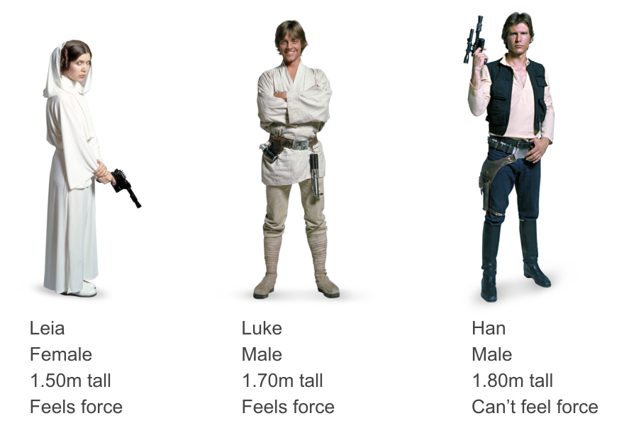
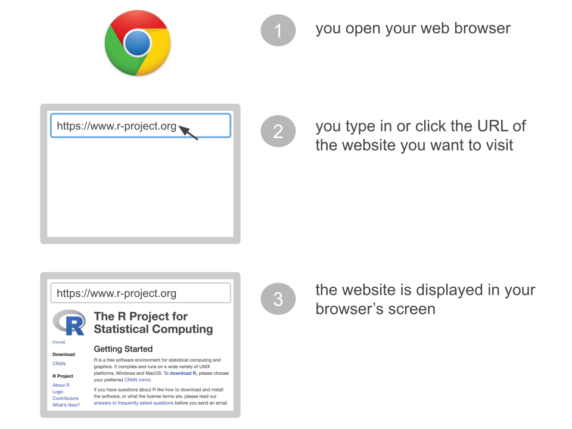
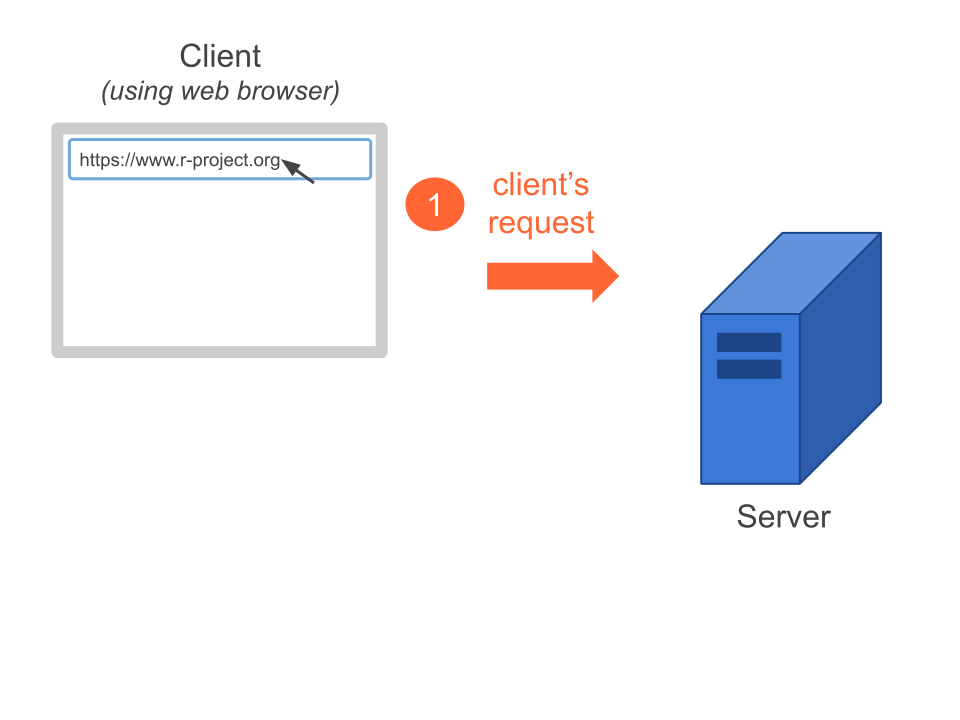
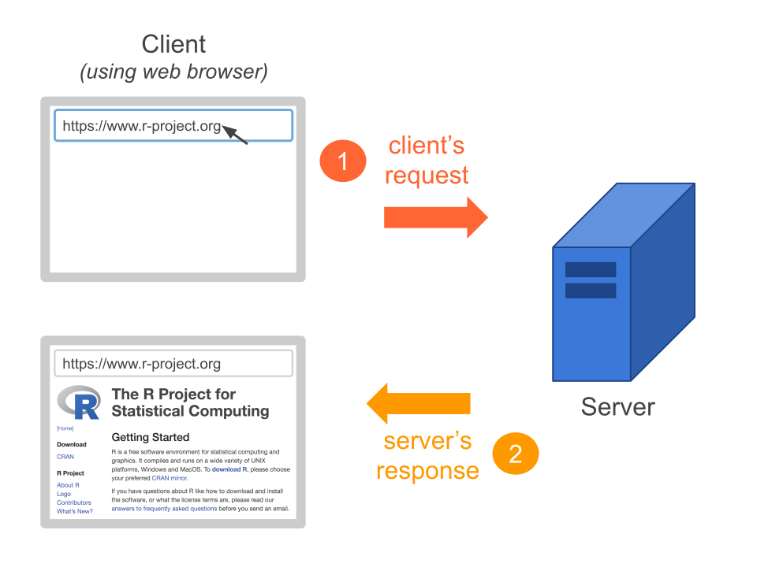
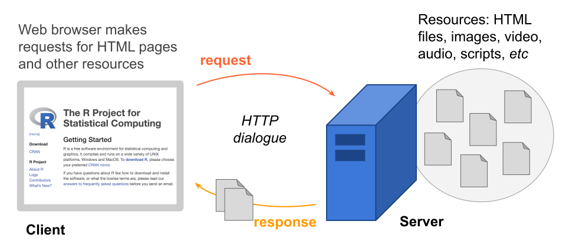
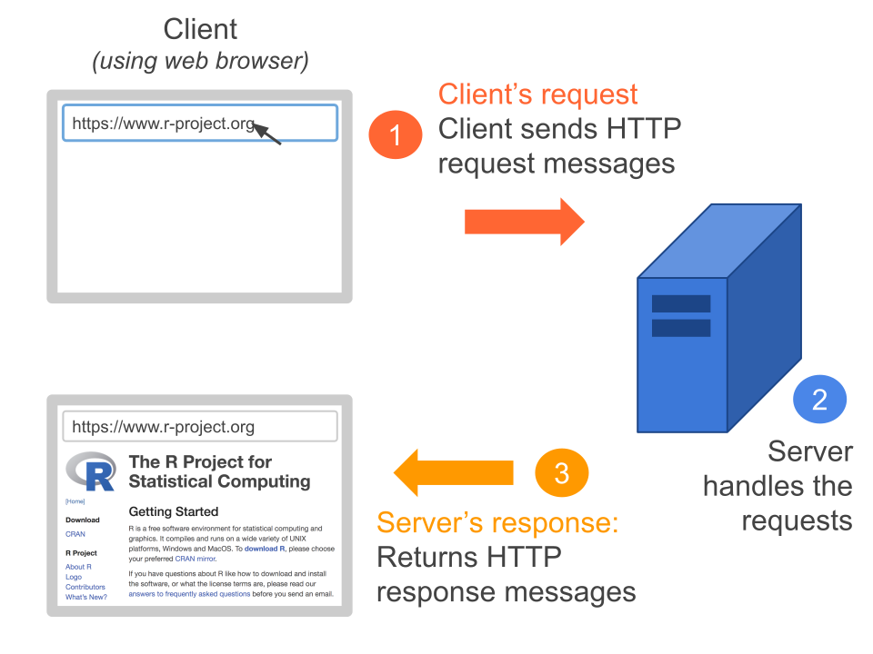
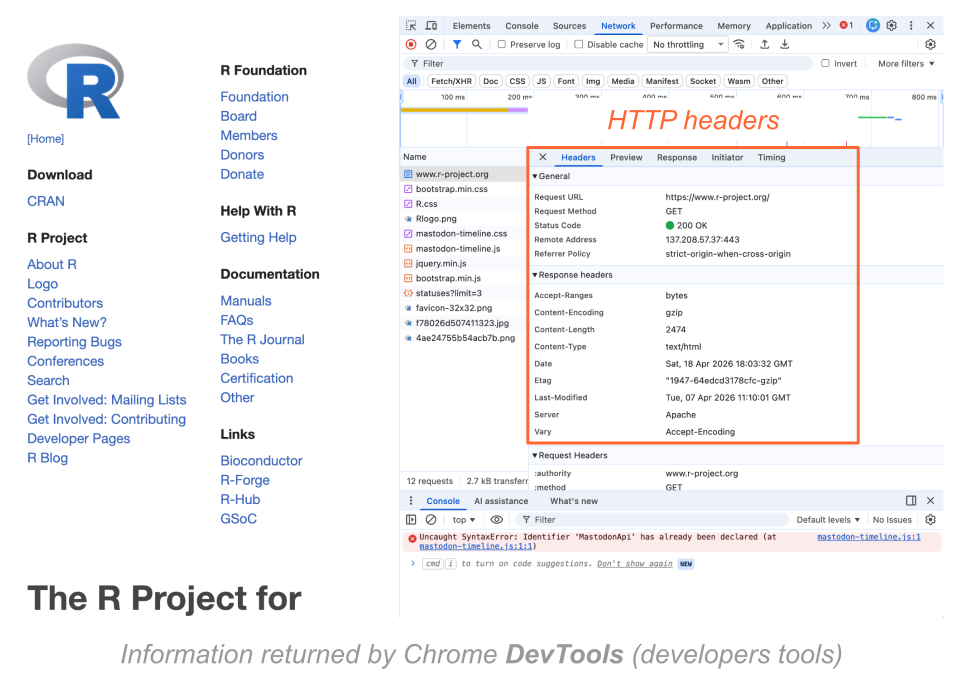
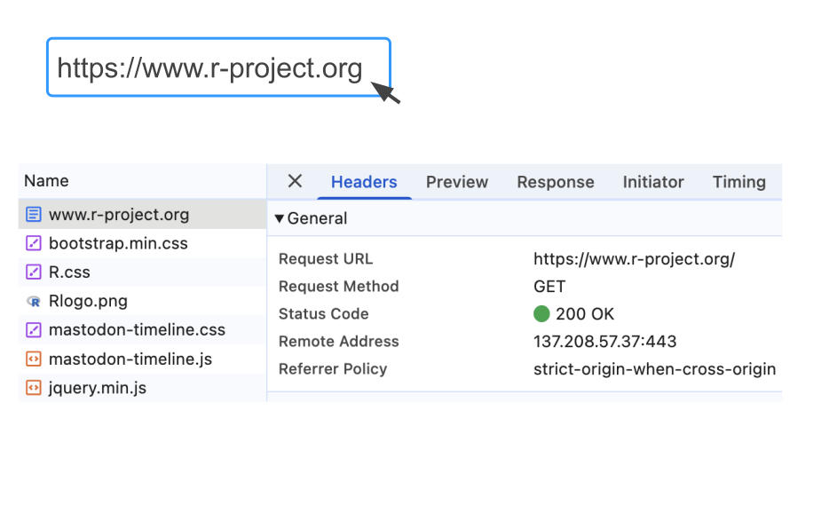
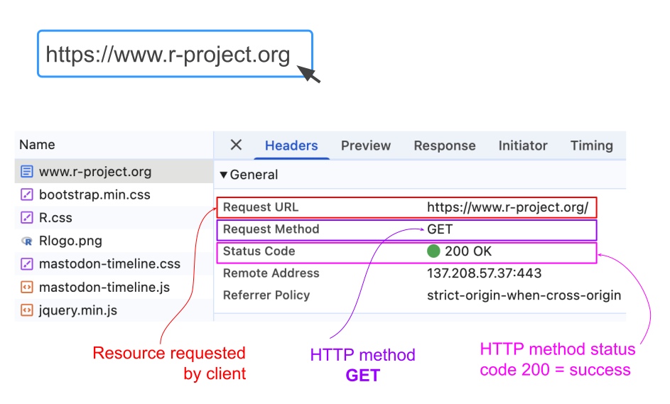

```{r setup, include=FALSE}
knitr::opts_chunk$set(echo = TRUE, error = TRUE)
library(tidyverse)
library(jsonlite)
```

# Introduction

## Data in various formats

So far you've been dealing with data sets in various formats: 

- internal data objects in R 
    + data frames such as `mtcars` or `faithful`
    + tibbles like `storms` or `penguins`

- text files with tabular structure (txt, csv, tsv, etc)

- unstructured text files (e.g. Jane Austen's novels)

- binary files like shapefiles or NetCDF files

. . .

\

But you also need to learn how to get data from the web through APIs.


## Web Data and JSON format

- Reading data from the Web entails a whole other set of considerations. 

- Because of the large variety of data formats available in the Web, we will primarily focus on retrieving data from [Application Programming Interfaces]{.bold-hilit} also known as **_APIs_**.

- Think of an API as a ["Data Sharing Interface"]{.bold-hilit}

- Why to focus on APIs? Because nowadays many companies, services, websites, etc. use APIs as their primary means to share information and data.

- BTW: An increasing number of APIs have adopted a common format to share data: [JSON]{.bold-hilit}

- So before discussing how to work with APIs, we'll begin with JSON data.


# Preamble

## {.nostretch}

{width="84%" fig-align="center"}


## Data in some kind of table

\

| Name | Gender | Height | Force |
|------|--------|--------|-------|
| Leia | female |  1.50  | TRUE  |
| Luke |   male |  1.70  | TRUE  |
| Han  |   male |  1.80  | FALSE |


##

Common formats to store tabular data

:::: {.columns}

::: {.column .fragment width="45%"}
Space separated values

```{.text filename="data.txt"}
Name Gender Height Force
Leia female 1.50 TRUE
Luke male 1.70 TRUE
Han male 1.80 FALSE
```

\

::: {.fragment}
Comma separated values

```{.text filename="data.csv"}
Name,Gender,Height,Force
Leia,female,1.50,TRUE
Luke,male,1.70,TRUE
Han,male,1.80,FALSE
```
:::
:::

::: {.column width="5%"}
:::

::: {.column .fragment width="50%"}

Tab separated values

```{.text filename="data.tsv"}
Name  Gender  Height  Force
Leia  female  1.50  TRUE
Luke  male  1.70  TRUE
Han male  1.80  FALSE
```

\

::: {.fragment}
Fixed width format

```{.text filename="data.fwf"}
Name Gender Height Force
Leia female 1.50   TRUE
Luke male   1.70   TRUE
Han  male   1.80   FALSE
```
:::
:::

::::


## Data in non-tabular form

. . .

One option

```{.text filename="datafile1.txt"}
Leia is a female, 1.50 meters tall, and can feel the force.
Luke is a male, 1.70 meters tall, and can feel the force.
Han is a male, 1.80 meters tall, and cannot feel the force.
```

. . .

\

Another option

```{.text filename="datafile2.txt"}
Names: Leia, Luke, Han
Heights: 1.50, 1.70, 1.80
Force: yes, yes, no
```

## Data in non-tabular form

Yet another option

```{.text filename="datafile3.txt"}
Leia: 
  - female
  - 1.50
  - force
Luke:
  - male
  - 1.70
  - force
Han:
  - male
  - 1.80
  - no force
```


# JSON

## JSON Data

- JSON stands for [JavaScript Object Notation]{.bold-hilit}

- It is a lightweight, text-based format used for storing and exchanging data.

- It originated from JavaScript, but is supported by virtually all modern programming languages.

- It is primarily used to transmit information between a web server and a client, or between different parts of an application.

- JSON has become the dominant data format for exchaning data over the web, overtaking previous popular formats such as XML.

. . .

\

[Let's see the data types, and the kind of data containers available in JSON]{.mdlit}


## JSON data types

. . .

JSON provides four data types

- [string]{.bold-hilit}: `"hello"`
    + analogous to `character` type in R

- [numbers]{.bold-hilit}: `1, 2, 3`
    + analogous to `numeric` mode in R
    + no distinction of integers and doubles in JSON

- [boolean]{.bold-hilit}: `true` and `false`
    + analogous to `logical` type in R

- [null]{.bold-hilit}: `null`
    + analogous to `NULL` in R


## JSON Containers or "data structures" 

JSON values (e.g. strings, numbers, booleans, null) are typically contained in one of two kind of structures:

\

1) JSON Arrays

\

2) JSON Objects


## Container: JSON arrays 

- Unnamed ordered arrays
- Defined with square brackets `[ ]`
- Elements separated by commas

. . .

```json
["A", "B", "C", "D"]
```

\

```json
[1, 2, 3, 4, 5]
```

\

```json
[true, true, false]
```

\

```json
["A", 1, true, null]
```


## Container: JSON objects

- Key-value pairs: `"key": value`
- Defined with curly braces `{ }`
- Key has to be quoted
- Key and value separated with a colon `:`

. . .

```json
{ "key": value }
```

. . .

\

```json       
{ 
  "class": "STAT 133",
  "semester": "Spring",
  "year": 2026,
  "prereqs": null
}
```


## {.nostretch}

{width="83%" fig-align="center"}


## JSON object and array {auto-animate=true}

:::: {.columns}
::: {.column width="30%"}
{fig-align="center" width="72%"}
:::

::: {.column .fragment width="70%"}
[Array]{.bold-hilit}

```json       
["Leia", "female", 1.5, true]
```

\

::: {.fragment}
[Object]{.bold-hilit}

```json
{ 
  "name": "Leia",
  "gender": "female",
  "height": 1.5,
  "force": true
}
```
:::

:::
::::


## {.nostretch}

{width="84%" fig-align="center"}


##

Data in a [JSON object]{.hilit}

. . .

```json         
{
  "name": ["Leia", "Luke", "Han"],
  "gender": ["female", "male", "male"],
  "height": [1.6, 1.7, 1.8],
  "force": [true, true, false]
}
```

. . .

\

Data in a [JSON array]{.mdlit}

. . .

```json         
[
  {"name": "Leia", "gender": "female", "height": 1.6, "force": true},
  {"name": "Luke", "gender": "male", "height": 1.7, "force": true},
  {"name": "Han", "gender": "male", "height": 1.8, "force": false}
]
```


# Package `"jsonlite"`

##

```{r}
#| eval: false
# install.packages("jsonlite")
library(jsonlite)
```

. . .

\

There are 2 main functions:

1) `fromJSON()`: convert JSON data (entered as text) to R objects

2) `toJSON()`: convert R objects to JSON data


##

```{r}
#| output-location: fragment
json1 <- '[1, 2, 3, 4, 5]'

r1 <- fromJSON(json1)
r1
```

. . . 

```{r}
class(r1)
```

. . .

\

```{r}
#| output-location: fragment
json2 <- '[true, true, false]'

r2 <- fromJSON(json2)
r2
```

. . .

```{r}
class(r2)
```


## 

```{r}
json3 <- '{"name": "Leia", "gender": "female", "height": 1.6, "force": true}'
```

. . .

\

```{r}
#| output-location: fragment
fromJSON(json3)
```


## 

```{r}
#| output-location: fragment
json4 <- fromJSON('{
  "name": ["Leia", "Luke", "Han"],
  "gender": ["female", "male", "male"],
  "height": [1.6, 1.7, 1.8],
  "force": [true, true, false]
}')

as.data.frame(json4)
```


## 

```{r}
#| output-location: fragment
leia_vec <- c('Leia', 'female', '1.50', 'true')

toJSON(leia_vec)
```

. . .

\

```{r}
#| output-location: fragment
leia_lst <- list(
  "name" = "Leia", 
  "gender" = "female", 
  "height" = 1.50, 
  "force" = TRUE)

toJSON(leia_lst)
```


## 

```{r}
#| output-location: fragment
leia_lst <- list(
  "name" = "Leia", 
  "gender" = "female", 
  "height" = 1.50, 
  "force" = TRUE)

toJSON(leia_lst, auto_unbox = TRUE, pretty = TRUE)
```


# Web Basics

##

In this section we'll give you a crash introduction to [HTTP]{.bold-hilit} so you can be prepared to work with [Application Programming Interfaces]{.hilit} (APIs). 

Specifically, we cover:

- Web made of Clients and Servers
- HTTP basics
- HTTP requests and responses


## {.nostretch}

{width="78%" fig-align="center"}

##

- You access websites using software called a **Web browser** (e.g. Chrome, Firefox, etc).

- The browser in your computer is the [Client]{.hilit} that requests a variety of resources.

- The client’s request is sent to [Web Servers]{.mdlit} which send responses back to the client.

- The way [Client]{.hilit} and [Server]{.mdlit} dialogue between each other is by following a **_formal protocol of communication_**.


## {.nostretch}

{width="80%" fig-align="center"}

## {.nostretch}

{width="80%" fig-align="center"}

## Clients and Servers

- The software-and-computers that form the Web are divided into two types: [Clients]{.hilit} and [Servers]{.mdlit}.

- A [Client]{.hilit} is the software that requests information (html pages, scripts, images, video, audio).

- A [Server]{.mdlit} is the software-computer in charge of serving the resources that the clients request.

- [Clients]{.hilit} and [Servers]{.mdlit} communicate via the [HyperText Transfer Protocol (HTTP)]{.bold-hilit} and other protocols.


## {.nostretch}

{width="90%" fig-align="center"}


# HTTP Basics

## HyperText Transfer Protocol

- Protocol: a system of rules that explain the correct conduct and procedures to be followed in formal situations.

- HTTP stands for **_HyperText Transfer Protocol_**

- HTTP is a communications protocol, i.e. a system of digital rules for data exchange within or between computers.

- HTTP allows clients and servers to communicate (send and receive messages).

- HTTP can be used to transfer documents, images, movies, audio files, data, scripts, and all other web resources that make up websites and applications.


## {.nostretch}

{width="78%" fig-align="center"}


## Anatomy of HTTP message

. . .

HTTP messages consist of 2 parts (separated by a blank line)

1) A [message header]{.bold-hilit}:
    + The 1st line in the header is the request/response line
    + The rest of the lines are __headers__ formed by `key:value` pairs.

2) An optional [message body]{.bold-hilit}

## {.nostretch}

{width="80%" fig-align="center"}

## {.nostretch}

{width="90%" fig-align="center"}

## {.nostretch}

{width="90%" fig-align="center"}


## HTTP Methods {.smaller}

| Method   | Description |
|----------|-------------|
| `GET`    | Retrieves whatever information is identified by the Request URI |
| `POST`   | Request with data enclosed in the request body |
| `HEAD`   | Identical to `GET` except that the server must not return a message-body in the response |
| `PUT`    | Requests that the enclosed entity be stored under the supplied request-URI |
| `DELETE` | Requests that the origin server delete the resource identified by the request-URI |
| `TRACE`  | Invokes a remote, application-layer loop-back of the request message |
| `CONNECT`| For use with a proxy that can dynamically switch to being a tunnel |


## Status Codes

| Status | Description |
|--------|-------------|
| `1xx`  | Informational messages |
| `2xx`  | Successful (e.g. 200, 202, 204, 205, 206) |
| `3xx`  | Redirection (e.g. 301, 303, 304) |
| `4xx`  | Client error (e.g. 400, 401, 403, 404) |
| `5xx`  | Server error (e.g. 500, 501, 503) |


## Recap

- The HTTP protocol is a standardized method for transfering data or documents over the Web.

- The software-and-computers that form the Web are divided into two types: [Clients]{.hilit} and [Servers]{.mdlit}.

- The clients' requests and the servers' responses are handled via HTTP.

- There are 2 types of HTTP messages: [requests]{.hilit} and [responses]{.mdlit}.

- We don't actually see HTTP dialogues but they are there behind the scenes.

