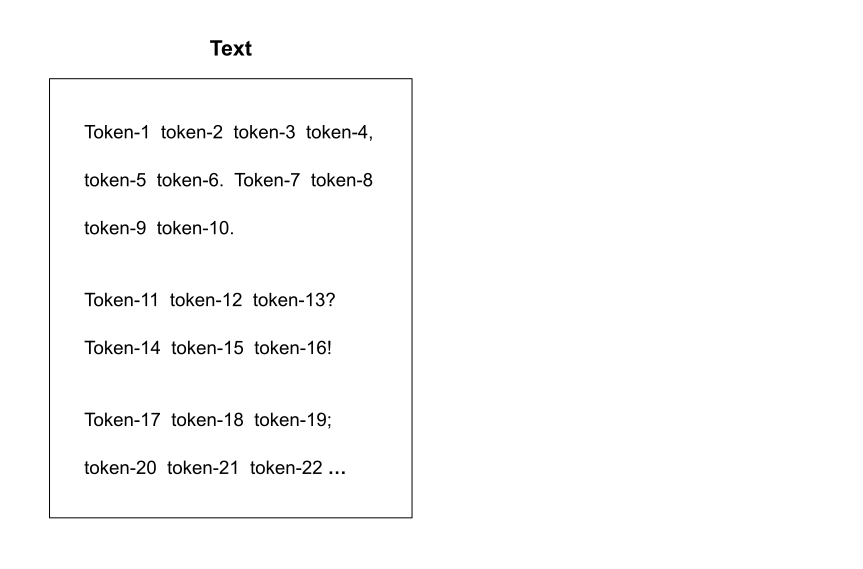
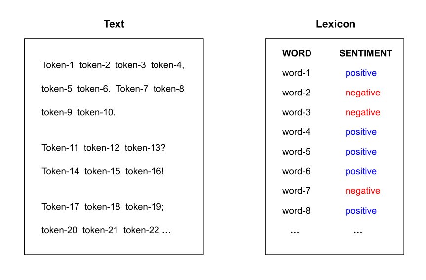
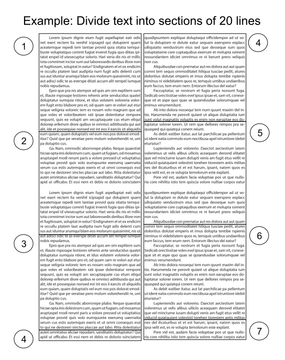
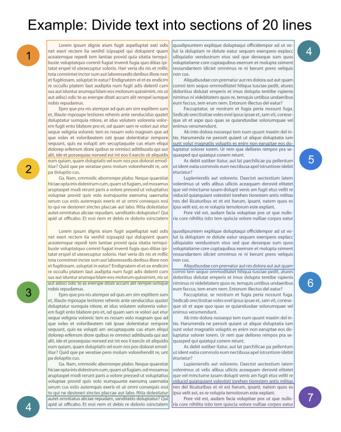

```{r setup, include=FALSE}
knitr::opts_chunk$set(echo = TRUE, error = TRUE)
library(tidyverse)
library(tidytext)
library(textdata)
library(janeaustenr)
library(plotly)

bing = read_csv("bing.csv")
afinn = read_csv("afinn.csv")
loughran = read_csv("loughran.csv")
nrc = read_csv("nrc.csv")
```


##

```{r}
#| eval: false
# packages
library(tidyverse)     # ecosystem of data science packages

library(tidytext)      # text mining using tidy tools

library(textdata)      # various text datasets

library(janeaustenr)   # full texts for Jane Austen's 6 completed novels

library(plotly)        # web interactive plots
```


# Analysis of Pride and Prejudice

## Pride and Prejudice (Jane Austen, 1813)

:::: {.columns}
::: {.column width="40%"}
{width="75%"}
:::

::: {.column width="60%"}
- Questions:
    1) ~~What words are most commonly used?~~
    2) What is the emotional arc of the novel?


- Steps:
    1) Access text as computer file
    2) Read into R
    3) Data cleaning
    4) Summary statistics
    5) Visualization
:::
::::


## Last time ...

We introduced the core ideas of Sentiment Analysis:

> Consider the text as a combination of its individual words or tokens, 
> and the [sentiment]{.bold-hilit} of the whole text as the sum of the 
> sentiment content of the individual words.

##

{fig-align="center" width=70%}

##

{fig-align="center" width=70%}

##

{fig-align="center" width=70%}

##

{fig-align="center" width=70%}

##

{fig-align="center" width=70%}


## Sentiment lexicons

- `"bing"`: from Bing Liu; this lexicon[^2] categorizes words in a binary fashion
into positive and negative categories.

- `"afinn"`: from Finn Arup Nielsen; this lexicon assigns words with a score
that runs between -5 and 5, with negative scores indicating negative sentiment
and positive scores indicating positive sentiment.

- `"nrc"`: from Saif Mohammad and Peter Turney; this lexicon categorizes words 
in a binary fashion (`"yes"` / `"no"`) into categories of positive, negative, 
anger, anticipation, disgust, fear, joy, sadness, surprise, and trust.

- `"loughran"`: another lexicon somewhat similar to `"afinn"`.

[^1]: Lexicons from `"tidytext"` sibling package `"textdata"`.

[^2]: This is the lexicon in `sentiments`.


## {.smaller}

:::: {.columns}
::: {.column}
```{r}
bing |> slice_head(n = 8)
```

::: {.fragment}
```{r}
afinn |> slice_head(n = 8)
```
:::

:::

::: {.column .fragment}
```{r}
loughran |> slice_head(n = 8)
```

::: {.fragment}
```{r}
nrc |> slice_head(n = 8)
```
:::
:::
::::


## Assigning sentiments to words

```{r}
#| output-location: fragment
pride_tbl = tibble(text = prideprejudice)
pride_tokens = unnest_tokens(pride_tbl, input=text, output=word)
pride_sentim = inner_join(pride_tokens, sentiments, by = "word")

pride_sentim
```

##

```{r}
#| output-location: fragment
#| out-width: 85%
pride_sentim |> 
  count(word, sentiment, name = "count", sort = TRUE) |> 
  slice_head(n = 20) |> 
  ggplot(aes(x = count, y = reorder(word, count), fill = sentiment)) +
  geom_col()
```


# Narrative Arc

## {.nostretch}

{fig-align="center" width=47%}

## {.nostretch}

{fig-align="center" width=47%}

## {.nostretch}

{fig-align="center" width=47%}

## {.nostretch}

{fig-align="center" width=47%}


## {auto-animate=true .smaller}

```{r}
#| eval: false
pride_tbl = tibble(text = prideprejudice)
```

## {auto-animate=true .smaller}

```{r}
#| output-location: fragment
pride_tbl = tibble(text = prideprejudice)

# example: divide text into sections of 80 lines
pride_tbl |> 
  filter(!str_detect(text, "^Chapter\\s\\d+"),
         text != "")
```

## {auto-animate=true .smaller}

```{r}
#| output-location: fragment
pride_tbl = tibble(text = prideprejudice)

# example: divide text into sections of 80 lines
pride_tbl |> 
  filter(!str_detect(text, "^Chapter\\s\\d+"),
         text != "") |> 
  mutate(line_number = row_number(),
         section = line_number %/% 80)
```


## {auto-animate=true .smaller}

```{r}
#| output-location: fragment
pride_tbl = tibble(text = prideprejudice)

# example: divide text into sections of 80 lines
pride_tbl |> 
  filter(!str_detect(text, "^Chapter\\s\\d+"),
         text != "") |> 
  mutate(line_number = row_number(),
         section = line_number %/% 80) |> 
  unnest_tokens(input = text, output = word)
```

## {auto-animate=true .smaller}

```{r}
#| output-location: fragment
pride_tbl = tibble(text = prideprejudice)

# example: divide text into sections of 80 lines
pride_tbl |> 
  filter(!str_detect(text, "^Chapter\\s\\d+"),
         text != "") |> 
  mutate(line_number = row_number(),
         section = line_number %/% 80) |> 
  unnest_tokens(input = text, output = word) |> 
  inner_join(sentiments, by = "word")
```

## {auto-animate=true .smaller}

```{r}
#| output-location: fragment
pride_tbl = tibble(text = prideprejudice)

# example: divide text into sections of 80 lines
pride_tbl |> 
  filter(!str_detect(text, "^Chapter\\s\\d+"),
         text != "") |> 
  mutate(line_number = row_number(),
         section = line_number %/% 80) |> 
  unnest_tokens(input = text, output = word) |> 
  inner_join(sentiments, by = "word") |> 
  count(section, sentiment)
```

## {auto-animate=true .smaller}

```{r}
#| output-location: fragment
pride_tbl = tibble(text = prideprejudice)

# example: divide text into sections of 80 lines
pride_tbl |> 
  filter(!str_detect(text, "^Chapter\\s\\d+"),
         text != "") |> 
  mutate(line_number = row_number(),
         section = line_number %/% 80) |> 
  unnest_tokens(input = text, output = word) |> 
  inner_join(sentiments, by = "word") |> 
  count(section, sentiment) |> 
  pivot_wider(names_from = sentiment, values_from = n, values_fill = 0)
```

## {auto-animate=true .smaller}

```{r}
#| output-location: fragment
pride_tbl = tibble(text = prideprejudice)

# example: divide text into sections of 80 lines
pride_tbl |> 
  filter(!str_detect(text, "^Chapter\\s\\d+"),
         text != "") |> 
  mutate(line_number = row_number(),
         section = line_number %/% 80) |> 
  unnest_tokens(input = text, output = word) |> 
  inner_join(sentiments, by = "word") |> 
  count(section, sentiment) |> 
  pivot_wider(names_from = sentiment, values_from = n, values_fill = 0) |>
  mutate(score = positive - negative)
```

## {auto-animate=true}

```{r}
section_scores = pride_tbl |> 
  filter(!str_detect(text, "^Chapter\\s\\d+"),
         text != "") |> 
  mutate(line_number = row_number(),
         section = line_number %/% 80) |> 
  unnest_tokens(input = text, output = word) |> 
  inner_join(sentiments, by = "word") |> 
  count(section, sentiment) |> 
  pivot_wider(names_from = sentiment, 
              values_from = n, 
              values_fill = 0) |>
  mutate(score = positive - negative)
```


##

```{r}
#| code-fold: true
#| out-width: 80%
section_scores |> 
  ggplot(aes(x = section, y = score, fill = score)) +
  geom_col() +
  scale_fill_viridis_c() +
  theme_bw() +
  labs(title = "Narrative arc of Pride and Prejudice",
       subtitle = "Each section involves 80 lines of text")
```
