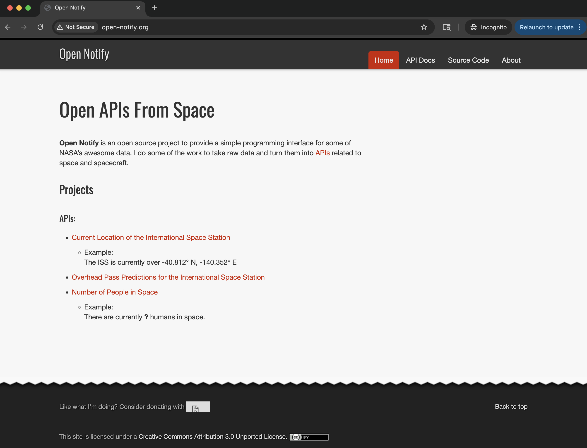
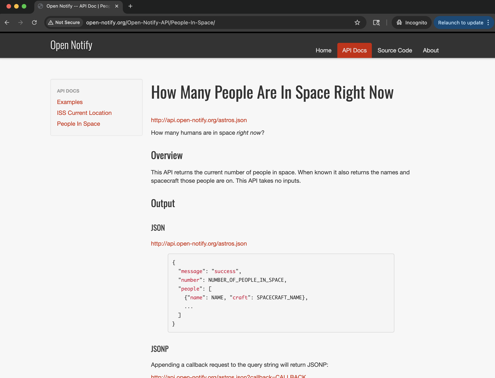
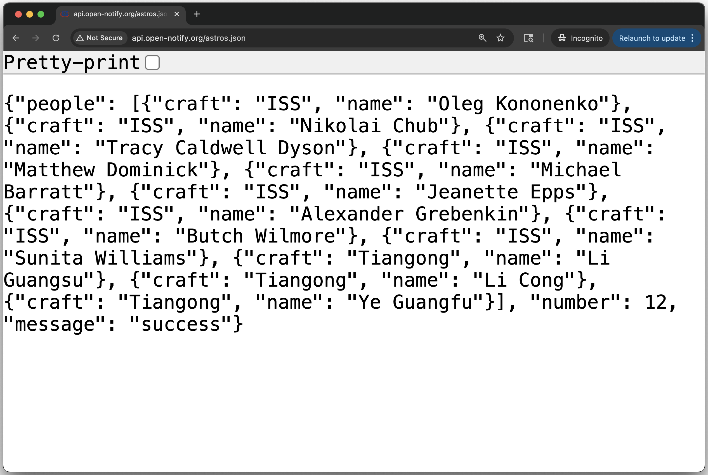
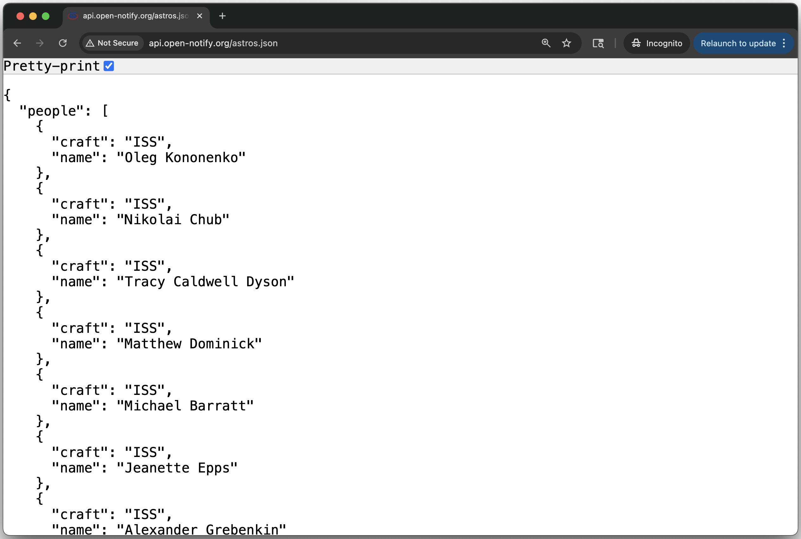
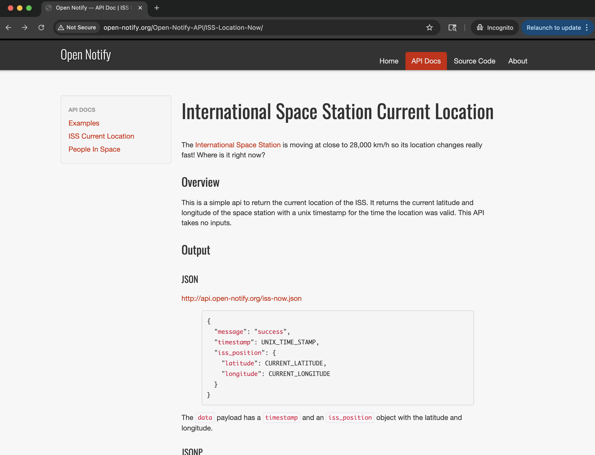
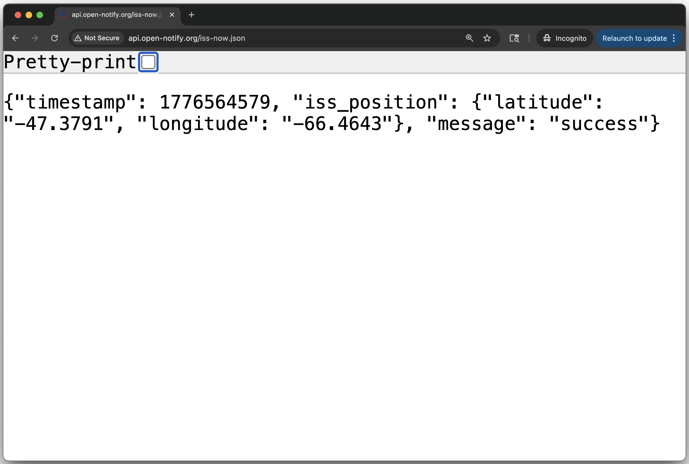
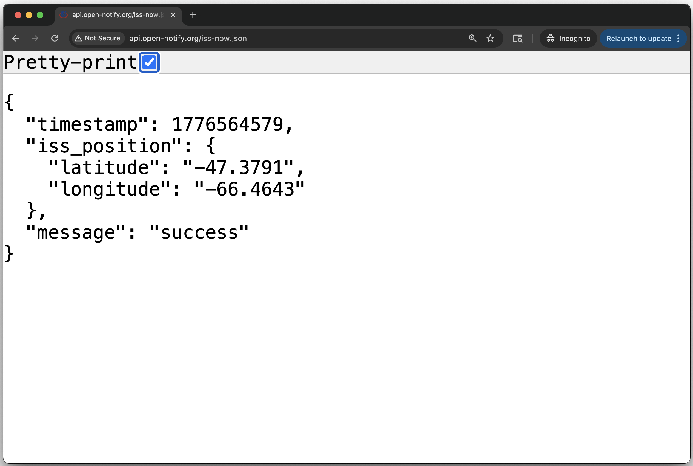
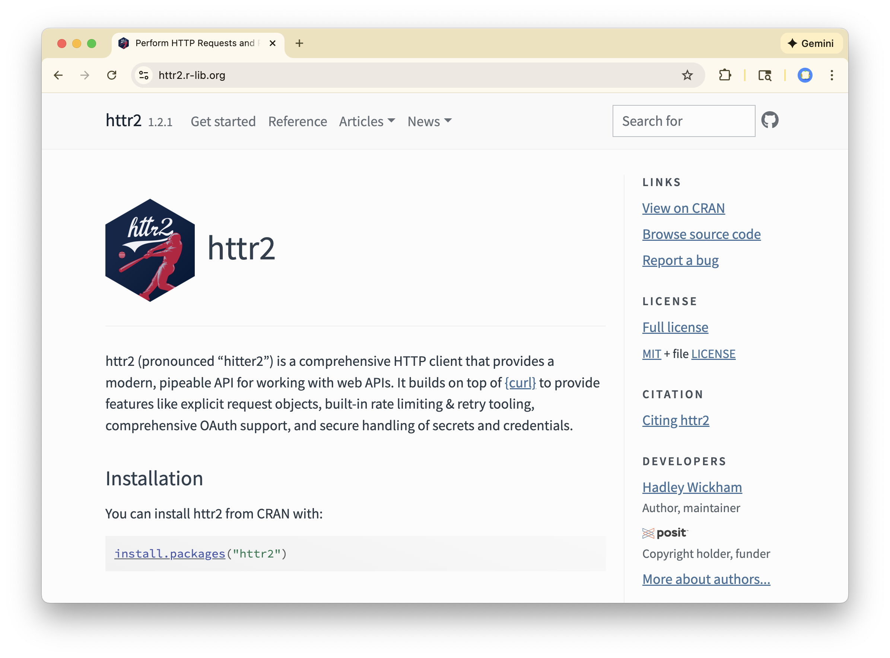

```{r setup, include=FALSE}
knitr::opts_chunk$set(echo = TRUE, error = TRUE)
library(tidyverse)
library(jsonlite)
library(httr2)
library(leaflet)
```


# API Example: Open Notify

## {.nostretch}

{width="70%" fig-align="center"}


## About Open Notify

[Open Notify](http://open-notify.org/) is an open source project, developed and maintained by Nathan Bergey, to provide a simple application programming interface (API) for some of NASA’s data.

. . .

Open Notify's APIs allow you to make 2 types of requests[^1]:

1) Current location of the International Space Station (ISS)
    + <http://api.open-notify.org/iss-now.json>

2) Number of people in space
    + <http://api.open-notify.org/astros.json>

[^1]: Both of these APIs take no inputs.


## {.nostretch}

{width="70%" fig-align="center"}


## Number of people in space

<http://api.open-notify.org/iss-now.json>

:::: {.columns}
::: {.column .fragment}

:::

::: {.column .fragment}

:::
::::


## {.nostretch}

{width="70%" fig-align="center"}


## Location of ISS

<http://api.open-notify.org/iss-now.json>

:::: {.columns}
::: {.column .fragment}

:::

::: {.column .fragment}

:::
::::


## Interacting with an API

1) _Web browser_: enter URL with parameters to make request.

\

2) _Command line_: use `curl` to make request.

\

3) _R or Python_: use HTTP libraries to make request.


## Interacting with a Browser {.nostretch}

Craft URL from a base URL (endpoint) and parameters

`http://api.open-notify.org/iss-now.json`

. . .

\

{width="50%"}


## Interacting from Command Line

Most shells have `curl` command for making HTTP requests.

. . .

```bash
curl "http://api.open-notify.org/iss-now.json"
```

. . .

```
{"timestamp": 1776564579, "iss_position": {"latitude": "-66.4643", "longitude": "-47.3791"}, "message": "success"}
```


## Interacting from R (option 1 _quick & dirty_)[^1]

. . .

```{r}
#| eval: false
iss_loc_json <- "http://api.open-notify.org/iss-now.json"

iss_loc_list <- fromJSON(iss_loc_json)

iss_loc_list
```

. . .

```
$timestamp
[1] 1776564579

$iss_position
$iss_position$longitude
[1] "-47.3791"

$iss_position$latitude
[1] "-66.4643"

$message
[1] "success"
```

[^1]: This is okay for a one-off file download.


## {.smaller}

```{r}
#| eval: false
iss_lat <- as.numeric(iss_loc_list$iss_position$latitude)
iss_lng <- as.numeric(iss_loc_list$iss_position$longitude)

leaflet() |> 
  addTiles() |> 
  setView(lng = iss_lng, iss_lat, zoom = 2) |> 
  addCircles(lng = iss_lng, lat = iss_lat, radius = 70000)
```

. . .

```{r}
#| echo: false
#| fig-width: 12
#| fig-height: 7
iss_lat <- -66.4643
iss_lng <- -47.3791

leaflet() |> 
  addTiles() |> 
  setView(lng = iss_lng, iss_lat, zoom = 3) |> 
  addCircles(lng = iss_lng, lat = iss_lat, radius = 70000)
```


# Interacting with APIs through HTTP Libraries

## Interacting from R (option 2 _more formal_)

Use an HTTP library, e.g. `"httr2"`

{fig-align="center"}


## Interacting from R (option 2 _more formal_) {auto-animate=true}

. . .

```{r}
#| eval: false
# install.packages("httr2")
library(httr2)
```

. . .

\

Open Notify's ISS location:

1) Create a request object with `request()`, this define your base request.

2) Complete the full path, via `req_url_path_append()`, by appending the JSON file name. 

3) Submit request with `req_perform()`.

4) Extract data with `resp_body_json()`


## Interacting from R (option 2 _more formal_) {auto-animate=true}

```{r}
#| eval: false
api_url <- "http://api.open-notify.org"
req <- request(api_url) |> 
  req_url_path_append("iss-now.json") |> 
  req_perform()

req
```

. . .

```
<httr2_response>
GET http://api.open-notify.org/iss-now.json
Status: 200 OK
Content-Type: application/json
Body: In memory (112 bytes)
```

. . .

```{r}
#| eval: false
names(req)
```

. . .

```
[1] "method"      "url"         "status_code" "headers"     "body"       
[6] "request"     "cache" 
```


## Interacting from R (option 2 _more formal_) {auto-animate=true}

```{r}
#| eval: false
api_url <- "http://api.open-notify.org"
req <- request(api_url) |> 
  req_url_path_append("iss-now.json") |> 
  req_perform() |> 
  resp_body_json()

req
```

. . .

```
$timestamp
[1] 1776564579

$iss_position
$iss_position$longitude
[1] "-47.3791"

$iss_position$latitude
[1] "-66.4643"

$message
[1] "success"
```


## 

`"httr2"` is the modern standard for API interaction in R. It treats the API request as a conversation.

. . .

:::: {.columns}
::: {.column width=60%}
Pros:

- API-First: Built specifically for modern web requirements like OAuth, API keys, and custom headers.

- Pipe-friendly: Works with `|>` (e.g., `request(url) |> req_perform()`).

- Robust: It has built-in features for retrying failed requests, rate-limiting, and pausing between calls.

- Informative: It gives you easy access to HTTP status codes.
:::

::: {.column .fragment width=40%}
Cons: 

- Dependency: Requires installing the package.

- Learning curve: Slightly more complex for a simple one-off file download.
:::
::::

